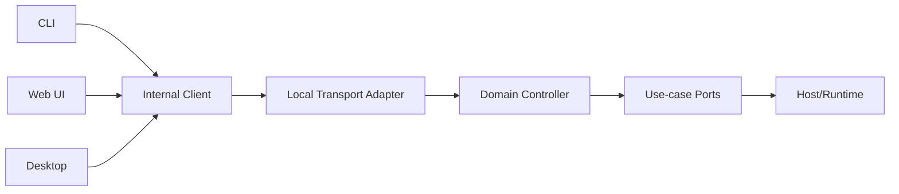
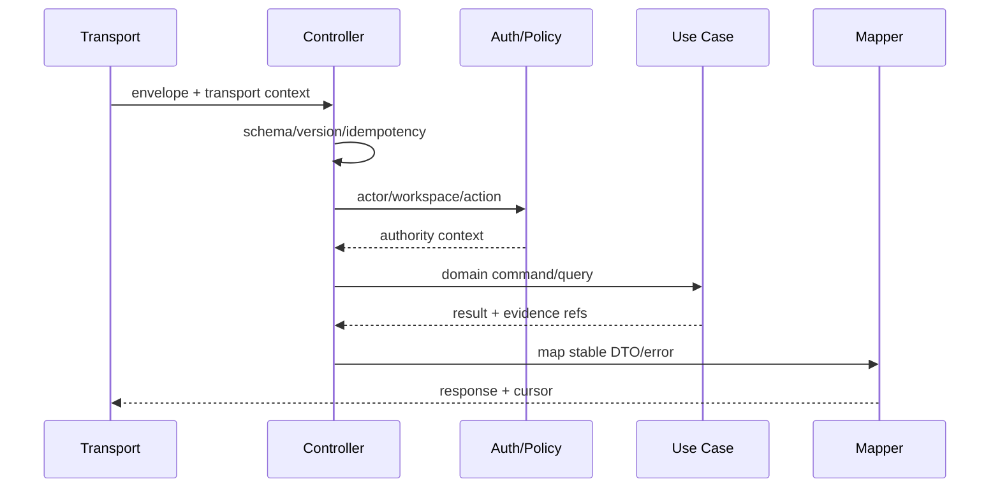

# 共享协议与 Controller 设计

## 1. 位置

共享协议只表达跨边界资源、命令、查询和事件；Controller 负责 DTO→领域输入、auth/policy context 和错误映射。领域对象和数据库行不得直接暴露。

## 2. 协议资源

| 资源 | 核心命令 | 查询/事件 |
|---|---|---|
| Workspace | register/remove/update | list/get, workspace.* |
| Session | create/fork/archive/import | get/list/items, session.* |
| Run | start/resume/cancel/approve | get/events, run.* |
| Operation | retry/reconcile | get/list, operation.* |
| Memory | propose/admit/edit/revoke/forget | search/get, memory.* |
| Artifact | create/finalize/delete | metadata/content stream |
| Profile | validate/select | list/get capabilities |

长任务返回 Operation/Run resource，不把单个 HTTP request 或 IPC call 保持到完成。

## 3. Controller 分层

Transport 认证得到 actor，Domain Policy 决定能否执行；二者不可合并成 `isAuthenticated` 一个布尔值。

## 4. 事件协议

事件 envelope 包含 `schemaVersion`、`eventId`、`cursor`、`resource`、`kind`、`occurredAt`、`correlationId`、payload。客户端只依赖公开事件，不解析服务端日志。Snapshot 返回 `asOfCursor`，订阅从该 cursor 之后开始。

## 5. 参数与兼容

| 参数 | 推荐 |
|---|---|
| serialization | JSON-compatible canonical schemas；大二进制另流 |
| version negotiation | client/server capability handshake |
| pagination | opaque cursor，稳定 sort key |
| errors | stable code + retryable + details schema + correlation id |
| idempotency | mutation command 必需 `command_id` |
| deprecation | 至少一个稳定窗口并提供迁移说明 |

## 6. 验收

同一 conformance fixtures 驱动 CLI、Web UI 和 Desktop 的内部调用路径；错误码/事件一致；旧客户端能忽略新增可选字段；未知 discriminator 明确报兼容错误；Controller 无具体 React/Electron/CLI import。该内部协议不意味着发布外部 SDK 或 API。
