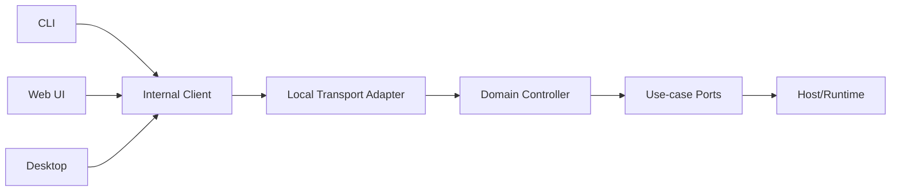
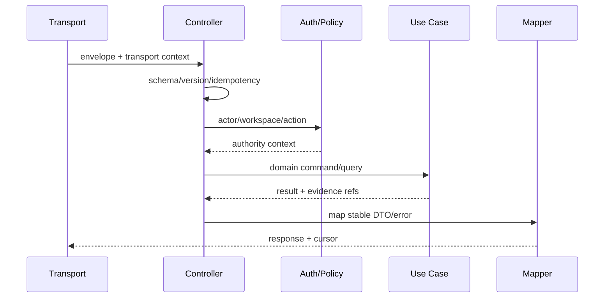

# 共享协议与 Controller 设计

> 当前实现状态（2026-10-03）：三端正式入口使用同一个长期Node Host/profile；Web loopback HTTP/SSE，Desktop Main和CLI通过私有UDS/Windows pipe HTTP adapter调用typed `TraceGraphClient`。旧 `tracegraph.client-protocol.v2` framing和fixtures仍保留兼容，不是当前Desktop完整能力的唯一wire vocabulary。

## 当前 Controller 与共享 owner

[`RunSessionController`](../../../packages/api/src/run-session-controller.ts)仅依赖contracts，绑定Host Workspace/Session scope和command ID。默认single admission保留嵌入兼容；共享composition注入workspace admission/coordinator，同Session串行、canonical工作区write排队、独立工作区有界并发，Run/PTY/preview/Git共享资源租约。关闭客户端不取消任务。`beforeResume` 在 workspace admission 后、任何 durable resume mutation 前重验共享 Host 的当前权限；恢复后审批复查，digest 变化要求新 Run。本进程活动 Run 权限保持原绑定，旧 Core 恢复语义不变。

`MemoryExperienceController`从同一动态项目注册推导scope；原生或HTTP入口都不接受客户端owner/actor。旧Desktop `RunInteractionController`为framed seam绑定Approval/Plan/Todo/Artifact/input，当前正式Main走已存在的同Host typed routes。Controller不依赖React/Electron/CLI；Host保留auth、replay、错误、二进制与SSE transport语义。

[`host-composition.ts`](../../../packages/host/src/composition/host-composition.ts)拥有配置、platformcredentials、permission ceiling、MCP/LSP/extension/skill接线、Model Run snapshot和Runtime。`workbench-control.ts`/routes承载versioned settings、caps、resources、closed developer/schedule/diagnostic commands；不声称所有Host route family已经抽成同一个domainController。

## 当前 CLI 与 Desktop 调用

CLI [`workbench-command.ts`](../../../apps/cli/src/workbench-command.ts)提供完整本机命令与三条实时JSONL，默认private共享连接，不创建第二Runtime；旧 `run-session-command.ts`仍有HTTP注入E2E。Desktop固定Main/preload桥完整适配Workbenchport，三条SSE使用pull stream bridge，不再以500ms Run.get polling补缺。秘密和Hosttoken留在服务端/Main，Renderer只接安全DTO。

真实UDS/TCP、单owner并发、queued→started、detach后台继续、配置restart/clear-key和显式shutdown由 [`local-host.test.ts`](../../../packages/host/src/local-host.test.ts)验证。macOS证据不能外推Windows pipe/完整Linux新增资源或独立外部发布验收。

## 1. 位置

```mermaid
flowchart LR
  CLI[CLI] --> SDK[Internal Client]
  WEB[Web UI] --> SDK
  DESK[Desktop] --> SDK
  SDK --> TR[Local Transport Adapter]
  TR --> CT[Domain Controller]
  CT --> UC[Use-case Ports]
  UC --> RT[Host/Runtime]
```

共享协议只表达跨边界资源、命令、查询和事件；Controller 负责 DTO→领域输入、auth/policy context 和错误映射。领域对象和数据库行不得直接暴露。

## 2. 协议资源方向（不作为全部当前 API 清单）

| 资源 | 核心命令 | 查询/事件 |
|---|---|---|
| Workspace | register/remove/update | list/get, workspace.* |
| Session | create/fork/archive/import | get/list/items, session.* |
| Run | start/resume/cancel/approve | get/events, run.* |
| Operation | retry/reconcile | get/list, operation.* |
| Memory | create/review/correct/revoke/delete | list, memory.* |
| Experience | lifecycle review | list, experience.* |
| Artifact | create/finalize/delete | metadata/content stream |
| Profile | validate/select | list/get capabilities |

目标是长任务返回Operation/Run resource。当前Run start返回canonical projection；同workspace queued admission和同步approve可能保持请求到开始/下一边界，客户端需要保留ID并读取事实，不能把连接中断当作取消。迁移另返回operation ID并查询持久receipt。

## 3. Controller 分层

```mermaid
sequenceDiagram
  participant T as Transport
  participant C as Controller
  participant A as Auth/Policy
  participant U as Use Case
  participant M as Mapper
  T->>C: envelope + transport context
  C->>C: schema/version/idempotency
  C->>A: actor/workspace/action
  A-->>C: authority context
  C->>U: domain command/query
  U-->>C: result + evidence refs
  C->>M: map stable DTO/error
  M-->>T: response + cursor
```

Transport 认证得到 actor，Domain Policy 决定能否执行；二者不可合并成 `isAuthenticated` 一个布尔值。

## 4. 事件协议

事件 envelope 包含 `schemaVersion`、`eventId`、`cursor`、`resource`、`kind`、`occurredAt`、`correlationId`、payload。客户端只依赖公开事件，不解析服务端日志。Snapshot 返回 `asOfCursor`，订阅从该 cursor 之后开始。

## 5. 参数与兼容

| 参数 | 推荐 |
|---|---|
| serialization | JSON-compatible canonical schemas；大二进制另流 |
| version negotiation | client/server capability handshake |
| pagination | opaque cursor，稳定 sort key |
| errors | stable code + retryable + details schema + correlation id |
| idempotency | mutation command 必需 `command_id` |
| deprecation | 至少一个稳定窗口并提供迁移说明 |

## 6. 验收

同一 conformance fixtures 驱动 CLI、Web UI 和 Desktop 的内部调用路径；Memory/Experience transport 使用同一 Controller 与 Runtime command ID；未知 discriminator 和非法 lifecycle action 明确拒绝；Controller 无具体 React/Electron/CLI import。该内部协议不意味着发布外部 SDK 或 API。
