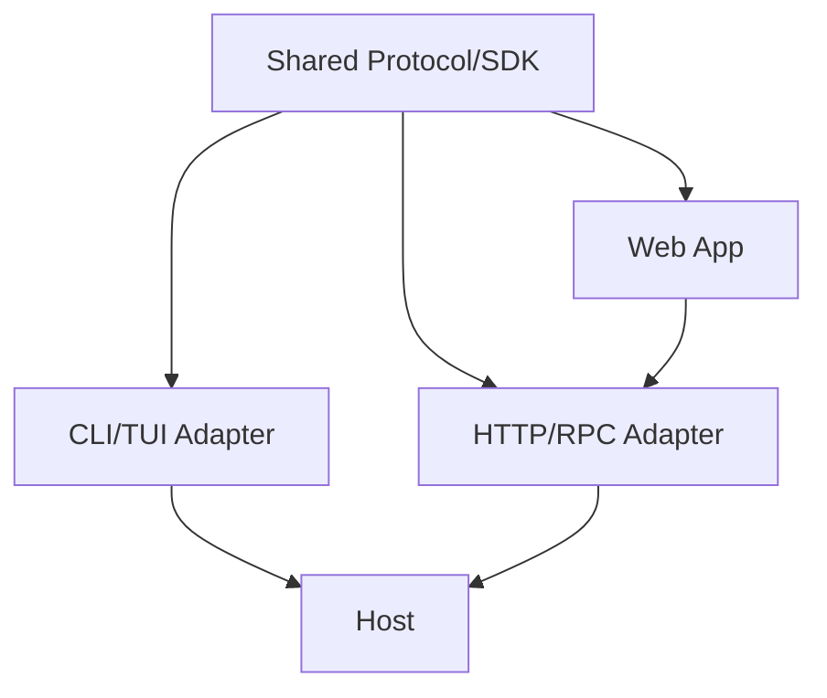
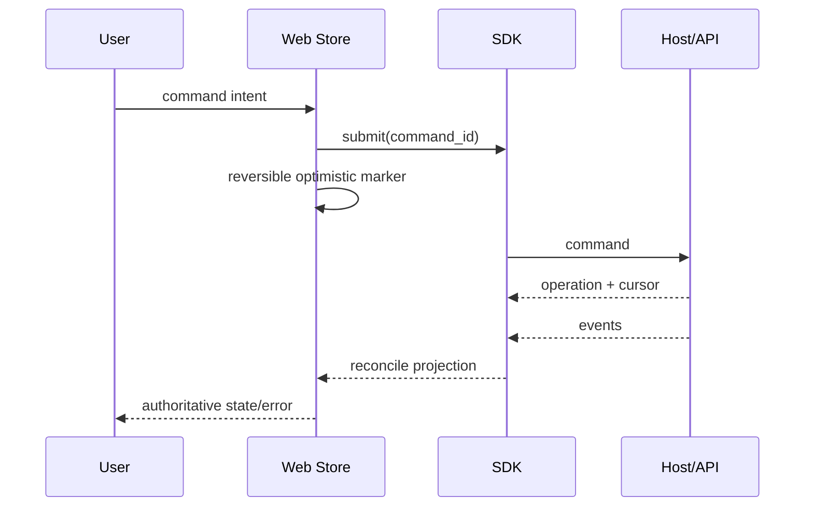

# CLI、API 与 Web 入口设计

## 1. 共享与差异

三种入口共享 command/query/event 语义，但不强迫共享交互层。CLI 优先脚本可组合，API 优先嵌入稳定性，Web 优先可视化与多任务导航。

## 2. CLI/TUI

| 模式 | 输出规则 | 错误规则 |
|---|---|---|
| human | 进度、颜色、建议，stderr/exit code 明确 | 终端错误可读 |
| `--json` | 单一 versioned result envelope | stdout 不混日志 |
| streaming | JSONL 或 TUI event renderer | 断线/中断有最后 cursor |
| non-interactive | 需要 approval 时 fail 或按显式 policy | 不暗自默认确认 |

CLI 可以嵌入本地 Host，也可连接已有 Host，但两种模式使用同一 Controller conformance。

## 3. API

API 分 Command、Query、Event stream 和 Artifact transfer。Mutation 接收 idempotency key；长任务返回 `202 + operation/run id`（HTTP 映射示例）。认证、限流和 CORS 属于 adapter；领域权限仍由 policy service 判定。

## 4. Web

Web 持有 normalized client projection、窗口/筛选/草稿等 UI 状态，不持有 Session/Run 真源。关键页面建议：workspace/session 导航、run timeline、approval inbox、Evidence/Artifact inspector、Memory review、settings/profile。

## 5. 参数

| 参数 | CLI | API/Web |
|---|---|---|
| reconnect | 用户重跑/`--follow` | 自动退避 + cursor |
| approval | TTY 可交互；脚本 fail/explicit flag | inbox + notification |
| stream backpressure | bounded renderer | client buffer + snapshot reset |
| offline | 查看本地缓存需标 stale | Web 只允许草稿，不伪造已提交状态 |
| logs | stderr/diagnostic file | server logs，协议返回 correlation id |

## 6. 验收

Golden conformance 场景覆盖 start/cancel/approval/reconnect/error；CLI JSON 可机器解析；Web 刷新不会丢 Run；API 重复 command 不重复副作用；三入口对同一终态和错误码含义一致。

