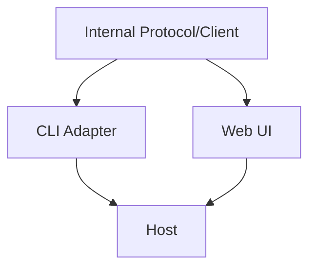
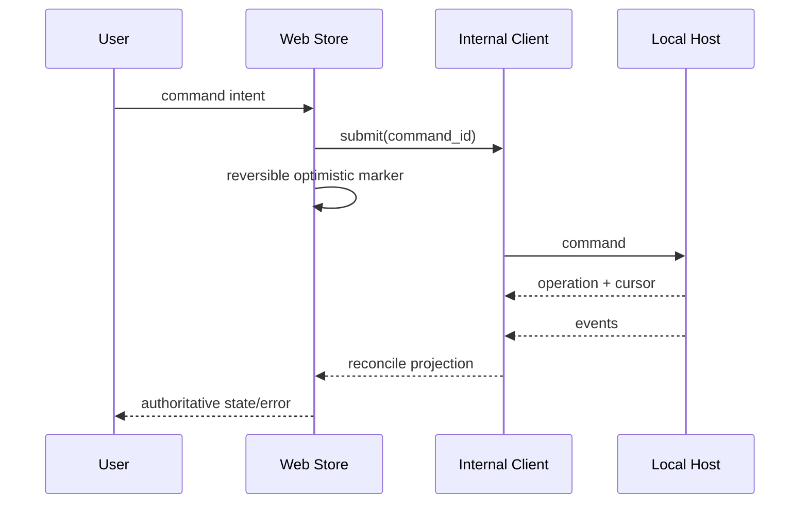

# CLI 与 Web UI 入口设计

## 1. 共享与差异

CLI 与 Web UI 共享 Command/Query/Event 语义，但不强迫共享交互层。CLI 优先脚本可组合，Web UI 优先可视化与多任务导航。Desktop 复用同一内部协议，进程边界见 [Desktop 进程与安全](03-desktop-process-security.md)。

## 2. CLI/TUI

| 模式 | 输出规则 | 错误规则 |
|---|---|---|
| human | 进度、颜色、建议，stderr/exit code 明确 | 终端错误可读 |
| `--json` | 单一 versioned result envelope | stdout 不混日志 |
| streaming | JSONL 或 TUI event renderer | 断线/中断有最后 cursor |
| non-interactive | 需要 approval 时 fail 或按显式 policy | 不暗自默认确认 |

CLI 可以嵌入本地 Host，也可连接已有 Host，但两种模式使用同一 Controller conformance。

## 3. Web UI

Web UI 持有 normalized client projection、窗口/筛选/草稿等 UI 状态，不持有 Session/Run 真源。关键页面建议：workspace/session 导航、run timeline、approval inbox、Evidence/Artifact inspector、Memory review、settings/profile。

### Web 与 Desktop 共用的 Agent 工作台体验

交互参照采用 DSH 的 Web 工作台，并吸收你所说的 Codex-like 完整 Agent 使用感受。目标不是只有一个聊天框，而是让用户在同一工作区里发起不同类型的任务、观察 Agent 正在做什么、检查产物并控制下一步；Coding 是其中一个重要工作流。

| 工作台区域 | 目标交互 | Outlive 约束 |
|---|---|---|
| 左侧导航 | Workspace/项目分组、Session 列表、新建/搜索/切换；区分运行中、待处理和归档状态 | 只显示 Host 投影；排序、折叠等纯 UI 偏好可留在 Client |
| 中央工作区 | 对话、Run/Turn 时间线、计划与进度、结构化 Tool 调用/结果、失败/取消/重试状态 | 显示事实事件与明确状态，不把 live hint 当作已提交结果 |
| 按需上下文面板 | 文件/Artifact 预览、变更 diff、Terminal/浏览器等会话上下文；支持从消息或 Tool 结果跳转检查 | 只开放当前 Profile 已装配的能力；文件和副作用仍经 Host/Policy |
| 人的控制入口 | Approval、模型/Profile、权限与设置入口 | 确认/拒绝由统一 Controller/Policy 处理，界面不能自行授予权限 |
| Outlive 记忆视图 | 查看 Memory/Experience 来源、scope、版本、冲突与有效状态；追踪检索、选中、提交给 Adapter 的阶段 | MemoryUse 仅证明请求提交状态，不宣称模型内部使用或因果影响；review/revoke/delete 走领域命令 |

交互基线可从 DSH 的三栏 AppFrame、Workspace/Session 侧栏、Conversation/Tool cards、右侧 Sidebar 与变更审阅中取材。Web 与 Desktop 应共享主要布局、组件和用户路径；Desktop 的标题栏、系统菜单、原生打开文件/目录等差异由平台适配层承接。具体功能按 Outlive 路线阶段落地，不要求首个版本一次复制 DSH 的全部面板或插件。

参考实现位置与不能据此声称的内容，记录在[DSH 工作台源码观察](../08-reference-lineage/01-source-observations.md)。

## 4. 参数

| 参数 | CLI | Web UI |
|---|---|---|
| reconnect | 用户重跑/`--follow` | 自动退避 + cursor |
| approval | TTY 可交互；脚本 fail/explicit flag | inbox + notification |
| stream backpressure | bounded renderer | client buffer + snapshot reset |
| offline | 查看本地缓存需标 stale | Web 只允许草稿，不伪造已提交状态 |
| logs | stderr/diagnostic file | server logs，协议返回 correlation id |

## 5. 验收

Golden conformance 场景覆盖 start/cancel/approval/reconnect/error；CLI JSON 可机器解析；Web UI 刷新不会丢 Run；三种产品入口对同一终态和错误码含义一致。HTTP/RPC 仅是本机 Host transport 选项，不构成外部 API 产品承诺。
