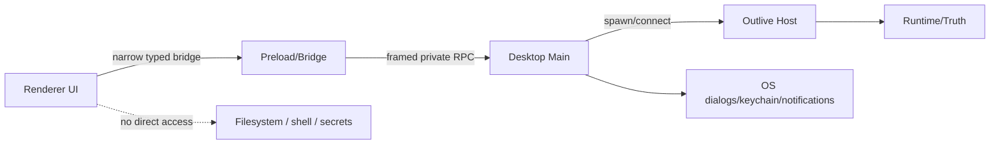
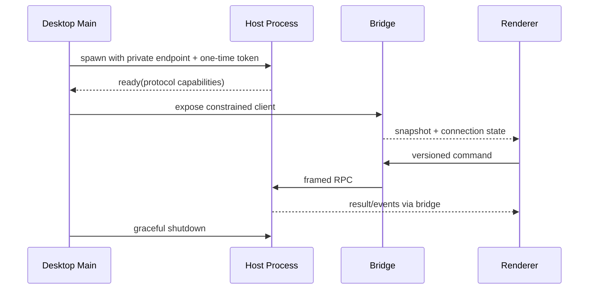

# Desktop 进程与安全设计

## 1. 进程架构

Desktop 是 Host 的平台适配器和用户界面，不是另一套后端。Renderer 按普通不可信 Web 页面处理，不获得 Node、shell、任意 IPC 或 credential 权限。

## 2. 进程职责

| 进程 | 拥有 | 不拥有 |
|---|---|---|
| Renderer | 页面、草稿、客户端投影 | 文件系统、Host token、领域真源 |
| Preload/Bridge | 白名单方法与 schema validation | 任意 channel 透传、业务逻辑 |
| Main | 窗口、OS 对话框、协议 handler、Host lifecycle | Agent Loop、Session 真源 |
| Host | workspace、Runtime、Truth、capability providers | UI 窗口状态 |

## 3. Host 生命周期

Host 崩溃由 Main 检测并展示 recovery；有频率上限，避免崩溃循环。Renderer reload 不重启 Host，窗口关闭是否结束后台 Run 由明确设置决定。

## 4. 安全控制

- context isolation 开启，禁用 remote module/任意 eval；
- Bridge 按 method 暴露，不提供 generic `invoke(channel, payload)`；
- 所有输入做 schema、大小和路径校验；
- workspace 目录通过 OS picker + capability grant，不相信 Renderer 字符串路径；
- credential 使用 OS keychain/Host resolver，永不发到 Renderer；
- navigation、new-window、deep link、download 与 external open 使用 allowlist；
- 自动更新包需签名、校验和和回滚策略。

## 5. 关键参数

| 参数 | 推荐 |
|---|---|
| host transport | 本地 private pipe/socket + framed protocol |
| host auth | 每次启动随机 token + OS 用户边界 |
| renderer CSP | default-deny，按资源显式开放 |
| restart policy | bounded exponential backoff + crash report |
| background runs | 默认可继续，但托盘/状态明确且可停止 |
| shell choice | Electron/Tauri 等作为待评审实现，不改变上述边界 |

## 6. 验收

安全测试覆盖恶意 Renderer payload、任意 IPC、路径逃逸、token 重放、外链/导航、Host crash/restart、renderer reload、窗口关闭和 update 签名失败。Desktop 与 Web 使用相同 client-store fixtures。

