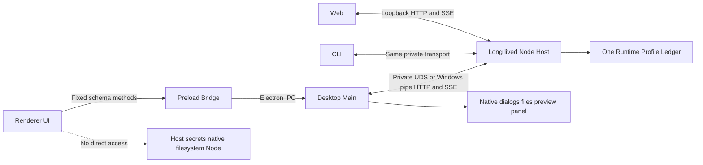
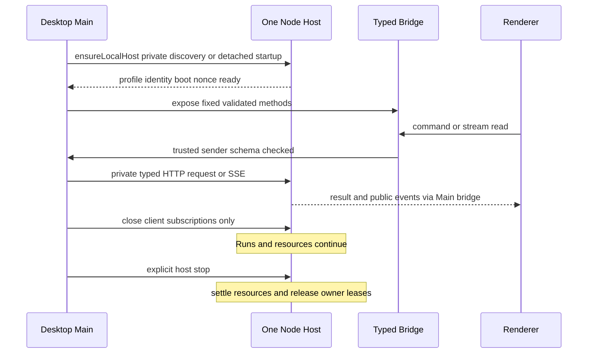

# Desktop 进程与安全设计

## 1. 当前进程架构

```mermaid
flowchart LR
  R[Renderer UI] -->|Fixed schema methods| P[Preload Bridge]
  P -->|Electron IPC| M[Desktop Main]
  M <-->|Private UDS or Windows pipe HTTP and SSE| H[Long lived Node Host]
  C[CLI] <-->|Same private transport| H
  W[Web] <-->|Loopback HTTP and SSE| H
  H --> RT[One Runtime Profile Ledger]
  M --> OS[Native dialogs files preview panel]
  R -.No direct access.-> X[Host secrets native filesystem Node]
```

Desktop是共享Host的平台适配器和用户界面，不拥有另一份Runtime/JSONL/configuration。Renderer按普通不可信页面处理，不获得Node、真实Hosttoken、shell或任意IPC权限；明确授权的developer操作由Host闭合commands执行。

## 2. 进程职责

| 进程 | 拥有 | 不拥有 |
|---|---|---|
| Renderer | 页面、草稿、客户端投影和安全capabilities | filesystem、Host token、credential、领域真源 |
| Preload/Bridge | 白名单方法与双向schema validation | 通用invoke、channel透传、业务Runtime |
| Main | 窗口、OS picker、受限文件打开、私有typed SDK连接与stream迭代器 | Session/Run/Memory真源、profile写入所有权 |
| Host | profile/根写租约、Runtime/Controllers、credentials/configuration、PTY/preview/schedules | UI窗口状态 |

## 3. 共享 Host 生命周期

```mermaid
sequenceDiagram
  participant D as Desktop Main
  participant H as One Node Host
  participant B as Typed Bridge
  participant R as Renderer
  D->>H: ensureLocalHost private discovery or detached startup
  H-->>D: profile identity boot nonce ready
  D->>B: expose fixed validated methods
  R->>B: command or stream read
  B->>D: trusted sender schema checked
  D->>H: private typed HTTP request or SSE
  H-->>R: result and public events via Main bridge
  D->>H: close client subscriptions only
  Note over H: Runs and resources continue
  D->>H: explicit host stop
  Note over H: settle resources and release owner leases
```

默认profile为 `~/.tracegraph/profiles/default`；`OUTLIVE_PROFILE_ROOT`和显式可信选项用于隔离，不读取另一应用目录下的真实Key。所有窗口关闭、Renderer reload、Main退出和CLI完成只detach，长期Host继续；不默认安装开机启动。显式stop拒绝queued task，关闭PTY/ownedpreview/scheduler、停止Run和held provider、关闭UDS/TCP SSE，最后释放根写入租约。Host崩溃不自动重放副作用；恢复状态和审批必须重验，客户端显式重连/启动后读取bootstrap recovery。

### 3.1 当前 owner 与私有连接

[`local-host.ts`](../../../packages/host/src/local-host.ts)的 `ensureLocalHost/connectLocalHost` 是公共服务连接API，Main和CLI复用。[`local-profile.ts`](../../../packages/host/src/local-profile.ts)保存稳定profile ID、data/session根和版本，discovery具有私有权限、随机socket token、PID和bootnonce。[`owner-lease.ts`](../../../packages/host/src/owner-lease.ts)在创建Runtime前取得profile和canonical根所有权，禁止另一个profile绕过目录选择创建第二writer。

UDS每个请求先验证私有token，再进入同一Fastify app的bearer/Origin/replay/command ID校验。Host同时为Web提供loopbackgateway；Main/Renderer不监听TCP，Renderer CSP仍 `connect-src 'none'`。原生路径注册/根解析/迁移/stop routes只允许已认证私有socket，即使TCP客户端持有live token也不能调用。

独立worker使用可信Node resolver：absolute realpath、受支持engine、非Electron与可执行身份，环境仅白名单 OS/PATH 和三个可信启动 policy 键（permission preset、rollback enabled/allow-force）。缺Node明确setup失败，不转发 `NODE_OPTIONS`、provider secrets或任意执行环境，不扩大Seatbelt目录范围。

### 3.2 当前隔离 shell、完整固定 bridge 与三条流

[`main.ts`](../../../apps/desktop/src/main.ts)加载本地Renderer，开启 `contextIsolation/sandbox/webSecurity`、关闭 `nodeIntegration`，拒绝任意导航、新窗口和Browser permissions，校验IPC sender为本地主frame。[`preload.cts`](../../../apps/desktop/src/preload.cts)是自包含CommonJS，只暴露 [`bridge-contract.ts`](../../../apps/desktop/src/bridge-contract.ts)的具名schema方法；不能提供Renderer自选channel或任意nativepath。

[`desktop-sdk.ts`](../../../apps/desktop/src/desktop-sdk.ts)适配共享Workbenchport：项目/Session/Run、Attachment、Approval/Plan/Todo、Artifact、input/cancel、Memory/Experience、Replay/rollback、Team/subagent、权限/配置/模型测试、usage/telemetry/skills/extensions/MCP/LSP、developer/schedule/resource commands。状态来自Hostcapabilities；available、unconfigured、readonly、policy-denied、unavailable和offline分别呈现。

[`stream-bridge.ts`](../../../apps/desktop/src/stream-bridge.ts)用固定open/read/close按需推进canonical/activity/model-surface三条SSE迭代器，有sender隔离与数量限制；不使用500ms Run.get polling替代流。Main和adapter过滤 `thinking_snapshot`，三条cursor保持原语义。closeStream只取消订阅，不能取消Run。Preview只构造demo adapter，不连接/启动真实profile。

### 3.3 原生项目、凭据与迁移

目录由Main OS picker或CLI显式参数授权，Main通过私有 `native.registerProject`登记到共享 `LocalProjectRegistry`；Renderer只持有safeProjectSummary/ID，不提交绝对路径。项目内文件打开经过Host根解析、realpath/普通文件/containment和根身份复核，再由Main交给系统应用。linked项目remove仅注销metadata；worktree删除成功同步注销对应registration。

APIKey是write-only输入，Host只持久化secret reference和安全provider参数；读取不返回Key。共享Host默认platformCredentialStore，可保留原Desktop Keychain引用；macOS backend失败不静默导出到文件，其他平台fallback privatefile仍是plaintext-at-rest。Run捕获模型/凭据引用，轮换/clear不热改进行中轮次；clear保留非秘密draft。保存、connectiontest和Run业务完成不是同一个结果。

迁移picker生成source，Renderer只接source ID/label/relative hash/bytes/conflicts；commit只能选择已预览source ID。activeRun/queued task/PTY/ownedpreview或legacywriter导致busy拒绝，要求显式停止资源；正常流程停owner、保留source原格式备份、单源提交/隔离冲突、重启新nonce并rebind。failed/unknown带operationID供查询持久receipt，不能在未知结果时重新提交。导入路径不自动授予Workspace执行权。

共享恢复前，Host 按当前 ceiling/预设、项目和 trusted extension rules 重算 permission digest；变化时返回 `resume_policy_changed` 并要求新 Run，不扩大旧批准。恢复后的审批再次校验；本进程活动 Run 仍绑定启动权限。rollback capability 默认 `policy-denied`，启用时 linked 工作区还受 force 策略与显式确认约束。

Host-owned PTY 的 [`terminal-guardian.ts`](../../../packages/host/src/terminal-guardian.ts) 监听 owner 生命周期管道，固定 `/bin/ps` 检查同 UID、TTY、PID/birth 与已观察后代，保护 Host/guardian process group；TERM/KILL 和 quiescence 完成后才释放工作区。限定 TTY 的 file-ioctl 与 same-sandbox signal 支持 job control，不扩大任意目录权限。真实 macOS [PTY 测试](../../../packages/host/src/terminal-job-control.test.ts) 覆盖 Ctrl-Z/jobs/fg/Ctrl-C、close 与 Host SIGKILL 后 background PID 消失。双重 fork/setsid 脱离终端不属于该清理 oracle 的保证。

### 3.4 保留的 DESK-064 framed child seam

`apps/desktop-host`的旧launcher/worker、API-062 framing、exact-version/EOF/崩溃恢复与 `RunInteractionController`测试继续保留。它是兼容和嵌入路径，不是当前Main每窗口拥有一份Host的产品模型。该seam的EOF关停只说明旧子进程生命周期，不意味着关闭当前窗口停止共享后台任务。

## 4. 安全控制

- Renderer无Node/token/credential，本地CSP和sender校验保持；具名bridge逐边界schema/bytes/cursor检查。
- 原生path仅来自picker或CLI可信输入；Renderer只能提交Host绑定ID，文件打开必须位于注册canonical根。
- 私有socket认证、loopbackbearer/Origin、replay只读与command ID保留；HTTP不可借token调用native routes。
- 共享configuration声明effective/source/scope；Memory/Experience Recall默认false且必须显式project consent，不从恢复state自动授权。
- PTY/ownedpreview/Git/Run共享canonical workspace写租约；readonly能力不当作长期终端的隐含性质。
- 自动更新/签名属于另一个发布能力；当前没有因为桥接实现就自动具备更新包验证。

## 5. 关键参数

| 参数 | 当前规则 |
|---|---|
| profile | `~/.tracegraph/profiles/default`；显式可信profileRoot优先 |
| transport | Main/CLI private socket HTTP + SSE；Web loopback同Runtime；legacy framed另保留 |
| auth | 私有随机discovery token/bootnonce和OS用户目录边界；统一HTTP live/replayauthority |
| renderer CSP | 本地资源defaultdeny、`connect-src 'none'` |
| Node | 独立受支持版本、absolute realpath/identity校验、环境白名单 |
| background | 关闭窗口继续；显式Hoststop关闭资源；不默认开机启动 |
| concurrency | 同Session串行、同canonicalworkspacewrite排队、独立workspace有界并发 |

## 6. 实际验收与待验收边界

[`local-host.test.ts`](../../../packages/host/src/local-host.test.ts)使用真实构建、临时profile和fakeprovider验证双transport同源、owner并发/互斥、queued→started、detach后台继续、native TCP拒绝、busy迁移/备份重启、配置真正restart与clear-keydraft、MCP失败rollback和显式stop关闭heldprovider/三条SSE。[`desktop-sdk.test.ts`](../../../apps/desktop/src/desktop-sdk.test.ts)、[`direct-routes.test.ts`](../../../apps/desktop/src/direct-routes.test.ts)与stream/security测试验证固定桥接和public流语义；真实GUI以当前验证报告的实际attempt为准。

当前实际OS证据在macOS；同Seatbelt下Electronbinary失败、supportedNode成功的[对照](../../validation/ui-086-workbench-ux/attempts/desktop-tests-failed/electron-process-oracle.json)证明无需放宽沙箱。Linuxarchive smoke不代表新增完整GUI/PTY/Sandbox验收；Windows pipe尚无真实Windows系统oracle。隔离模型测试不读写用户真实Keychain。未签名preview归档、维护者/Agent旅程、签名/公证/更新和独立非维护者从零安装是分开的证据，不能互相替代。
