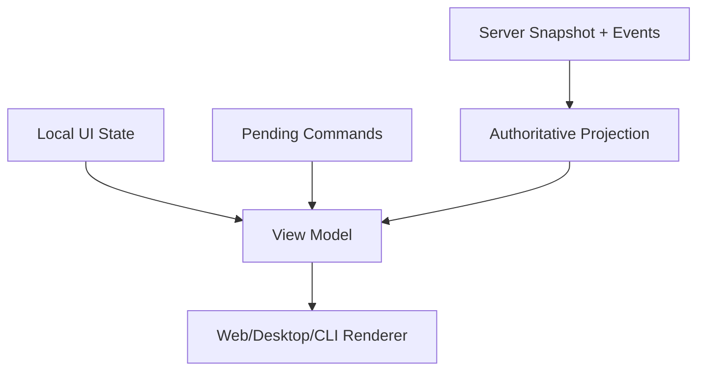
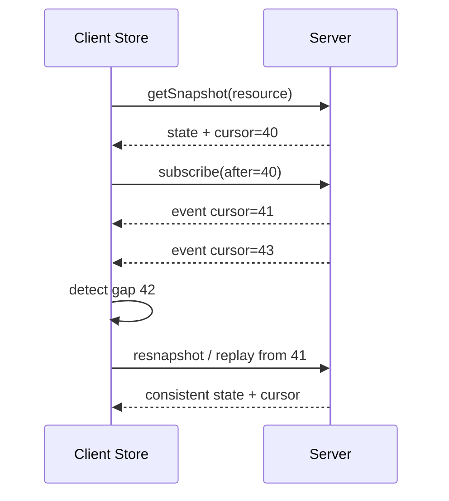

# 客户端状态同步设计

## 1. 状态分类

客户端区分权威投影、待确认命令、可丢弃 UI 状态和本地草稿。禁止把乐观标记写回成 server fact。

## 2. 同步算法

1. 获取 snapshot，记录 `asOfCursor`；
2. 从 cursor 后订阅事件；
3. 事件按 ID 去重、按 cursor 应用；
4. 检测 gap、版本不兼容或 buffer overflow 时放弃局部修复，重新 snapshot；
5. 每个 pending command 按 `command_id` 与 result/event reconcile；
6. 断连期间保留草稿，mutation 仅在显式 offline queue policy 下排队。

## 3. Store 结构

| slice | key | 来源 |
|---|---|---|
| workspaces/sessions/runs | stable resource ID | snapshot/events |
| operations/approvals | operation/approval ID | command result/events |
| artifacts/memories | stable ID + version | query/events |
| pendingCommands | command ID | local + result reconciliation |
| connection | endpoint/session/cursor/stale | internal client stream |
| ui | route, panes, filters, draft | local only |

Server 事件 reducer 必须纯函数、可重放；组件不直接解析 wire event。

## 4. 乐观更新规则

只对可逆、低风险、确定字段做乐观显示，如 rename 的 pending label；start run、approval、delete、tool side effect 不假定成功。每个 optimistic patch 保存 inverse patch 和 command ID；超时显示 `unknown`，不能直接回滚一个可能已成功的外部操作。

## 5. 参数

| 参数 | 推荐 |
|---|---|
| event dedupe | bounded LRU + cursor semantics |
| reconnect backoff | jittered bounded exponential |
| pending timeout | 转为 unknown/query result，不自动重复 mutation |
| cache persistence | 只存非敏感投影；按 actor/workspace 分区 |
| stale indicator | 断连立即可见；超过阈值禁用危险命令 |

## 6. 验收

Property tests 验证事件重放幂等、乱序/gap、snapshot+stream race；E2E 覆盖刷新、断网、两窗口、命令响应丢失、旧客户端事件和 actor 切换。清空 client store 后能完整恢复，不影响 Host 真源。
