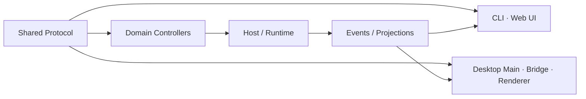
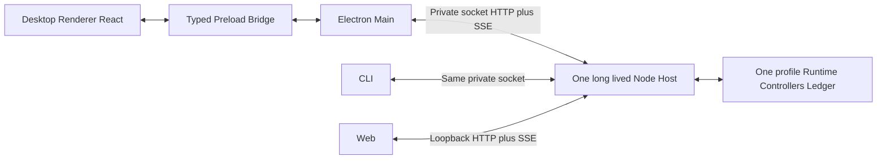

# 06 · 三种产品入口、内部协议与 Desktop

## 子模块导航



| 子模块 | 评审焦点 |
|---|---|
| [共享协议与 Controller](01-shared-protocol-controller.md) | 资源、命令、查询、事件与版本边界 |
| [CLI 与 Web UI](02-cli-web-ui.md) | 两种窗口/终端入口如何复用语义又保留交互差异 |
| [Desktop 进程与安全](03-desktop-process-security.md) | Main/Preload/Renderer、Host 生命周期和最小权限 |
| [客户端状态同步](04-client-state-sync.md) | snapshot、增量事件、重连、乐观状态和冲突处理 |

## 1. 一套业务语义，三种产品入口

| 入口 | 适合 | Transport | 是否拥有 Runtime 状态 |
|---|---|---|---:|
| CLI | 命令、脚本与实时进度；当前不建设完整 TUI | private UDS/Windows pipe HTTP + SSE | 否 |
| Web UI | 本机浏览器工作台 | loopback HTTP Command/Query + 三条 SSE | 否 |
| Desktop | 日常多项目、原生目录与窗口 | 固定 renderer bridge → Main typed SDK → private UDS/Windows pipe HTTP + SSE | 否 |

入口只做输入、呈现、连接和平台适配。Session、Run、Memory、Approval、Tool、Workspace 的 owner 都在 Host/Runtime。
独立 API、对外 SDK、ACP 及编辑器插件暂不属于当前产品范围；内部 Host protocol/client 仅作为上述三种入口的实现依赖。

### Web UI 与 Desktop UI 的工作台方向

Web 与 Desktop 的交互形态以 DSH Agent 工作台为直接参照；按用户使用感受，它接近 Codex 一类完整 Agent 工作台。目标是复用熟悉的 Workspace/Session 导航、中心对话与运行活动、结构化工具/审批呈现、按需上下文面板和变更审阅，承载编码及其他工具型任务。Desktop 复用 Web 的主要工作台 UI，只额外提供窗口、菜单、原生目录/文件操作等平台能力；不维护另一套业务交互。

借鉴的是产品信息架构与可见工作流，不是照搬 DSH 的代码或插件实现。Outlive 特有的 Evidence 来源、Memory 生命周期与本次 MemoryUse 必须按 Outlive 契约呈现；不能因参考 DSH 就暗示它已有相同记忆管理能力。详细交互目标见 [CLI 与 Web UI 设计](02-cli-web-ui.md)，源码观察见[设计依据](../08-reference-lineage/01-source-observations.md)。

**DEC-07 已接受 Electron 外壳**。DESK-064/065/066 与 CLIENT-068 的 child/framed RPC、共享 UI、原生桥与 Memory 控制是历史实现基础。2026-10-03 的 HOST-087/PAR-088/CLI-089/SET-090 将当前正式入口收敛为一个长期独立 Node Host：默认 `~/.tracegraph/profiles/default`，Main/CLI私有连接，Web loopbackgateway进入同一 Runtime/Controller/configuration。旧child/framed seam保留兼容，不再为每个窗口各写一份数据。当前能力和平台证据见 [模块09](../../modules/09-Host-与-SDK-接口层.md)、[模块11](../../modules/11-CLI-与装配.md)；归档、签名、公证、更新和独立外部安装验收分开。

## 2. 共享协议核心

目标包：

```text
packages/sdk/protocol     request/response/event schema, minimal deps
packages/sdk/client       reconnect, pagination, command idempotency
packages/sdk/server       protocol dispatch to controllers
packages/api/*            domain controllers
packages/client/store     client-side projections and optimistic UI
```

协议使用资源/动作命名：

```text
session/create
session/read
session/fork
run/start
run/cancel
run/evidence/export
memory/search
memory/review
memory/revoke
workspace/register
settings/read
settings/update
```

Command 请求包含 `commandId`；并发敏感更新包含 `expectedVersion`；分页使用 opaque cursor；错误使用稳定 code + safe message，不回显 secret 或原始不可信输入。

## 3. Durable event 与 live hint

客户端必须区分：

| 流 | 例子 | 能否恢复 | 客户端策略 |
|---|---|---:|---|
| Durable Event | `tool.receipt`、`run.ended`、`memory.activated` | 能 | 以 sequence/cursor 去重并投影 |
| Projection Snapshot | 当前 Run/Session/Team 状态 | 能重建 | 替换本地 durable view |
| Live Hint | token chunk、typing、临时进度 | 不能保证 | 只做体验增强，断线后丢弃 |

Live Hint 不能改变“完成/成功”状态。断线重连时：停止旧 generation → 读取 durable cursor 之后的事件或 snapshot → 再订阅 live stream。

## 4. BFF 与 Controller

Gateway/BFF 负责：

- transport decode/encode；
- authentication/connection scope；
- protocol version negotiation；
- Command/Query route；
- event filtering、pagination 和 backpressure；
- safe error mapping。

Controller 负责：

- 把请求映射到 domain service；
- 检查 resource ownership；
- 维护命令 idempotency；
- 返回 committed identity 或 accepted status。

BFF 不直接打开 JSONL 或 Memory index；UI 也不能用“本地应用”身份绕过 Controller。

## 5. Web UI 入口

现有 `apps/web` 和 Host/SSE 是可保留基础。V2 收敛点：

- Web UI 只依赖内部 `sdk/client` 与 client UI modules，不复制 route DTO；
- canonical、live activity、model surface三条SSE各自保留sequence/cursor；snapshot水合durable状态，瞬时流不替代账本；
- 浏览器不提交任意本机路径；Desktop原生picker和CLI显式path经私有native route授权，linked项目共享同一注册表；
- credential 输入 write-only，client 不持久化 secret；
- replay view 与 live head 有独立 cursor，禁止浏览历史时误发当前命令；
- optimistic state 只覆盖“命令已发送”，收到 committed projection 后替换。

## 6. CLI/TUI 入口

CLI 分成两层：

```text
apps/cli              argv、命令 UX、profile 选择、进程退出码
packages/client/tui   可选终端呈现
packages/sdk/client   内部 client helper；不是对外发布的 SDK
```

当前实现选择命令与实时进度：

- one-shot结构化结果与稳定退出码；
- events/activity/model三条machine JSONL；
- terminal attach使用Host-ownedPTY，不另建Runtime。

完整interactive TUI不属于当前已授权计划；上述 `packages/client/tui` 仅保留未来呈现方向，不能作为已实现能力。

Machine mode 的 stdout 只输出协议结果；日志走 stderr。命令成功退出码只表示 CLI 命令完成，不自动等价为外部业务副作用成功，结果中仍需 Observation status。

## 7. 暂不纳入的产品入口

独立 `apps/api`、面向第三方的 SDK、ACP/编辑器接入当前均不建设，也不作为 V2 验收项。Web UI 所需的本机 HTTP/SSE、Desktop 所需的私有 UDS/Windows pipe HTTP adapter与固定bridge，以及 CLI 使用的内部 client/controller 都是三种产品入口的实现传输，不构成独立 API 产品承诺。

## 8. Desktop 设计

### 8.1 技术选择倾向

基于当前 React/Vite/TypeScript 资产，第一选择是 **Electron**：可以复用 Web renderer、Node Host 和跨平台打包经验。Tauri 可在包体/安全需求明确后通过 Agent Note 比较，不应在 V2 文档中假定已决定。

### 8.2 当前进程模型



- **Renderer**：共享 `@tracegraph/workbench`，无Node/token/原生路径；preview独立demo adapter。
- **Preload/Main**：具名schema bridge、可信sender、picker与项目内文件打开；typed client连接Host，三条SSE通过pull open/read/close传递，过滤private thinking字段。
- **Host**：profile/data/session根写入owner、Runtime、Controller、credential/configuration、Git/PTY/preview/schedule资源；当前主装配在 `packages/host`。

### 8.3 私有原生通道与 loopback gateway

当前Desktop Main/Renderer不启动TCP listener。长期Host同时持有私有UDS/Windows pipe server与loopback HTTP gateway，两者使用同一Fastify app/Runtime。私有请求先验证discovery/token/owner identity，再进入统一bearer/Origin/replay/command ID边界；原生路径/迁移/stop仅允许私有连接。Renderer CSP仍为 `connect-src 'none'`。

关闭所有Web/Desktop窗口不停止Host；CLI完成与订阅关闭仅detach。显式host stop结束Run、queued任务和Host-owned资源后释放写入租约。不默认安装开机启动。崩溃后恢复不自动续跑副作用，pending approval 仍重签/重验；共享 Host 恢复会比较当前 permission digest，变化时要求新 Run；用户可显式重新连接/启动，不以自动重放冒充恢复。

旧 `apps/desktop-host` child/framed RPC仍有conformance/EOF/版本错配/恢复测试，但不代表当前Main按窗口管理Runtime生命周期；source见 [`main.ts`](../../../apps/desktop/src/main.ts)、[`local-host.ts`](../../../packages/host/src/local-host.ts)和 [`stream-bridge.ts`](../../../apps/desktop/src/stream-bridge.ts)。

### 8.4 Renderer 安全

- `contextIsolation: true`；
- `nodeIntegration: false`；
- CSP 严格，不加载任意远程脚本；
- `shell.openExternal` 使用 URL allowlist；
- 文件路径和 dialog 由 Main/Host 生成 opaque handles；
- Renderer 不读取环境变量和 credential store；
- 版本不匹配时 fail closed，并给出可诊断错误。

### 8.5 数据目录与升级

- Web/Desktop/CLI使用同一profile owner，禁止两个Runtime共目录；显式legacy serve同样受canonical根写入lease限制；
- 启动时先验证 Session format 和迁移计划；
- 迁移先显式source扫描/选择、拒绝activewriters/resources，备份原格式和目标，选单源并隔离冲突；failed/unknown按operation receipt对账，原source不改；
- 新 binary 不删除旧 generation；
- plugin/extension 与核心版本不兼容时停用并报告，不自动运行未知代码。

## 9. Client state ownership

| 可留在 Client | 必须留在 Host/Runtime |
|---|---|
| 当前 tab、滚动位置、草稿、折叠、临时筛选 | Session、Run、tool status、approval、todo、team、memory |
| 尚未提交的输入 | 已接纳 inbox/queue |
| optimistic command pending | command result 和事实状态 |
| theme/locale 的本地显示偏好 | 安全 policy、credential、workspace authority |

刷新浏览器或重开窗口后，业务状态必须可从 Host 重新水合。

## 10. 协议兼容性

变更以下任一面都视为 breaking-risk：

- RPC method/field；
- event type/payload；
- cursor/sequence 语义；
- CLI 参数和 JSON 输出；
- config/profile schema；
- Session resume/fork；
- Desktop framing；
- internal client method/error。

流程：先更新 canonical contract → 生成 schema/fixtures → 更新所有消费者 → compatibility test → 文档。不能只改 TypeScript interface 而不验证 wire payload。

## 11. 客户端里程碑

1. **已完成 API-060**：统一内部 Command/Query/Event vocabulary；
2. **已完成 API-061**：拆出 Run/Session Controller 与本地 Web transport；
3. **已完成 API-062**：提供 framed RPC transport/client/server conformance；
4. **已完成 CLI-063**：CLI Run/Session slice 复用 Host Controller；
5. **已完成 DESK-064**：建 `apps/desktop-host` 并完成无 GUI process smoke、恢复与生命周期验证；
6. **已完成 DESK-065**：建 `apps/desktop`，使用隔离 Electron shell 并由 Web/Desktop 共用 `@tracegraph/workbench`；
7. **已完成 DESK-066**：原生目录选择/持久项目注册、受限项目文件打开与 write-only credential bridge 已实现并验证；
8. **已完成 CLIENT-068**：Memory/Experience 控制面接入统一协议与共享 UI；
9. **当前共享切片 HOST-087/PAR-088/CLI-089/SET-090**：单owner/profile、完整typed操作与SSE、共享设置；DEV-091/RUN-092增加协调的开发资源和后台运行，验收以各自测试/报告为准；SNAP-070已有单独实施记录，不再标为客户端下一项；
10. 独立 `apps/api`、对外 SDK 和 ACP 不进入当前路线；未来如重议，需新增 Note 和产品需求证据。

## 12. 验收标准

- 同一命令从 CLI/Web UI/Desktop 产生相同 canonical events；
- Desktop Main/Renderer 中没有 Session/Memory 真源；
- 重连不重复命令、不丢 durable event；
- protocol schema 与实现由 CI 检查新鲜度；
- Desktop Main/Renderer不监听网络、Renderer无Node权限；共享Host可为Web提供loopbackgateway，native调用必须走私有通道；
- Web 的 Host transport 默认仅供本机客户端使用，不作为独立公开 API 承诺；
- 每个客户端都能展示 Memory 来源、unknown 状态和恢复报告，而非只显示聊天文本。

当前OS证据运行在macOS临时profile；Linuxarchive smoke不等价于完整新增GUI/PTY/Sandbox验收，Windows pipe尚无真实Windows运行oracle。维护者/Agent旅程与独立非维护者从零安装分开记录，签名/公证/更新不由上述切片自动获得。
