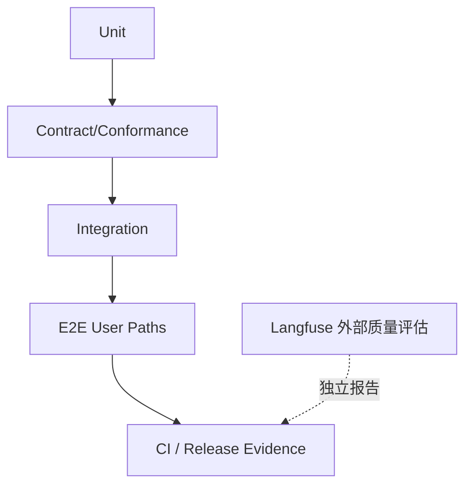
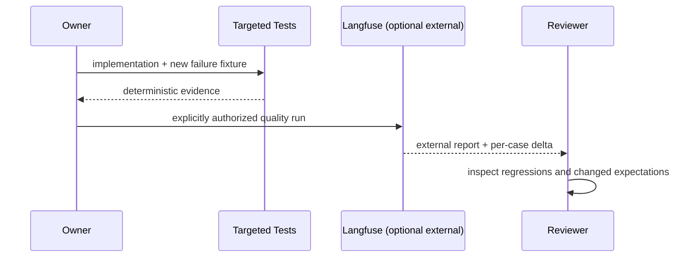

# 工程测试与外部质量评估策略

## 1. 证据层位置

本地测试与工程门禁证明确定性契约、安全边界和可复现行为。模型、检索、Memory/Experience 与任务质量评估计划交由外部 Langfuse 项目执行；不建设本地 Eval Runner 或 `evals/` 目录。外部质量分数不替代本地正确性和安全门禁。

## 2. 层级责任

| 层 | 回答 | 示例 |
|---|---|---|
| Unit | 局部算法是否正确 | state transition、budget、upcaster |
| Contract | provider 是否满足 port | MCP/LSP/tool/store conformance |
| Integration | 多模块组合是否成立 | Runtime→Tool→Evidence→Session |
| E2E | 用户路径/部署是否成立 | CLI/Web/Desktop start→approve→resume |
| 外部质量评估 | 跨数据集的模型/产品质量趋势 | retrieval relevance、Experience paired comparison、task quality；由 Langfuse 运行和报告 |
| Security | 是否能违反边界 | path escape、approval reuse、scope leakage |

## 3. Fixture 设计

Fixture 使用稳定 ID/clock、临时 workspace、fake model/provider 和显式 expected events。禁止以网络、当前主目录或真实 secret 作为普通测试前置。模型 fixture 记录 semantic response，不依赖 token chunk 的偶然分片。

## 4. 外部评估边界

Langfuse 中的评估数据集、评分器/人工判读和运行报告由外部项目管理；本仓只定义需要回答的产品问题、事件/指标语义和隐私约束，不复制一套本地数据集或评分执行框架。外部评估需标明数据版本、模型/配置、样本量、阈值来源和失败样例，以便结果可解释、可复查。

外部评估仅用于可能不确定的质量问题，例如检索相关性、经验复用收益和任务结果趋势。关键安全/权限条件必须用本地确定性断言，禁止用 LLM-as-judge 证明“没有越权”或“删除已生效”。

### 4.1 能力评测卡与独立 oracle

每条关键能力记录：固定任务与 workspace、允许操作、期望/禁止事件、模型可见输入来源、Receipt、外部世界状态、失败/`unknown`、模型/工具调用数、延迟与内存、脱敏规则、基线版本。**至少有一个不依赖 Agent 自述的 oracle**：例如执行 `commit_patch` 后重读目标文件、比较未触及文件字节，并核对 Receipt/Observation 与 Ledger 投影。进程退出 0 或回答“已完成”不能代替它。

| 风险 | 正例与反例 | Oracle |
|---|---|---|
| P2 Runtime 拆分 | 合法审批/补丁路径；事件乱序或丢 Receipt | 现有 CLI e2e、Ledger replay 与外部文件状态 |
| P4 Memory | 正确来源；过期、撤销、冲突、跨 scope、注入 | 本地测试断言必须/禁止的来源 ID 与权限；外部 Langfuse 只比较相关性与任务质量 |
| P5 外部动作 | 对账成功；执行后状态未知或重试碰撞 | 命令 ID、before-image、Receipt、独立观察和无重复副作用 |

`SNAP-070` 的通用 recorded-session harness 仍是 P7 目标；P2 不能把它当作既有测试前置。现有小型离线检索 fixture 和四项性能 gate 只能证明受控输入下的回归边界，不代表开放域任务成功率或产品 SLA。使用 Langfuse 评估属于显式、可选的外部流程，不是 P2/P7 本地 CI 的前置条件。

## 5. 变更流程

修改预期值需与实现 diff 分开说明；修复一个 Case 时必须检查邻近反例，防止针对 fixture 过拟合。

## 6. 参数

| 参数 | 推荐 |
|---|---|
| random seed | 固定并报告；可有 nightly multi-seed |
| flaky retry | 一次仅用于分类，最终仍标 flaky/fail |
| model/network lane | 本地 CI 默认离线；Langfuse 评估显式启动、单独授权和报告 |
| external eval aggregation | 同时查看 case-level 变化与总体趋势；不作为本地安全 hard gate |
| coverage | 关注风险/状态转换，不把行覆盖率当目标 |

## 7. 验收

每个关键不变量至少一个本地正例和反例；所有 provider family 有 conformance；修复事故加入 fixture；如运行 Langfuse 外部评估，报告可追到数据集版本/model/config；失败能定位 owning module，而不是只给总分。未运行的外部评估必须标为未验证。
