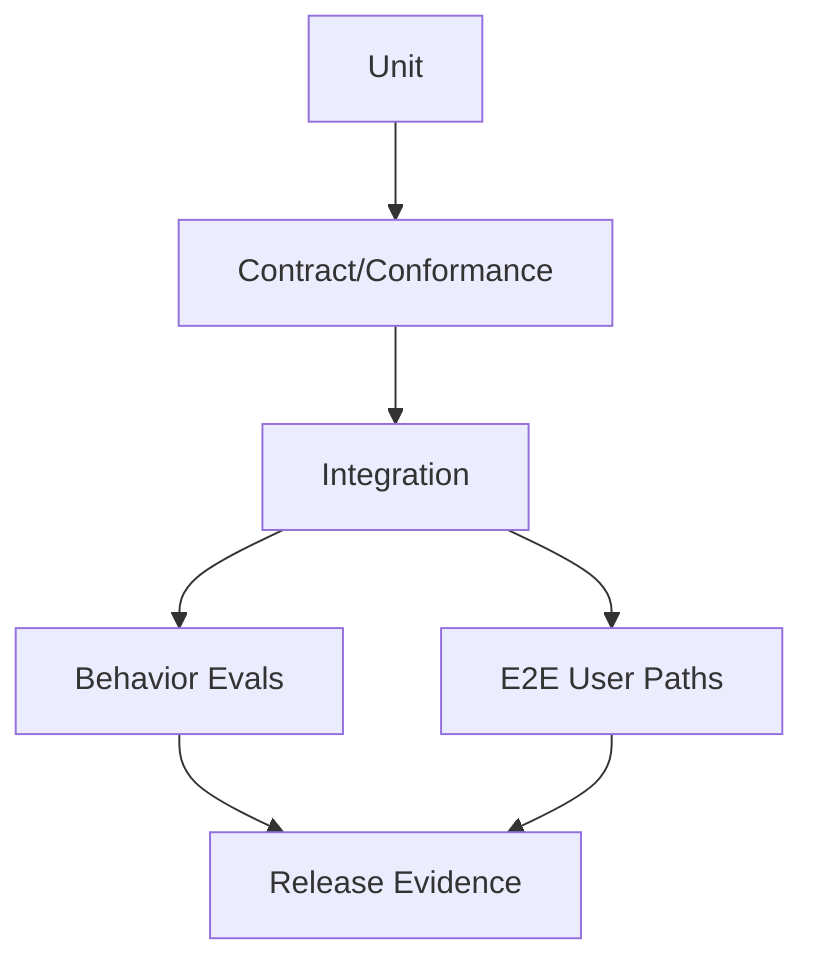
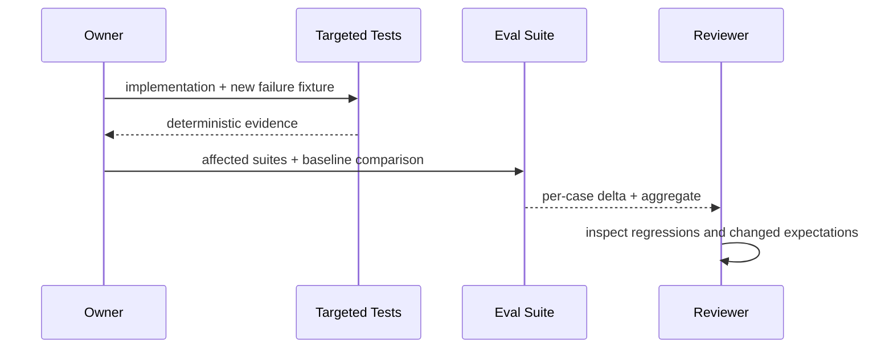

# 测试与 Eval 策略

## 1. 证据层位置



测试证明确定性契约和边界；Eval 衡量可能带模型/检索不确定性的质量。二者不能用同一个“通过率”混合。

## 2. 层级责任

| 层 | 回答 | 示例 |
|---|---|---|
| Unit | 局部算法是否正确 | state transition、budget、upcaster |
| Contract | provider 是否满足 port | MCP/LSP/tool/store conformance |
| Integration | 多模块组合是否成立 | Runtime→Tool→Evidence→Session |
| E2E | 用户路径/部署是否成立 | CLI/Web/Desktop start→approve→resume |
| Eval | 质量是否改善/退化 | retrieval precision、episode boundary、task success |
| Security | 是否能违反边界 | path escape、approval reuse、scope leakage |

## 3. Fixture 设计

Fixture 使用稳定 ID/clock、临时 workspace、fake model/provider 和显式 expected events。禁止以网络、当前主目录或真实 secret 作为普通测试前置。模型 fixture 记录 semantic response，不依赖 token chunk 的偶然分片。

## 4. Eval Case

```yaml
id: memory-version-conflict
input: fixtures/sessions/version-conflict.jsonl
profile: eval-local
expected:
  must_retrieve: [new-decision]
  must_not_retrieve: [superseded-decision]
  require_evidence: true
scorers: [scope, freshness, provenance]
```

每个 scorer 写明人类语义、确定性/模型裁判、阈值来源和失败样例。LLM-as-judge 只能辅助，关键安全/权限条件使用确定性断言。

### 4.1 能力评测卡与独立 oracle

每条关键能力记录：固定任务与 workspace、允许操作、期望/禁止事件、模型可见输入来源、Receipt、外部世界状态、失败/`unknown`、模型/工具调用数、延迟与内存、脱敏规则、基线版本。**至少有一个不依赖 Agent 自述的 oracle**：例如执行 `commit_patch` 后重读目标文件、比较未触及文件字节，并核对 Receipt/Observation 与 Ledger 投影。进程退出 0 或回答“已完成”不能代替它。

| 风险 | 正例与反例 | Oracle |
|---|---|---|
| P2 Runtime 拆分 | 合法审批/补丁路径；事件乱序或丢 Receipt | 现有 CLI e2e、Ledger replay 与外部文件状态 |
| P4 Memory | 正确来源；过期、撤销、冲突、跨 scope、注入 | Context 中必须/禁止的来源 ID 与权限断言 |
| P5 外部动作 | 对账成功；执行后状态未知或重试碰撞 | 命令 ID、before-image、Receipt、独立观察和无重复副作用 |

`SNAP-070` 的通用 recorded-session harness 仍是 P7 目标；P2 不能把它当作既有测试前置。现有小型离线检索 fixture 和四项性能 gate 只能证明受控输入下的回归边界，不代表开放域任务成功率或产品 SLA。

## 5. 变更流程



修改预期值需与实现 diff 分开说明；修复一个 Case 时必须检查邻近反例，防止针对 fixture 过拟合。

## 6. 参数

| 参数 | 推荐 |
|---|---|
| random seed | 固定并报告；可有 nightly multi-seed |
| flaky retry | 一次仅用于分类，最终仍标 flaky/fail |
| model/network lane | 默认离线；真实模型独立非阻塞/受预算 lane |
| eval aggregation | 同时看 case-level hard gates 与总体趋势 |
| coverage | 关注风险/状态转换，不把行覆盖率当目标 |

## 7. 验收

每个关键不变量至少一个正例和反例；所有 provider family 有 conformance；修复事故加入 fixture；Eval report 可追到 case/version/model/config；失败能定位 owning module，而不是只给总分。
