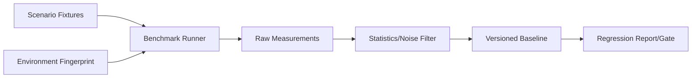
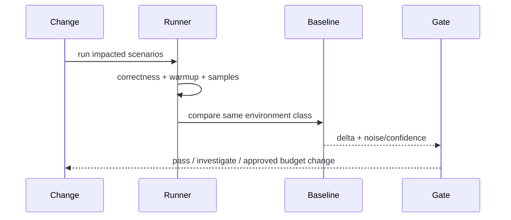

# Benchmark 系统设计

## 1. 架构位置

Benchmark 测性能/资源，不判断语义正确；场景必须先通过 correctness assertion，速度更快但结果错误不能被记录为优化。

## 2. 场景目录

| 场景 | 主要指标 | 必要正确性 |
|---|---|---|
| cold/warm startup | ready latency、RSS | protocol ready/capabilities 正确 |
| session open/replay | p50/p95、events/s、peak memory | final projection digest |
| ledger append | latency、throughput、fsync mode | versions/no loss |
| context build/compact | latency、tokens/bytes | anchors/provenance preserved |
| memory retrieve | latency、index size | required/forbidden IDs |
| tool large output | wall time、spill bytes | receipt/artifact/truncation |
| client catch-up | events/s、render/update cost | final store digest |

## 3. Measurement 模型

每次 run 记录 commit、scenario version、config/profile digest、OS/CPU/memory/runtime、warmup、sample count、raw samples、summary 和 correctness result。基线不能只有一个平均值；至少保存 median、p95、MAD/variance 和资源峰值。

## 4. 回归判断

小于测量噪声的变化不报回归；超过预算但有明确产品收益可经 Note 调整基线，必须同时记录成本，不得直接覆盖 baseline。

## 5. 参数

| 参数 | 推荐 |
|---|---|
| warmup | 按场景固定并报告 |
| samples | 先由变异度决定，不统一写死 |
| comparison | 同 runner class、同 profile、同 fixture version |
| hard gate | 少数用户关键路径；其余趋势告警 |
| baseline update | reviewed artifact，绑定 commit/原因 |
| network/model | 不进核心 perf gate；单独端到端观测 |

## 6. 防作弊与可用性

禁止通过减少验证、丢事件、缩短 fixture 或缓存跨 case 数据获得“优化”。Runner 默认 offline、临时目录隔离、固定 clock/seed；报告给出复现命令和 raw artifact。

## 7. 验收与待决策

同机重复运行误差可量化；故意注入慢路径能触发 gate；错误输出不能获得有效性能结果；baseline 文件可 code review。待定：固定 CI runner 规格、各场景预算、是否发布公开 benchmark dashboard。

