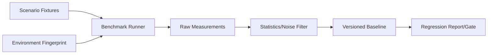
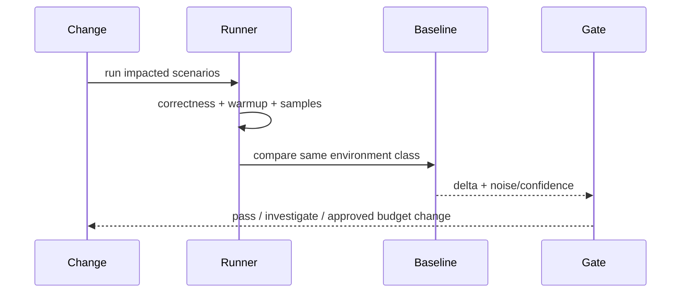

# Benchmark 系统设计

> 当前实现边界（BENCH-072/073）：仓库已有 Node 离线 harness 和八条固定用户路径场景；每个 manifest 有 correctness 命令、固定样本配置与受审 wall-time P95 上限，专用 CI job 固定 Ubuntu 24.04 / Node 22.19.0 并上传原始报告。普通 `pnpm test` 只运行 harness 契约测试，不运行性能场景。首轮本地校准为 macOS ARM64 / Node 24.21.0；CI 首次报告仍需审查后再收紧预算。当前上限是硬 guardrail，不是跨提交统计比较；v1 暂不测量进程树 RSS/CPU。

## 1. 架构位置

```mermaid
flowchart LR
  SC[Scenario Fixtures] --> RN[Benchmark Runner]
  EN[Environment Fingerprint] --> RN
  RN --> MT[Raw Measurements]
  MT --> ST[Statistics/Noise Filter]
  ST --> BL[Versioned Baseline]
  BL --> RP[Regression Report/Gate]
```

Benchmark 测性能/资源，不判断语义正确；场景必须先通过 correctness assertion，速度更快但结果错误不能被记录为优化。

## 2. 场景目录

| 场景 | 主要指标 | 必要正确性 |
|---|---|---|
| cold/warm startup | ready latency、RSS | protocol ready/capabilities 正确 |
| session open/replay | p50/p95、events/s、peak memory | final projection digest |
| ledger append | latency、throughput、fsync mode | versions/no loss |
| context build/compact | latency、tokens/bytes | anchors/provenance preserved |
| memory retrieve | latency、index size | required/forbidden IDs |
| tool large output | wall time、spill bytes | receipt/artifact/truncation |
| client catch-up | events/s、render/update cost | final store digest |

BENCH-073 将首批场景固定为 Runtime/Host readiness、50-event Ledger
append、Tool-backed Run replay、长历史 Context compaction、128 条受治理
Memory recall、只读 `read_file` Tool、Run cancel/quiescence、pending-plan
Run recovery。对应 manifest、正确性 oracle、初始 P95 与上限见
`benchmarks/README.md`；场景入口位于 `benchmarks/paths/scenario.mjs`。

## 3. Measurement 模型

每次 run 记录 commit、scenario version、config/profile digest、OS/CPU/memory/runtime、warmup、sample count、raw samples、summary 和 correctness result。基线不能只有一个平均值；至少保存 median、p95、MAD/variance 和资源峰值。

## 4. 回归判断

```mermaid
sequenceDiagram
  participant PR as Change
  participant R as Runner
  participant B as Baseline
  participant G as Gate
  PR->>R: run impacted scenarios
  R->>R: correctness + warmup + samples
  R->>B: compare same environment class
  B-->>G: delta + noise/confidence
  G-->>PR: pass / investigate / approved budget change
```

小于测量噪声的变化不报回归；超过预算但有明确产品收益可经 Note 调整基线，必须同时记录成本，不得直接覆盖 baseline。

## 5. 参数

| 参数 | 推荐 |
|---|---|
| warmup | 按场景固定并报告 |
| samples | 先由变异度决定，不统一写死 |
| comparison | 同 runner class、同 profile、同 fixture version |
| hard gate | 少数用户关键路径；其余趋势告警 |
| baseline update | reviewed artifact，绑定 commit/原因 |
| network/model | 不进核心 perf gate；单独端到端观测 |

**DEC-12 已接受**：PR 使用固定、可复现的 Runner class 与受控运行时，运行有代表性的关键路径子集；更大场景放到 nightly/release。先以观察模式测量噪声，再逐步阻断少数关键路径。此处参考 DSH 将 Benchmark 放入独立 PR lane 的做法，但不照搬它的专用 Runner 规格；Outlive 的机器规格和具体预算须经基线测量后校准。

## 6. 防作弊与可用性

禁止通过减少验证、丢事件、缩短 fixture 或缓存跨 case 数据获得“优化”。场景 fixture 应固定 clock/seed；Runner 默认 offline、临时目录隔离，报告给出复现命令和 raw artifact。

### BENCH-072 当前 Runner

实现位于 `benchmarks/support/runner.mjs`，规则见 `benchmarks/AGENTS.md`。场景 JSON 固定 correctness command、工作目录、warmup/sample 次数、超时与 wall-time P95 预算；正确性失败会生成失败报告并跳过计时。每条 correctness/warmup/sample 命令都在新 Node 进程与私有临时 HOME/TMP 下执行，Node fetch/TCP/TLS/UDP/DNS 限于 loopback，凭据与代理环境变量被清除，继承的 `NODE_OPTIONS` 被替换为受控 offline guard。每次运行写一份不覆盖的有界 JSON 到忽略目录 `_tmp_benchmarks/reports/`，保留原始耗时/退出状态、median/P95/MAD/min/max、预算结果、场景配置 SHA-256、commit/dirty 状态、OS/CPU/Node 元数据；不保留 stdout/stderr、绝对路径、用户名或环境值。测试覆盖正确性 fail-closed、timeout、预算失败、离线 guard、临时目录清理与报告脱敏。

Runner v1 报告 wall time；它不把机器总内存冒充测得 RSS，也没有跨进程 CPU/RSS 采样。BENCH-073 已加入路径上限和 CI 报告；首轮 CI 数据用于后续校准，不会自动改写预算。跨提交噪声模型和可移植资源适配器仍延期。G16 evals 保持独立。

## 7. 验收与实施校准

同机重复运行误差可量化；故意降低预算会触发 gate；错误输出不能获得有效性能结果；manifest 预算可 code review。DEC-12 的固定 Runner class 已落为 Ubuntu 24.04 / Node 22.19.0 CI job。上限变化必须通过 manifest diff 显式审查；是否发布公开 benchmark dashboard 属于后续发布选择，不阻塞本地 Benchmark。
