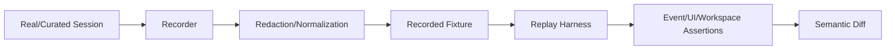
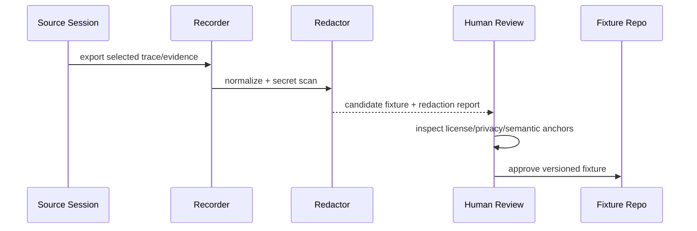

# 录制会话 Snapshot 设计

## 1. 位置



Snapshot 捕获真实交互形态，补足手写测试遗漏；它不是简单对整段 JSON 做字符比较，也不在回放时重新执行真实副作用。

## 2. Fixture 结构

```text
snapshots/<case>/
├── manifest.yaml       case/schema/recorder/source digest
├── input.events.jsonl  归一化输入与 recorded provider responses
├── workspace.before/   最小输入树或内容寻址包
├── expected.events.jsonl
├── workspace.after.manifest.json
├── assertions.yaml     必须/禁止事件与业务结果
└── REDACTION.md        脱敏与人工审查说明
```

时间、随机 ID、路径和模型 chunk 可规范化；因果顺序、状态、Receipt、Artifact digest 和用户可见行为不可随意抹平。

## 3. 录制与晋级



真实用户数据默认不得进入仓库；优先在本地重演后人工合成最小等价 fixture。任何凭据、个人路径、远程 URL token、私人代码都必须排除。

## 4. 回放模式

| 模式 | Provider | 用途 |
|---|---|---|
| protocol replay | recorded model/tool responses | Runtime 事件确定性 |
| state replay | event ledger only | Projection/client/store |
| workspace replay | fake/sandbox execution | 文件副作用与 Artifact |
| UI replay | recorded protocol stream | Web/Desktop 展示回归 |

Snapshot 更新必须显示 semantic diff：新增/删除事件、状态改变、EvidenceRef 改变、workspace digest 和用户可见文本类别。

## 5. 参数

| 参数 | 推荐 |
|---|---|
| fixture size | 最小可解释；大 artifact 内容寻址/单独存放 |
| normalization | 明确字段 allowlist，不全局正则抹掉差异 |
| update mode | 显式命令 + 人工 review |
| compatibility | 保留旧 schema fixture，测试 upcaster |
| retention | 按关键场景价值，不按录制日期无限增长 |

## 6. 验收

同 fixture 离线重复得到相同语义 digest；secret scan 通过；旧 fixture 在新版本可重放；故意改变状态机或 UI 事件触发可读 diff；workspace 结果独立验证，不接受模型“完成”文本作为断言。

