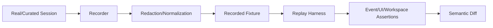
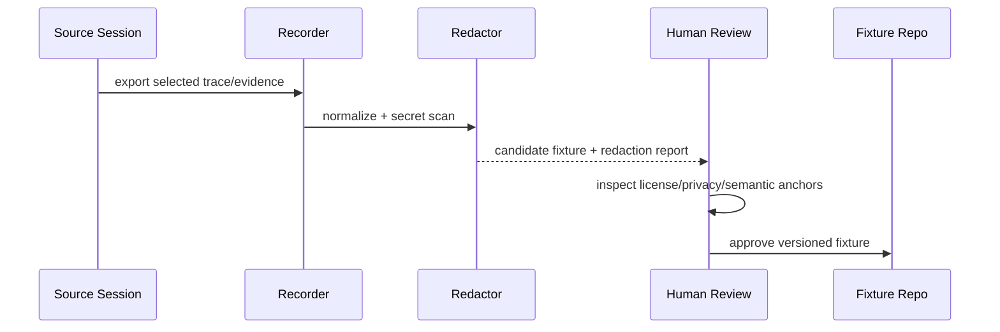

# 录制会话 Snapshot 设计

> 当前实现边界：**SNAP-070/071 已交付五个有界合成 Runtime fixture**：最小完成、recovery、用户取消、reviewed Memory recall 和只读 subagent。无凭据只读 replay 同时比较稳定事件摘要与 workspace 前后路径/内容摘要；显式离线 capture 导入仍只支持 `minimal-completion`。Live Session 导出、UI replay、OS 级 crash 注入和 workspace 变更之外的副作用仍是后续设计目标。

## 1. 位置


```mermaid
flowchart LR
  LIVE[Real/Curated Session] --> REC[Recorder]
  REC --> RED[Redaction/Normalization]
  RED --> FX[Recorded Fixture]
  FX --> RP[Replay Harness]
  RP --> AS[Event/UI/Workspace Assertions]
  AS --> DIFF[Semantic Diff]
```

Snapshot 捕获真实交互形态，补足手写测试遗漏；它不是简单对整段 JSON 做字符比较，也不在回放时重新执行真实副作用。

## 2. Fixture 结构

SNAP-070/071 的 accepted fixture 位于 `snapshots/<profile>/<scenario>/`，严格包含 `snapshot.json`、`input.json`、`model-stream.jsonl`、`expected.json` 和 `REDACTION.md`。Expected 固定 Run status/outcome/failure code、有序 event type/summary，以及 workspace 前后排序条目（相对路径、file/directory 类型和文件 SHA-256）；不包含 volatile ID、时间戳或 hidden reasoning。Snapshot 读取有文件数、文件字节、workspace entry 与总字节上限。Record 候选写到被 Git 忽略的 `snapshots/candidates/`，人工检查后才能晋级。

```text
snapshots/runtime/minimal-completion/  # SNAP-070 accepted fixture
├── snapshot.json
├── input.json
├── model-stream.jsonl
├── expected.json
└── REDACTION.md
```

后续 richer scenario 的目标布局可以扩展为：

```text
snapshots/<case>/
├── manifest.yaml       case/schema/recorder/source digest
├── input.events.jsonl  归一化输入与 recorded provider responses
├── workspace.before/   最小输入树或内容寻址包
├── expected.events.jsonl
├── workspace.after.manifest.json
├── assertions.yaml     必须/禁止事件与业务结果
└── REDACTION.md        脱敏与人工审查说明
```

时间、随机 ID、路径和模型 chunk 可规范化；因果顺序、状态、Receipt、Artifact digest 和用户可见行为不可随意抹平。

## 3. 录制与晋级


```mermaid
sequenceDiagram
  participant S as Source Session
  participant R as Recorder
  participant D as Redactor
  participant H as Human Review
  participant F as Fixture Repo
  S->>R: export selected trace/evidence
  R->>D: normalize + secret scan
  D-->>H: candidate fixture + redaction report
  H->>H: inspect license/privacy/semantic anchors
  H->>F: approve versioned fixture
```

真实用户数据默认不得进入仓库；优先在本地重演后人工合成最小等价 fixture。任何凭据、个人路径、远程 URL token、私人代码都必须排除。

## 4. 回放模式

下表描述的 state-only 与 UI replay 仍是目标能力；当前五个 accepted case 通过真实 Runtime、合成 provider 和 fixture sandbox 做有界回放。

| 模式 | Provider | 用途 |
|---|---|---|
| protocol replay | recorded model/tool responses | Runtime 事件确定性 |
| state replay | event ledger only | Projection/client/store |
| workspace replay | fake/sandbox execution | 文件副作用与 Artifact |
| UI replay | recorded protocol stream | Web/Desktop 展示回归 |

Snapshot 更新必须显示 semantic diff：新增/删除事件、状态改变、EvidenceRef 改变、workspace digest 和用户可见文本类别。

## 5. 参数

| 参数 | 推荐 |
|---|---|
| fixture size | 最小可解释；大 artifact 内容寻址/单独存放 |
| normalization | 明确字段 allowlist，不全局正则抹掉差异 |
| update mode | 显式命令 + 人工 review |
| compatibility | 保留旧 schema fixture，测试 upcaster |
| retention | 按关键场景价值，不按录制日期无限增长 |

## 6. 验收

SNAP-070/071 当前已验证：

- 根 `pnpm test` 在递归包测试前 replay 五个 accepted case；`pnpm run test:snapshots` 可单独执行此门禁。
- `runtime/recovery` 从待审批 Run 写入 `run.interrupted`，新 Runtime 执行 resume、重发 approval、获批后应用 patch；事件摘要与 `src/add.ts` 前后摘要同时比较。
- `runtime/cancel` 在 provider 请求阻塞时提交用户 cancel，并比较排队/消费/终止事件及未变化的 workspace。
- `memory/memory-recall` 创建并审核合成 V2 Memory，断言三个 `memory.use_status` 阶段；`runtime/subagent` 通过 readonly profile 委派一个 child，并断言 started/completed receipt。两者也比较未变化的 workspace。
- 最小场景与四类 SNAP-071 场景都在无 provider-key 环境中运行；replay 只读取 accepted fixture。
- `record --case <profile/scenario> --source <capture.json> --write` 只创建新候选，不覆盖；敏感字段、常见 token/private-key 和个人绝对路径在写盘前拒绝。
- `refresh --case <profile/scenario>` 输出事件和 workspace manifest 的 semantic diff；只有附带 `--write` 才替换 `expected.json`，input 与 model stream 不变。Capture importer 当前只接受最小完成场景。
- `@tracegraph/test-support` 包内用隔离无凭据子进程验证 minimal fixture replay 只读，并为 SNAP-071 四类场景验证行为锚点、workspace 变化/不变和 workspace-only drift。

Live Session 导出、state-only/UI replay 和任意真实用户数据录制仍是设计目标，不随 SNAP-070/071 一并宣称完成。

同 fixture 离线重复得到相同语义 digest；secret scan 通过；旧 fixture 在新版本可重放；故意改变状态机或 UI 事件触发可读 diff；workspace 结果独立验证，不接受模型“完成”文本作为断言。
