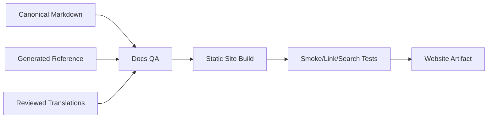
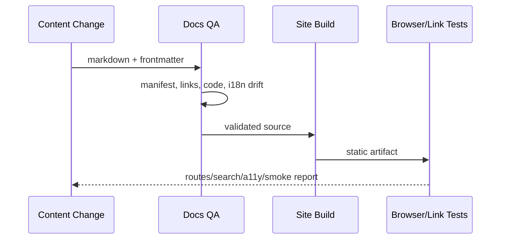

# Docs、i18n 与 Website 质量设计

## 1. 发布链

Website 消费仓库文档，不在 CMS 中维护第二份架构真源。若未来采用独立前端/WordPress，只能通过构建/同步读取版本化内容。

建设时机：不与 V2 实现并行。只有 P1–P7 实现阶段完成并进入 P8，且治理前置条件满足后，才启动 `SITE-085`；在此之前，仓库内的 `docs/` 与 README 已是完整、可直接使用的文档入口。

## 2. 内容分层

| 层 | 受众 | 发布要求 |
|---|---|---|
| Architecture/design | 贡献者/评审者 | 清楚标 `proposed/current` |
| Module/reference | 实现者 | 与代码/schema 版本绑定 |
| Guide/tutorial | 用户 | 命令可执行、环境前置清楚 |
| Concepts | 全部 | 术语一致、避免内部文件细节 |
| Release/limitations | 用户 | 每版本不可缺失 |

内部 reference-lineage 或敏感 Note 默认不发布，但公开设计需独立成立，不能出现“看内部文档才知道安全边界”。

## 3. i18n 质量门

翻译检查：source digest、新增/删除段落、术语表、链接、代码块、配置 key、标题锚点和页面状态。机器翻译可生成 draft，合并前由熟悉领域的人审查；技术事实变更优先更新 canonical，再同步翻译。

## 4. Website 功能边界

V2 Website 最小功能：版本切换、语言切换、全文搜索、编辑源文件链接、状态 badge、API reference、release/upgrade/limitations。账号、评论、论坛、遥测 dashboard 和云控制台不进入 docs site 核心。

## 5. 构建与验证

## 6. 参数

| 参数 | 推荐 |
|---|---|
| versioning | stable + latest + explicitly archived |
| default language | 按目标社区决定；URL 始终含可预测 locale/version |
| external links | 定期检查，网络抖动先告警后 hard fail |
| analytics | 默认无/隐私友好 opt-in，不采集源码或 prompt |
| accessibility | keyboard、contrast、semantic heading 作为发布门 |
| search index | 由构建产物生成，按版本/语言隔离 |

## 7. 验收标准

从 canonical Markdown 可重复构建站点；断链、stale translation、不可运行示例和缺失状态标记会失败；版本/语言切换不会落到错误内容；公开页面能回到源文件和对应版本。

## 8. 待评审

静态站点框架、域名与部署平台；公开文档 canonical 语言；是否发布 V2 proposed 设计；是否允许社区翻译，以及翻译 owner/过期策略。
