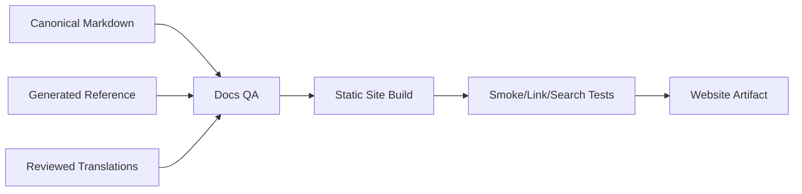
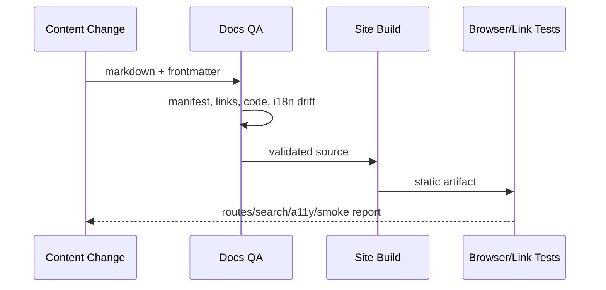

# Docs、i18n 与 Website 质量设计

**DEC-10 已接受：**P1–P7 完成后，在 P8 使用 VitePress 从版本化 `docs/` 构建静态文档站；站点是 Markdown 的发布投影，不是第二份文档真源。公开 API/用户指南以英文为源、中文为人工审校配对版；当前 V2 设计集保持中文源。

## 1. 发布链

```mermaid
flowchart LR
  MD[Canonical Markdown] --> QA[Docs QA]
  API[Generated Reference] --> QA
  TR[Reviewed Translations] --> QA
  QA --> SG[Static Site Build]
  SG --> SM[Smoke/Link/Search Tests]
  SM --> DEP[Website Artifact]
```

Website 消费仓库文档，不在 CMS 中维护第二份架构真源。若未来采用独立前端/WordPress，只能通过构建/同步读取版本化内容。

建设时机：不与 V2 实现并行。只有 P1–P7 实现阶段完成并进入 P8，且治理前置条件满足后，才启动 `SITE-085`；在此之前，仓库内的 `docs/` 与 README 已是完整、可直接使用的文档入口。

## 2. 内容分层

| 层 | 受众 | 发布要求 |
|---|---|---|
| Architecture/design | 贡献者/评审者 | 清楚标 `proposed/current` |
| Module/reference | 实现者 | 与代码/schema 版本绑定 |
| Guide/tutorial | 用户 | 命令可执行、环境前置清楚 |
| Concepts | 全部 | 术语一致、避免内部文件细节 |
| Release/limitations | 用户 | 每版本不可缺失 |

内部 reference-lineage 或敏感 Note 默认不发布，但公开设计需独立成立，不能出现“看内部文档才知道安全边界”。

## 3. i18n 质量门

翻译检查：source digest、新增/删除段落、术语表、链接、代码块、配置 key、标题锚点和页面状态。机器翻译可生成 draft，合并前由熟悉领域的人审查；技术事实变更优先更新 canonical，再同步翻译。

## 4. Website 功能边界

V2 Website 最小功能：版本切换、语言切换、全文搜索、编辑源文件链接、状态 badge、API reference、release/upgrade/limitations。账号、评论、论坛、遥测 dashboard 和云控制台不进入 docs site 核心。

## 5. 构建与验证

```mermaid
sequenceDiagram
  participant C as Content Change
  participant Q as Docs QA
  participant B as Site Build
  participant T as Browser/Link Tests
  C->>Q: markdown + frontmatter
  Q->>Q: manifest, links, code, i18n drift
  Q->>B: validated source
  B->>T: static artifact
  T-->>C: routes/search/a11y/smoke report
```

## 6. 参数

| 参数 | 推荐 |
|---|---|
| versioning | stable + latest + explicitly archived |
| default language | 当前 V2 设计文档以 `zh-CN` 为源；公开用户文档以英文为源并提供审校中文配对；URL 含可预测 locale/version |
| external links | 定期检查，网络抖动先告警后 hard fail |
| analytics | 默认无/隐私友好 opt-in，不采集源码或 prompt |
| accessibility | keyboard、contrast、semantic heading 作为发布门 |
| search index | 由构建产物生成，按版本/语言隔离 |

## 7. 验收标准

从 canonical Markdown 可重复构建站点；断链、stale translation、不可运行示例和缺失状态标记会失败；版本/语言切换不会落到错误内容；公开页面能回到源文件和对应版本。

## 8. 已裁决方向与 P8 仍需确定的实施细节

已裁决：采用 VitePress；公开 API/用户指南英文 canonical、中文人工审校配对；社区翻译可通过 PR 贡献，合并前须经过事实、术语和链接审校；Website 延至 P8 并从规范 Markdown 构建。

仍需在 P8 按当时发布需求确定域名、托管/部署平台、是否公开 V2 proposed 设计，以及社区翻译的具体 owner 与过期复核流程。这些运营细节不改变 DEC-10 已接受的真源、语言和审校原则。
