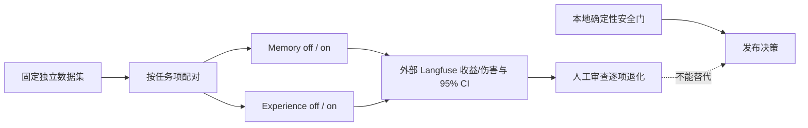

# Memory 与 Experience 配对外部评估方案

## 1. 当前状态与能力边界

**`MEM-048` 已完成首轮本机 Langfuse 合成数据 paired pilot，状态为 `exploratory-inconclusive`。** 两条 lane 均有 48 个冻结任务项、control/treatment run、逐项 trace/score、配对收益/伤害与 95% 区间。2026-10-03 又按 `EVAL-074` 完成一次性公开 LongMemEval / LongMemEval-V2 对照，使用本地评估 runner 并保留逐题报告；这没有把 Langfuse 加入本地 CI，也没有完成真实任务分布的独立验证。



| 评估对象 | 当前可核对能力 | 正式 V2 对照的前置条件 |
|---|---|---|
| Memory | G-21 V1 保持独立；`MEM-049` 已将 V2 eligibility gate 接到显式开关的 Runtime 消费者，默认关闭。 | 本轮以 V2 Runtime Recall off/on 做合成任务对照；结论只适用于本地合成 pilot。 |
| Experience | `MEM-050` 已提供 owner-scoped 生命周期、validated-only 召回、scope/applicability/counterexample 检查和 Context provenance；Runtime 默认关闭。 | 本轮以 Experience Recall off/on 做合成任务对照；结论只适用于本地合成 pilot。 |

本轮提供了可复核的“有/无”运行对照，但不能据此声称开放域任务上的通用收益或无伤害。Langfuse 以本机 self-hosted 模式运行；合成输入、输出和 traces 均留在本机，没有发送真实 Session、用户 Memory 或生产数据。正式计分使用 `mem-101..148` 与 `exp-101..148` 新 ID；此前用作 Runtime 诊断的 `mem-001/002` 已从整轮结果中排除。

## 2. 评估问题与对照臂

先分别评估 Memory 和 Experience，不把两种机制合在一个处理臂，以免混淆各自贡献。两项研究都使用同一组固定任务分别运行 control/treatment，并按稳定的 `eval_case_id` 配对。

| 研究 | Control | Treatment | 解释边界 |
|---|---|---|---|
| Memory | 当前任务不提供任何 Memory 内容。 | 仅提供当前 policy 明确允许、scope 匹配、未过期/撤销/冲突且带有效来源的 Memory。 | 测量“允许 Memory 可用”这一处理臂的增量；不得从模型自述推断它实际依赖了 Memory。G-21/legacy 试跑不得标成 V2 结果。 |
| Experience | 不提供 Experience Case。 | 只提供已审核为 `validated`、条件匹配、当前适用且带反例/来源的 Experience Case。 | 候选不能进入处理臂；注入或展示不等于采纳，采纳也不等于成功。只按当前任务的外部验证结果判分。 |

当前只规定两个独立 paired study。`Memory × Experience` 交互对照是后续问题，只有两项单独对照都可运行且具备足够样本后再单独预注册。

## 3. 数据集与运行控制

1. 在 Langfuse 外部项目中固定独立验证集版本；它不能被用于抽取器、检索排序、提示词或评分器调参。调参与试运行使用另一份 development set。
2. 首批仅用人工编写的合成任务和合成 Memory/Experience。不得把真实 Session、Prompt/响应、Memory 正文、源码、凭据、可识别用户信息或未经脱敏的 Artifact 放入数据集或 Trace。真实数据只有在用户对具体数据范围明确 opt-in、最小化/脱敏完成且存在可撤回配置后才能另行评审。
3. 任务族至少覆盖：需要记忆的任务、无需记忆即可完成的任务、过期/冲突/条件不匹配案例；Experience 集还要覆盖失败经验、关键版本/环境不同、反例应阻止复用。安全与越权案例仍由本地确定性测试验证，不把外部裁判当安全 Oracle。
4. 两臂固定相同的应用 commit、系统/提示词版本、模型与 Provider 配置、工具权限、任务预算、评分器版本和数据集版本；唯一区别是 Memory 或 Experience 开关。随机化臂运行顺序；若使用重复采样，先规定重复数和随机种子。
5. 为人工成对评分隐藏 arm 标签；保留逐项差异和失败样例，不只比较总分。Langfuse 对比应使用同一数据集版本与评分器定义，并记录代码、模型、提示词及评估器版本。参照 [Langfuse 数据集](https://langfuse.com/docs/evaluation/experiments/datasets) 与[实验对比](https://langfuse.com/docs/evaluation/experiments/compare-experiments)。

### 3.1 2026-10-01 首轮本机合成试运行

Langfuse v4 self-hosted API 在本次部署未返回 dataset version；报告以 dataset 名称、冻结输入 SHA-256、48 项 read-back 校验和四个不可变 run ID 锁定本轮结果，不伪造版本时间戳。首次无效尝试均保留在本机审计文件并从指标中排除。

| Lane | Langfuse 数据集（SHA-256） | Control run | Treatment run | 配对收益 | 95% task-family-stratified CI | Treatment 退化 |
|---|---|---|---|---:|---:|---|
| Memory V2 | `mem048-memory-synthetic-holdout-20261001062250-6305985b` (`d69a25841c97678bf69c1431969574a3c2ec3358a41744784270b5c73289da22`) | [2342a18248967a5b](http://127.0.0.1:3000/project/mem048-synthetic/datasets/cmup5dnui005vp406dv91i9kh/runs/2342a18248967a5b) | [306fe8d467b6d916](http://127.0.0.1:3000/project/mem048-synthetic/datasets/cmup5dnui005vp406dv91i9kh/runs/306fe8d467b6d916) | 24 wins / 24 ties / 0 losses；24/48 → 48/48，`+50.0 pp` | `[+50.0, +50.0] pp` | 0 regressions；0 wrong treatment answers |
| Experience | `mem048-experience-synthetic-holdout-20261001062250-6305985b` (`729941b54f0756fc3734f5ca52e444167a9c03b4a9c79cd54fc1456018c3a3a1`) | [d0986e3d146f1199](http://127.0.0.1:3000/project/mem048-synthetic/datasets/cmup5do64007ap406a3nmph4q/runs/d0986e3d146f1199) | [8872fbd2051218e4](http://127.0.0.1:3000/project/mem048-synthetic/datasets/cmup5do64007ap406a3nmph4q/runs/8872fbd2051218e4) | 32 wins / 16 ties / 0 losses；16/48 → 48/48，`+66.7 pp` | `[+66.7, +66.7] pp` | 0 regressions；0 wrong treatment answers |

两条 lane 均使用 local `qwen3:4b`（Ollama `0.35.0`，model digest `359d7dd4bcdab3d86b87d73ac27966f4dbb9f5efdfcc75d34a8764a09474fae7`）、temperature `0`、固定 seed `20261001`、同版闭集 JSON token 输出与 exact-token Oracle；共 192 次模型运行。每个 run 的 48 个 item scores 与一条 run-level score 均通过 Langfuse v3 Scores API 读回；每条 lane 抽查一条 treatment trace 并解析到 observation。平均延迟：Memory off/on `380.7/425.0 ms`，Experience off/on `393.4/462.9 ms`；本地 Ollama 不提供可核验的计费成本。

区间按预注册的 task-family-stratified paired bootstrap、10,000 次重采样计算。由于每个合成任务仅采样一次，且每个 task family 内本轮结果一致，两项区间均退化为点区间；该 pilot **不能证明真实分布收益、统计功效或一般性无伤害**。应把它作为消费链/评估基础设施的初始行为证据，不用作发布质量阈值。

完整逐项数据和验证记录位于本机受限权限目录：`/Users/cain/.local/share/tracegraph-mem048-langfuse/reports/mem048-20261001062250-6305985b.json`；此前无效及因诊断重叠而排除的 run 见 `invalid-attempt-20261001.json` 与前一份带 `excluded-from-primary-evidence` 标记的报告。文件均为 mode `0600`。

## 4. 指标、伤害与统计口径

### 主要指标

- **`verified_task_completion_rate`**：每个任务由预先定义的独立 Oracle 判定是否完成；可以是确定性业务结果或盲态人工判定。模型回答“完成了”不算成功证据。报告 paired treatment − control 的绝对百分点差。
- **Memory 次要指标**：答案正确性、有效来源/引用支持率、检索结果 `precision@k`；分别报告定义、分母和逐项结果。`grounded_memory_rate` 是 Memory 记录本身的来源质量指标，不作为任务完成收益的替代指标。
- **Experience 次要指标**：Case 适用性判定、带当前业务验证的复用结果、错误建议率。不能仅以 Case 被召回、展示或模型声称使用作为复用成功。
- **资源指标**：token、模型调用数、延迟和成本按臂报告；不与质量分合成单一总分。

### 伤害指标

逐项记录 treatment 相对 control 新增或加剧的错误答案、无效/错误引用、过期或冲突材料影响、条件不匹配建议、额外返工/回滚，以及带来退化的任务数。给出伤害类型计数、分母、区间和经脱敏的代表案例。scope 泄漏、撤销/删除绕过、注入、权限/审批、安全副作用必须由本地确定性正反例测试阻断；即使外部质量得分上升，也不能豁免。

### 统计规则

- 以**任务项**为配对单位，报告各臂分母、paired wins/ties/losses、平均绝对差和双侧 **95% paired cluster-bootstrap 置信区间**；重复运行嵌套在任务项内，重采样时按任务项聚类，任务族分层，至少 10,000 次重采样。
- 最终独立验证前，按基线、最小有意义差异和预期配对差异率做样本量/功效计划。没有该计划、样本不足或区间跨越有意义的收益与伤害时，只能标为 exploratory / inconclusive，不能宣布成功或无伤害。
- 预先登记唯一主要指标、排除规则和评分器版本；次要指标标记为探索性，不因观察到结果后改变主指标。

### 参数

| 参数 | 规则 |
|---|---|
| `study_pairing_unit` | 固定数据集中的一个独立任务项；重复采样按任务项聚类 |
| `primary_metric` | `verified_task_completion_rate`，其余列为预注册次要/探索指标 |
| `confidence_level` | 双侧 95%；配对 cluster bootstrap 至少 10,000 次、按任务族分层 |
| `dataset_split` | 调参 development set 与最终独立验证集分离；最终集版本冻结 |
| `local_safety_gate` | 必须独立通过；Langfuse 分数不能覆盖本地安全失败 |

## 5. 隐私与外部运行边界

- 当前默认**不发送任何内容**。评估必须显式触发；Langfuse、网络、模型凭据不可用或无授权时，不阻塞本地测试、CI 或发布门禁，状态记录为 `not evaluated`。
- 合成数据运行也要审阅输出，避免模型意外输出用户数据或密钥；外部项目只保留评估所需字段，并设置访问、保留和删除策略。
- 建议最小元数据：随机 `eval_case_id`、task family、arm、run/replicate、应用 commit、配置/提示词/模型/评分器版本标识、必要的聚合分数、延迟/成本和脱敏后的判分依据。禁止放入稳定用户 ID、路径、原始来源 locator 或不必要的 Memory/Case ID。
- Dataset 输入、生成输出和 Trace 可能包含正文；只有经过审查的合成内容，或另行获准且脱敏的内容，才可以外发。不要把“评分字段已脱敏”误当成正文自动安全。

## 6. Langfuse 报告模板

外部报告至少包含下列字段；尚无证据的字段保持 `not run` / `unknown`，不能填写估算值或伪造置信区间。

```yaml
task: MEM-048
status: not-evaluated
study: memory | experience
langfuse_project_ref: null
dataset_name: null
dataset_version_or_digest: null
dataset_created_from: synthetic | explicitly-authorized-redacted
dataset_items: null
excluded_items_and_reasons: null
application_commit: null
arm_configuration_refs: null
model_provider_and_version: null
prompt_or_policy_version: null
memory_retriever_or_experience_case_version: null
evaluator_and_rubric_version: null
run_refs: []
primary_metric: verified_task_completion_rate
control_denominator: null
treatment_denominator: null
paired_wins_ties_losses: null
absolute_delta: null
confidence_interval_95_percent: null
harm_counts_by_type: null
cost_latency_by_arm: null
local_safety_gates_ref_and_result: null
limitations_and_decision: not evaluated
```

## 7. 验收与完成判据

`MEM-048` 的本轮验收已满足：Memory 与 Experience 两项报告均可复核，包含固定数据集 digest、模型/配置/评分器、样本量、收益、伤害、95% 区间和 Langfuse dataset/run/trace/score 引用。任务状态为 **completed / exploratory-inconclusive**；本机 Langfuse 不可用或未授权时仍不影响本地测试、CI 或发布门禁。若后续要回答真实分布质量或发布阈值问题，应由 `EVAL-074` 另行预注册并使用独立、经授权的数据集，不能改写本次报告。
