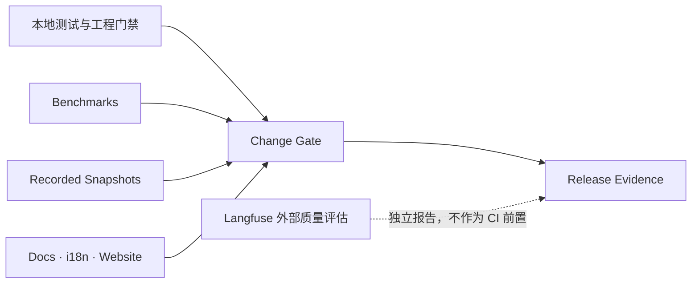
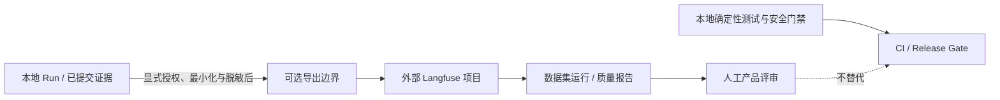

# 07 · 工程质量、外部评估、文档与国际化

## 子模块导航



| 子模块 | 评审焦点 |
|---|---|
| [测试与外部评估策略](01-test-eval-strategy.md) | 哪些问题由本地测试/门禁验证，哪些交由 Langfuse 评估 |
| [Benchmark 系统](02-benchmark-system.md) | 场景、度量、基线、噪声与回归门槛 |
| [录制会话 Snapshot](03-recorded-session-snapshots.md) | 录制、脱敏、回放、断言和更新审查 |
| [Docs、i18n 与 Website](04-docs-i18n-website.md) | 文档真源、翻译、生成站点和发布边界 |

## 1. 工程验证与产品评估分责

| 层 | 目的 | 放置位置 | 是否允许网络/真实模型 |
|---|---|---|---:|
| Unit | 局部算法与边界 | owning package `tests/` | 否 |
| Contract/Conformance | Provider 是否满足 seam | owning family/test-support | 否 |
| Integration | 多包真实组合 | app/package integration tests | 默认否 |
| E2E | 产品入口与部署路径 | apps 下的端到端测试 | 默认否；真实外部依赖单独声明 |
| Snapshot | 确定性 Session 回放与行为回归 | `snapshots/` | 回放否；录制显式允许 |
| Benchmark | 性能和资源回归 | `benchmarks/` | 否 |
| 产品/模型 Eval | 检索、记忆、Experience、任务质量对比 | 外部 Langfuse 项目；不设仓库内 `evals/` 目录 | 显式运行/授权；不作为普通 CI 的网络前置 |

本地测试与门禁负责能被确定性断言的正确性、安全和兼容性；Langfuse 负责需要数据集、模型或人工评审的质量评估。两者不能互相替代，Langfuse 的分数不能豁免本地安全门禁。

## 2. Benchmarks

### 2.1 与现有离线性能检查的边界

Benchmark 回答“同一用户路径是否变慢/变大”，不承担模型质量评判。迁移期间可复用 TraceGraph 当前已有的离线性能检查；V2 新增的跨包性能基线统一进入 `benchmarks/`，不因此保留本地 `evals/` 目录。

### 2.2 按用户路径组织

```text
benchmarks/
├── AGENTS.md
├── session-open/
├── ledger-append-replay/
├── context-assembly/
├── memory-recall/
├── tool-roundtrip/
├── cancellation-quiescence/
├── recovery/
├── client-hydration/
└── support/
```

不按 package 镜像，因为一次可感知路径通常跨越多个 owner。

### 2.3 首批预算

| 路径 | 主要指标 | 备注 |
|---|---|---|
| cold start | ready time、RSS | CLI/Web/Desktop 分开 |
| ledger append | p50/p95、fsync bytes | 单事件与 atomic batch |
| replay | events/s、peak memory | 1k/10k/100k events |
| context assembly | latency、allocated bytes、token estimate drift | 含 0/10/100 memory hits |
| memory recall | p95、index size、quality fixture score | 性能与效果报告分开 |
| tool roundtrip | runtime overhead，不含工具实际工作 | no-op/fake provider |
| cancel | cancel request→quiescent | 含 process group |
| recovery | damaged tail + pending action | 不允许网络 |
| client hydration | snapshot→interactive | Web/Desktop 分开 |

预算必须写在受评审源码中，环境变量不能静默放宽。报告保留 raw samples、聚合方式、机器信息和基线 commit。

### 2.4 测量纪律

- 固定、合成、脱敏输入；
- 新进程和私有临时根，结束后清理；
- CPU timing 与内存 endpoint 分开；
- 首次运行/warmup 明确；
- 使用 production entrypoint，不复制产品算法到 benchmark；
- CI 使用足够方差余量，reference machine 保存更严格趋势；
- 只有显式 `benchmark:update` 可以改 baseline。

## 3. Recorded-session Snapshots

### 3.1 负责什么

Snapshot 保存真实 Agent Session 的规范化输入和预期输出，用于无 API key 回放：

- model-visible request；
- tool schema；
- canonical events；
- 用户可见 stdout/UI projection；
- workspace 最终状态；
- parent/child Session 关系；
- format migration。

普通组件 DOM、纯函数 golden file 或 CLI help 不属于顶层 snapshots，应留在 owning package。

### 3.2 场景结构

```text
snapshots/<profile>/<scenario>/
├── snapshot.yaml
├── session.vN.jsonl
├── session.1.vN.jsonl          # child 1，如有
├── model-stream.jsonl
├── system-prompt.expected.md
├── tool-schemas.expected.json
├── stdout.expected.jsonl
├── workspace/
└── workspace.expected/
```

`snapshot.yaml` 说明 owner、profile、composition、recording source、format version、平台、workspace 和哪些输出被 pin。

### 3.3 三种模式

| 模式 | 网络/Key | 行为 |
|---|---:|---|
| replay | 否 | 只读 fixture，比较结果 |
| record | 是，显式 | 产生新的当前 generation，不删除旧 generation |
| refresh | 否 | 用旧输入跑新 writer，更新当前输出基准 |

所有更新 diff 必须人工审查。禁止测试失败后无解释地批量刷新。

### 3.4 规范化与隐私

- ID 使用保持关系的 typed token，不把所有值替换成同一个占位符；
- 路径变成 `{{cwd}}` 等稳定 locator；
- 系统提示和 tool catalog 可由单独 sidecar owner 持有；
- secret、真实用户内容、环境路径和凭据必须检查；
- normalization 必须是 fixed point；
- Model prose 不能证明 workspace 副作用，必须比较 `workspace.expected`。

## 4. 外部产品/模型质量评估：Langfuse

V2 不建设自有的模型评估 Runner、LLM-as-judge 框架或根目录 `evals/`。需要比较检索、Memory/Experience 复用、任务完成质量等带模型或人工判断的指标时，计划使用外部 Langfuse 项目管理评估数据与报告；Langfuse 集成属于后续可选工作，不是 Runtime 的依赖，也不阻塞本地开发与发布门禁。



边界约束：

- 评测运行、模型裁判、评测集与结果归外部 Langfuse 项目管理；仓库不镜像一套 `evals/` 目录或实现第二个评测平台。
- 默认不向外部平台发送原始 Session、Memory、源代码、credential 或可识别用户内容。需要真实数据时必须有明确 opt-in、最小化/脱敏策略和可撤回配置。
- 确定性不变量（权限、scope、撤销/删除、协议、状态机、回放一致性）仍由本地正反例测试与 CI 门禁阻断；模型裁判不能作为安全证明。
- Langfuse、网络或模型凭据不可用时，本地测试、构建和发布门禁仍能独立运行；外部评估结果单独报告“未运行/未验证”，不伪装为通过。
- Experience paired comparison 可以在 Langfuse 外部评估流程中对照有/无经验的质量差异；跨任务稳定收益不足时，不宣称 Agent 已从经验中学习。

## 5. 回归变更规则

任何基线更新 PR 必须回答：

1. 哪个产品行为有意改变？
2. 哪些 diff 是其直接结果？
3. 是否出现意外字段、token、权限或延迟变化？
4. 是否需要迁移旧 Session？
5. 能否用更窄 fixture 证明，而不是更新整个库？

性能下降不能用“功能更多了”自动接受；需要预算、用户价值和替代方案。

## 6. 文档国际化

### 6.1 UI i18n

目标包：`packages/client/locale`。

- 稳定 locale id：`en-US`、`zh-CN`；
- key 按语义而非英文原文命名；
- 参数使用 typed placeholders；
- 缺失 key 在开发/CI 报错，生产明确 fallback；
- Host 只发稳定 error/status code，Client 翻译；
- 日志、协议 field、event type 不翻译；
- Desktop/Web/TUI 共用术语表，但呈现可以不同。

### 6.2 文档配对

公共长期文档采用三件套：

```text
architecture.md
architecture.zh.md
architecture.i18n.yaml
```

YAML 记录两侧 hash、最后确认时间和 schema；它只表示“人工确认语义一致”，不是自动翻译质量证明。

```yaml
schema_version: 1
pair:
  en: architecture.md
  zh: architecture.zh.md
confirmed:
  en_sha256: "..."
  zh_sha256: "..."
  at: 2026-09-23
```

提案期 V2 文档先以中文为主，frontmatter 标明 `language: zh-CN`；接受为公共规范后再分批建立英文 pair，不能为了“看起来双语”生成未经评审的整库翻译。

### 6.3 术语真源

维护 `docs/i18n/terminology.md`，固定 Agent、Run、Turn、Step、Receipt、Observation、Session、Memory、Experience、Ledger、Projection、Replay、Workspace、Provider、Capability seam 等核心术语。UI、README 和技术文档不得各自翻译。

## 7. 文档门禁

建议 `pnpm doc-sync` 聚合：

- frontmatter/YAML schema；
- Markdown links/anchors；
- generated catalogs fresh；
- package README required sections；
- current/target wording lint；
- i18n pair hash/structure；
- event/tool/protocol catalog；
- V2 manifest 的路径完整性；
- roadmap dependency DAG 无环。

检查默认只读；带 `--write` 的命令必须显式指定目标。

## 8. Website

Website 进入 Phase 8，而不是架构 Phase 0。届时：

- 从 `docs/` 读取，不复制正文；
- build 同时做 dead-link、Mermaid 和版本导航检查；
- 当前版与 V2 proposal 明确分栏；
- 展示可运行 demo、evidence bundle viewer 和 benchmark dashboard；
- 不把营销页面的承诺反向当成实现真源。

## 9. 质量完成标准

- 行为、效果和性能各有独立证据层；
- recorded Session 可无 key 回放；
- Memory 的错误召回、越权和遗忘有负面测试；
- benchmark 能指出改动前后，而非只打印一个数字；
- docs 清单、链接、生成图和 roadmap DAG 在 CI 可验证；
- 中英文支持有一个明确真源和 fallback，不在组件中散落条件分支；
- website 未出现之前，README/docs 仍可完整使用。
