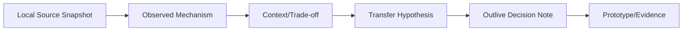
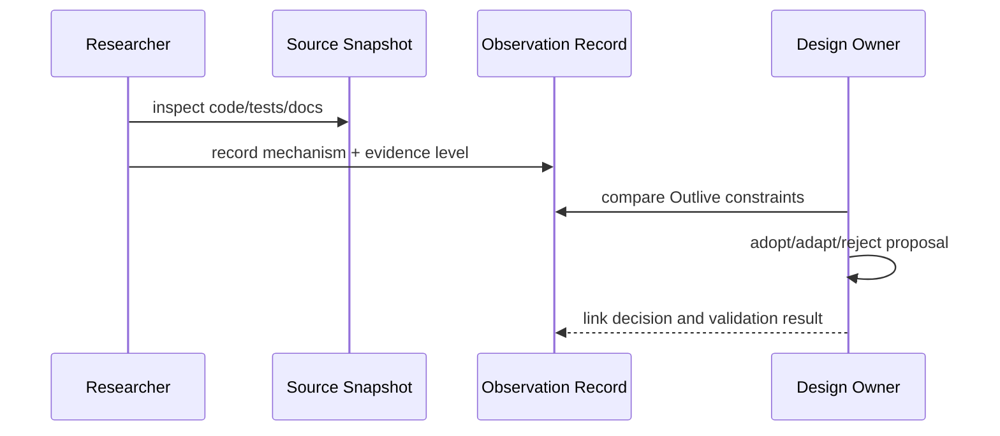

# 参考源码观察与证据等级

## 1. 位置



“某项目做了什么”是观察，“Outlive 应该照做”是待验证假设。参考项目不成为本仓架构 authority。

## 2. 证据等级

| 等级 | 证据 | 可支持的说法 |
|---|---|---|
| E3 | 源码 + 测试 + 可运行验证 + commit | 行为和边界可复核 |
| E2 | 源码快照 + 文档/测试，但无 commit 或未运行 | 结构与设计意图可观察，版本精度有限 |
| E1 | README/讨论/Issue | 社区诉求或公开宣称，不能证明内部实现 |
| E0 | 二手总结/记忆 | 只能用于形成检索问题，不进入设计依据 |

每条观察记录 snapshot path/date、commit（若有）、files、机制、适用上下文、成本和不应推断的内容。

## 3. 项目观察重点

| 项目 | 重点 | 对 Outlive 的假设 |
|---|---|---|
| DeepSeek Harness | package groups、composition、AGENTS/Notes/Skills、benchmarks/snapshots、Desktop/LSP，以及 Web/Desktop Agent 工作台 | 治理、可选 LSP 接缝和工作台交互可迁移；包数量不可照抄、语言服务器不随包提供、记忆体验须由 Outlive 自行设计 |
| ZCode | coding loop、工具体验、CLI/Web/Desktop、协议边界 | Coding 交互可强化，但需接入证据与长期记忆 |
| OpenAI Codex | core/app-server protocol、sandbox、rollout、memory、crate 边界 | 协议/安全/回放值得借鉴，技术栈和内部规模不照搬 |
| Claw Code | philosophy、agent-managed workflow、Rust runtime/tools | Agent 自管理流程有启发，但 governance 不能交给模型自证 |
| Pi | 小内核、event/session tree、extensions/RPC | 最小核心和扩展性优秀，但权限/企业治理需补足 |
| TraceGraph | ledger、receipt、projection、local-first、现有 tests/evals（Current） | 是迁移基础，不是待替换的“旧 Demo”；V2 不因此保留本地产品评测套件 |

### DSH Web/Desktop 工作台观察

本次核对本机 checkout `/Users/cain/Downloads/dsh/deepseek-harness`，Git commit `46a7f68b0922371ce7144b668b90e377d8e799f4`（2026-09-23）。证据等级为 **E2**：核对源码与包文档，未在本轮启动 GUI 做交互验证；该观察证明源码结构和设计意图，不等于 Outlive 已实现。

| 源码位置 | 可确认的机制 | 可迁移的体验模式 |
|---|---|---|
| `packages/client/ui-layout/README.md` | AppFrame 组合侧栏、中心主视图与右侧面板轨道 | 三栏工作台；上下文面板按需展开，不挤占主对话的阅读空间 |
| `packages/client/ui-sidebar/README.md`、`packages/client/ui-workspace/README.md` | Workspace/Session 浏览、创建、搜索、分组、归档、分叉与排序 | 左侧项目/会话导航和多任务切换 |
| `packages/client/ui-chat/README.md`、`packages/client/ui-tool/README.md` | Conversation 按 Session 记录组织，并把 Tool 生命周期呈现为有状态的结构化卡片/活动组 | 中央对话同时呈现 Agent 执行活动，而非只展示纯文本问答 |
| `packages/client/ui-approval/README.md`、`packages/client/ui-deliverables/README.md`、`packages/client/ui-sidebar-right/README.md` | 显示待处理审批、已交付/变更文件、diff review 与右侧文件/上下文面板 | 将人工决策、产物检查和对话放在同一工作流中 |
| `apps/web/src/main.ts`、`packages/client/web/README.md` | Web 入口运行 `AppWebEntry`；Desktop 提供启动注入并复用客户端渲染入口 | Web/Desktop 共享主要 UI，不另建一套业务工作台；平台差异通过 Host/bridge 提供 |

**迁移决定（用户已接受）：**Web UI 与 Desktop UI 借鉴并模仿 DSH 的 Agent 工作台信息架构与核心交互，目标是接近 Codex 一类完整 Agent 工作台；Outlive 以自身 Workspace/Session/Run/Evidence/Memory 契约承载编码及其他工具型任务。该决定不意味着复制 DSH 的代码、组件 API 或所有功能，也不能据此声称 DSH 实现了 Outlive 的 Memory/MemoryUse 治理。

### DSH 的 LSP 代码导航观察

证据等级为 **E2**：本节 LSP 观察来自最初的 DSH 源码归档快照（无 Git 元数据）；本次未运行语言服务器或端到端测试。Web/Desktop 工作台的补充观察使用下一节标明的固定 Git checkout。

| 源码位置 | 可确认的机制 |
|---|---|
| `packages/lsp/lsp/README.md` | 定义 provider-neutral 的导航契约；仅暴露 definition、references、implementation、hover 四种只读操作，明确排除 diagnostics、rename、formatting 等 |
| `packages/lsp/lsp-stdio/README.md` | stdio Provider 按扩展名映射并按 workspace 管理进程；调用已配置的外部命令，不安装或分发语言服务器 |
| `packages/lsp/tool-lsp/README.md`、`packages/lsp/tool-lsp/src/index.ts` | 通过一个模型可见的 `lsp` 工具暴露四种操作；普通导航仍优先使用 search/read，语义搜索不明确时再调用 LSP |

**迁移假设：**Outlive 复用“契约 seam + 外部服务 Provider + 独立模型工具”的边界；首个 Provider 可以是 stdio，服务端由部署方管理。当前 TraceGraph G-12 中的 diagnostics 不属于该 DSH 导航契约，是否迁入 Outlive 必须单独裁决，不能从“保留 LSP”推导出来。

### DSH Session 与 `dsh-memory-cain` 记忆方案的边界

这次记忆设计核对的是 `/Users/cain/Downloads/dsh/deepseek-harness` 的本地仓库快照，commit `46a7f68b09`。记忆设计材料位于未跟踪目录 `dsh-memory-cain/`；其中 `dsh-memory/` 是作者对当前源码的分析，`dsh-memory-dev/` 是用户自己的方案草稿，不是 DSH 官方文档或已实现功能。

| 证据来源 | 观察到的机制 / 提案 | 不能据此声称 |
|---|---|---|
| DSH `packages/core/session/src/types.ts` 的 `SessionEventMap` 与 `packages/core/session/src/index.ts` 的 `Session` | Session 是 merge-extensible append-only event source，消息历史从事件派生；事件契约明确涵盖进入 step 的 user message 和 model-visible system message | DSH 已经实现通用 MemoryEntry、跨 Session 记忆 ownership、候选审核或记忆管理 UI |
| DSH `packages/context/session-reference/src/index.ts`、`types.ts` + `packages/core/agent-loop/src/agent.ts` | `agent/pre-step` seam 解析用户显式提到的另一个 Session，把引用内容作为附加 UserMessage 并携带 `session-reference` source、原 Session、保留/截断元数据；Agent Loop 在请求前将 `decision.messages` append 为 `user/message` | Session reference 等同于长期 Memory；append 证明 Provider 成功收到，或证明内容导致回答 |
| DSH `dsh-memory-cain/dsh-memory/` | Cain 对上述事件、Surface、compaction、session query 的现状梳理，可用于定位源码核查 | 这套分析就是上游 DSH 产品承诺 |
| DSH `dsh-memory-cain/dsh-memory-dev/` | 用户提议 MemoryEntry/projection/source metadata、可见性 L0–L5、候选审核、显式冲突、先治理后自动召回等机制 | 这些机制已经存在于 DSH，或已由 DSH 团队批准进入 roadmap |

**Outlive transfer decision（仍为 proposed）：**复用 append-only 执行历史、派生 Surface、Context 可追溯与显式引用的设计精神；但长期记忆属于独立 owner/scope 的 Memory aggregate stream，与 Session/Run stream 共用规范 Event Ledger 基础设施而不绑定单次会话。Runtime 交给 Provider Adapter 的记忆版本须在当前 Run 的 Context Manifest / MemoryUse 中可重建，并记录 Adapter 调用与响应状态；这不证明远端接受或模型内部使用。搜索命中、预算选择、Adapter 调用分成三个阶段；UI 可报告本次请求包含的记忆与来源，不声称记忆造成某个答案。候选审核、记忆浏览器和可见性方案来自 Cain 的本地设计输入，不标注为 DSH 功能。

**证据等级：**DSH 源码结构为 E2（固定 commit 的可读源码，本轮未执行针对记忆的 E2E）；`dsh-memory-dev/` 是用户设计输入，不按 DSH 实现证据分级。引用具体机制时先读表中源码文件与该本地提案的 README，不能只复述本观察摘要。

## 4. 观察模板

```yaml
source: project/snapshot
evidence_level: E2
files: [path/a, path/b]
mechanism: "..."
context: "它解决的约束"
benefit: "可迁移价值"
cost: "复杂度与前置"
not_claimed: "不能据此声称的事实"
outlive_hypothesis: "需原型验证的决定"
```

## 5. 更新流程



## 6. 参数与边界

| 参数 | 推荐 |
|---|---|
| refresh | 做相关重大设计前，而非固定追逐上游 |
| snapshot provenance | commit 优先；无 `.git` 明确写 source archive/date |
| copied code | 先审许可证与 NOTICE；设计模式不等于源码可复制 |
| community claims | 链接具体 issue/discussion，不伪称“全社区排名” |
| benchmark comparison | 同任务/环境/版本才比较 |

## 7. 验收

设计评审能从 Outlive 决定追到观察和源文件，也能看到为什么不适用；更新快照不会自动改变架构；没有“因为 stars 多所以采用”的推理跳跃。
