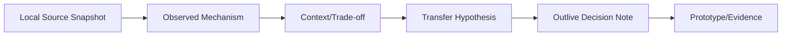
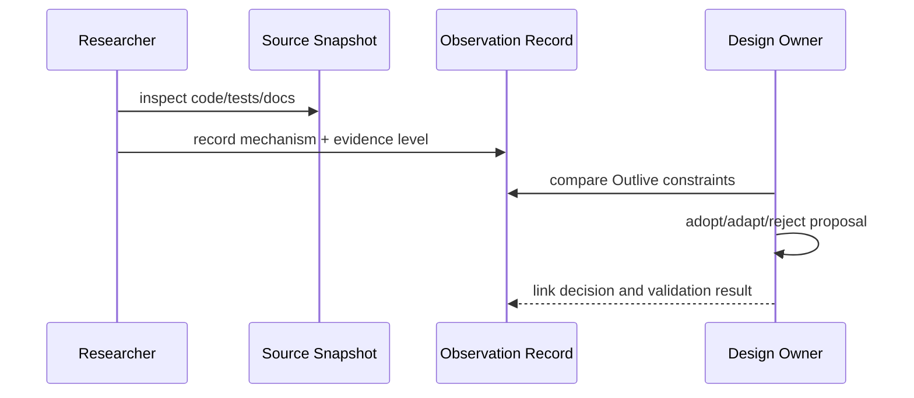

# 参考源码观察与证据等级

## 1. 位置



“某项目做了什么”是观察，“Outlive 应该照做”是待验证假设。参考项目不成为本仓架构 authority。

## 2. 证据等级

| 等级 | 证据 | 可支持的说法 |
|---|---|---|
| E3 | 源码 + 测试 + 可运行验证 + commit | 行为和边界可复核 |
| E2 | 源码快照 + 文档/测试，但无 commit 或未运行 | 结构与设计意图可观察，版本精度有限 |
| E1 | README/讨论/Issue | 社区诉求或公开宣称，不能证明内部实现 |
| E0 | 二手总结/记忆 | 只能用于形成检索问题，不进入设计依据 |

每条观察记录 snapshot path/date、commit（若有）、files、机制、适用上下文、成本和不应推断的内容。

## 3. 项目观察重点

| 项目 | 重点 | 对 Outlive 的假设 |
|---|---|---|
| DeepSeek Harness | package groups、composition、AGENTS/Notes/Skills、benchmarks/snapshots/Desktop、LSP 三包代码导航栈 | 大工程治理和可选 LSP 接缝可迁移，但包数量不可照抄、语言服务器不随包提供 |
| ZCode | coding loop、工具体验、CLI/Web/Desktop、协议边界 | Coding 交互可强化，但需接入证据与长期记忆 |
| OpenAI Codex | core/app-server protocol、sandbox、rollout、memory、crate 边界 | 协议/安全/回放值得借鉴，技术栈和内部规模不照搬 |
| Claw Code | philosophy、agent-managed workflow、Rust runtime/tools | Agent 自管理流程有启发，但 governance 不能交给模型自证 |
| Pi | 小内核、event/session tree、extensions/RPC | 最小核心和扩展性优秀，但权限/企业治理需补足 |
| TraceGraph | ledger、receipt、projection、local-first、现有 tests/evals（Current） | 是迁移基础，不是待替换的“旧 Demo”；V2 不因此保留本地产品评测套件 |

### DSH 的 LSP 代码导航观察

证据等级为 **E2**：本地 DSH 源码快照中的包 README 与实现可检查，但该快照没有可读取的 Git commit，本次也未运行其语言服务器或端到端测试。

| 源码位置 | 可确认的机制 |
|---|---|
| `packages/lsp/lsp/README.md` | 定义 provider-neutral 的导航契约；仅暴露 definition、references、implementation、hover 四种只读操作，明确排除 diagnostics、rename、formatting 等 |
| `packages/lsp/lsp-stdio/README.md` | stdio Provider 按扩展名映射并按 workspace 管理进程；调用已配置的外部命令，不安装或分发语言服务器 |
| `packages/lsp/tool-lsp/README.md`、`packages/lsp/tool-lsp/src/index.ts` | 通过一个模型可见的 `lsp` 工具暴露四种操作；普通导航仍优先使用 search/read，语义搜索不明确时再调用 LSP |

**迁移假设：**Outlive 复用“契约 seam + 外部服务 Provider + 独立模型工具”的边界；首个 Provider 可以是 stdio，服务端由部署方管理。当前 TraceGraph G-12 中的 diagnostics 不属于该 DSH 导航契约，是否迁入 Outlive 必须单独裁决，不能从“保留 LSP”推导出来。

## 4. 观察模板

```yaml
source: project/snapshot
evidence_level: E2
files: [path/a, path/b]
mechanism: "..."
context: "它解决的约束"
benefit: "可迁移价值"
cost: "复杂度与前置"
not_claimed: "不能据此声称的事实"
outlive_hypothesis: "需原型验证的决定"
```

## 5. 更新流程



## 6. 参数与边界

| 参数 | 推荐 |
|---|---|
| refresh | 做相关重大设计前，而非固定追逐上游 |
| snapshot provenance | commit 优先；无 `.git` 明确写 source archive/date |
| copied code | 先审许可证与 NOTICE；设计模式不等于源码可复制 |
| community claims | 链接具体 issue/discussion，不伪称“全社区排名” |
| benchmark comparison | 同任务/环境/版本才比较 |

## 7. 验收

设计评审能从 Outlive 决定追到观察和源文件，也能看到为什么不适用；更新快照不会自动改变架构；没有“因为 stars 多所以采用”的推理跳跃。
