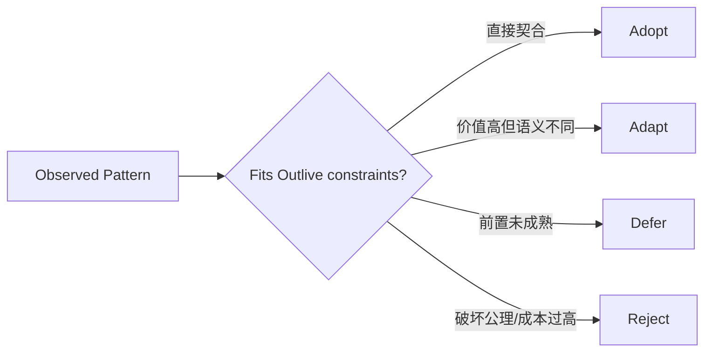
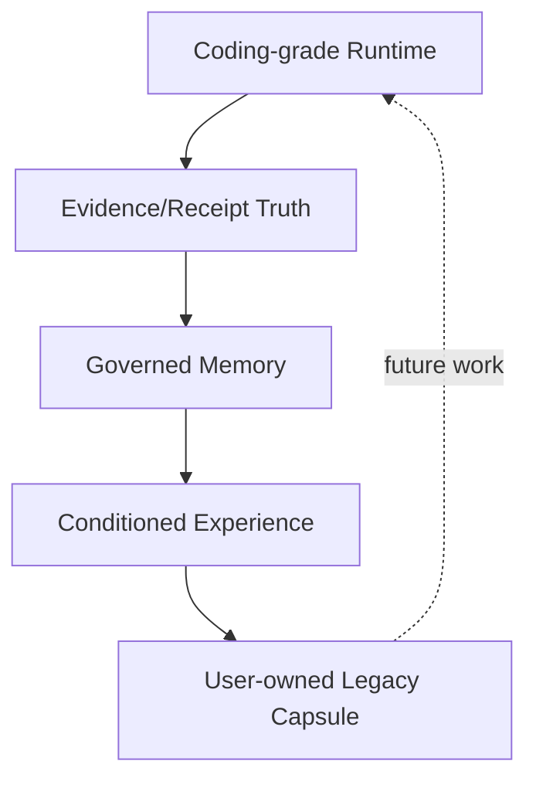

# 吸收、改造、延后与拒绝矩阵

## 1. 决策分类

分类针对模式，不针对项目优劣。每个决定需有 owner、前置、验证和撤回条件。

## 2. 决策矩阵

| 模式 | 来源启发 | 决定 | Outlive 版本 | 验证 |
|---|---|---|---|---|
| 小而稳定的 Agent Loop | Pi、ZCode、Codex | Adopt | Runtime 只编排 ports | deterministic loop fixtures |
| 家族包 + profile composition | DeepSeek Harness | Adapt | 先逻辑边界，满足门槛再升包 | import graph + extraction benchmark |
| Agent Notes / Skills 分工 | DeepSeek Harness | Adopt | 决策理由与操作手册分离 | repo governance eval |
| App-server/shared protocol | Codex、ZCode、Pi | Adopt | CLI/API/Web/Desktop 同领域协议 | multi-transport conformance |
| Recorded session snapshots | DeepSeek Harness、Codex | Adapt | 录制后脱敏、离线回放、业务断言 | snapshot semantic diff |
| 强 Coding 工具体验 | ZCode、Claw Code、Codex | Adopt | Tool pipeline 叠加 Receipt/Observation | task/evidence eval |
| 任意扩展直接进入内核 | 多插件系统常见 | Reject | Definition/Provider/Adapter + policy | malicious extension tests |
| 向量库即 Memory | 常见 RAG 产品 | Reject | 生命周期、证据、scope、纠错先于索引 | leakage/conflict/delete eval |
| 模型声明“完成”即成功 | agent demo 常见 | Reject | 业务 Receipt/Verifier/Artifact | negative completion cases |
| 一次拆成大量 package | 大型仓库表象 | Reject | 评分卡和 move-only extraction | build/graph/cognitive cost |
| 自动人格/逝者模拟 | 数字永生叙事 | Defer/Reject in V2 | Legacy 仅策展与可移植知识 | policy and product review |
| 云端多租户控制面 | 企业 harness | Defer | local-first，协议预留身份/scope | later threat/scale design |

## 3. Outlive 独有组合

亮点不在单独拥有 Tool、Memory 或 Trace，而在于形成闭环：工作产生业务证据 → 证据可提炼为可纠正记忆/经验 → 未来调用仍带来源并重新验证 → 用户可导出和遗忘。

## 4. 反复制原则

- 不复制技术栈、目录数量或品牌术语，只吸收可解释机制；
- 不把上游内部能力写成 Outlive 已实现；
- 不因成熟项目采用某设计就跳过本仓规模/迁移成本评估；
- 参考代码进入仓库前单独做许可证、NOTICE 和安全审查；
- 相同用户问题可借鉴，相同内部实现并非必要。

## 5. 决策参数

| 参数 | 推荐 |
|---|---|
| adopt bar | 与公理一致且能给出本仓验收 |
| adapt bar | 有明确差异和原型退出条件 |
| defer review | 到前置里程碑再评，不按日期自动启用 |
| reject permanence | 可因新证据重开，但新 Note 必须回应旧拒绝理由 |
| source coupling | 不依赖上游私有 API/目录稳定性 |

## 6. 下一轮需原型的决定

1. Runtime core 内部分层后，哪些边界真正值得独立 package；
2. Desktop shell 与 Host 进程通信模型；
3. Memory admission 的自动化范围；
4. Recorded Session 的脱敏和 semantic diff；
5. MCP/LSP/Extension 长生命周期 provider 的统一接口。
