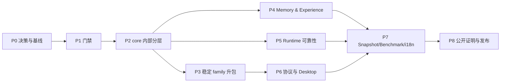

# 09 · 实施路线

## 1. 执行原则

这不是一个“从目录顶部做到目录底部”的大重构。任务按可独立交付的薄切片排列：

- 每个任务只做 docs / move / behavior / protocol / baseline 中的一类；
- 非机械 diff 目标小于 500 行，通常不超过 800 行；
- 每步都有最窄验证和反向失败证据；
- 不以“所有 package 都拆完”作为进度，而以边界是否可守、用户路径是否可证明衡量；
- 任一 Phase 结束后都能安全停下；
- 任务 DAG 以 [roadmap.yaml](roadmap.yaml) 为机器真源，本页解释为什么这样排。

## 2. 总览



P4 与 P5 可在 P2 后并行；P6 应等待 Evidence/Session/API 边界稳定，避免 Desktop 固化旧协议。

## 3. Phase 0 · 决策、文档和可复现基线

目标：所有后续 Agent 能区分当前事实与目标设计，并知道从哪里开始。

| Task | 动作 | 输出 | 验收 |
|---|---|---|---|
| `OLV-000` | 评审工作名、产品边界和九个决策 | 接受/修订的 V2 charter | 决策记录进入 implemented 或 rejected Note |
| `GOV-001` | 建根 `AGENTS.md`、Notes/Skills 入口 | 治理骨架 | 链接全部存在；不与上级 workspace 规则冲突 |
| `DOC-002` | 校验 V2 frontmatter、manifest 和 roadmap DAG | `verify-v2-docs` | 坏路径、未知 status、依赖环均 exit 1 |
| `BASE-003` | 锁定当前 package DAG、LOC、测试数、事件数、性能基线 | baseline report | 命令可重跑；数字不手填为永久事实 |
| `BOUND-004` | 把 local-first、当前 Memory/沙箱/Desktop 边界写入迁移基线和 owning modules | README/模块/迁移基线更新 | 只写已实现/未实现，不把 V2 写成 current |

**退出标准**：未来 Agent 只读 `AGENTS.md` 和 V2 主入口即可定位 current truth、target design、owner 与验证命令。

## 4. Phase 1 · 先让架构违规可失败

| Task | 动作 | 验收要点 |
|---|---|---|
| `ARCH-010` | 新增 `architecture-policy.yaml` 与 `verify-boundaries` | 当前 DAG 通过；临时 `contracts→core` import 失败 |
| `ARCH-011` | 建 module graph 生成器 | 移动/新增 package 未更新图时 `--check` 失败 |
| `ARCH-012` | 建差异化不变量门禁 | 第二 Ledger writer、wire 泄漏、Projection I/O fixture 均失败 |
| `ARCH-013` | 渐进 `legacy/managed` 标记 | 只强制已迁移模块，存量不被一次性重写 |
| `DOC-014` | package README contract gate | 缺 purpose/state/model-effect/verification/limitations 时失败 |

**退出标准**：错误依赖、第二真源和文档漂移不再依赖人工发现。

## 5. Phase 2 · `core` 内部先成层

本阶段以 [TraceGraph → Outlive 迁移基线](10-tracegraph-to-outlive-migration.md)的行为保持路线为基础。

### 5.1 P2A · Kernel 与 seams

| Task | 内容 | 不做 |
|---|---|---|
| `CORE-020` | 提取 `kernel`：brand/types/crypto/workspace 与注册接口 | 不改导出名/行为 |
| `CORE-021` | 将 sandbox/lsp/mcp 移入 `seams/`，消除其对 domains 的反向依赖 | 不先升包 |
| `CORE-022` | 将 tool registry 的 Definition 与 Executor/Policy 分开 | 不新增工具 |
| `CORE-023` | 将 Extension registration 与 manager lifecycle 分开 | 不开放任意代码执行 |

### 5.2 P2B · Domains 与 Runtime 缩小

| Task | 内容 | 验收 |
|---|---|---|
| `CORE-024` | evidence/session/context/model/memory/team 等目录化 | 顶层平铺清零；行为测试不变 |
| `CORE-025` | 提取 Run/Turn/Step 状态机与纯函数 | canonical event 顺序不变 |
| `CORE-026` | 提取 Tool/Context/Evidence service façade | `runtime.ts` 不访问其内部文件 |
| `CORE-027` | feature drivers 通过扩展点注册 | 禁止新增 feature-specific loop 分支 |
| `CORE-028` | 缩小 `runtime.ts` 为 agent-loop coordinator | LOC 单调下降；snapshot 无意外 diff |

每个任务只做移动/提取；行为改进留 P4/P5。

## 6. Phase 3 · 只升稳定边界

| Task | 第一批物理 family | 为什么先做 |
|---|---|---|
| `PKG-030` | `evidence/{event,ledger,artifact,projection,replay}` | 有独立真源和纯投影边界 |
| `PKG-031` | `session/{format,persistence,projection,query}` | 有持久兼容责任 |
| `PKG-032` | `mcp`、`lsp` | 已是清晰外部 seam |
| `PKG-033` | `tool/{tools,executor,policy,approval}` | 副作用强制点需窄 API |
| `PKG-034` | `context/{context,compaction,spill}` | 多 Provider 与模型可见契约 |
| `PKG-035` | `boot/profile-loader` | 为多 app 统一组合做准备 |

每升一个 package：添加 README、公开 export、依赖规则、conformance/REAL composition test，并证明旧 import 已清零。Memory family 等 contract V2 稳定后再升，不能先搬一个仍在快速变化的 API。

## 7. Phase 4 · Memory 与 Experience 差异化

### 7.1 Contract 与生命周期

| Task | 内容 | 验收 |
|---|---|---|
| `MEM-040` | Memory Contract V2：status/scope/provenance/validity/governance/lineage | v1 reader/migration；现有记录不丢 |
| `MEM-041` | Candidate/Review/Activate/Dispute/Supersede/Revoke/Expire | 非法状态转移拒绝；事件完整 |
| `MEM-042` | Context provenance 统一 Memory `origin/source_refs/trust` | 每个 recalled item 可追到来源 |
| `MEM-043` | 两阶段 Episode extraction + consolidation | lease/backoff/idempotency；主 Run 不阻塞 |

### 7.2 Experience 与用户控制

| Task | 内容 | 验收 |
|---|---|---|
| `MEM-044` | Experience Case schema/extractor | 成功、失败、unknown 都能表达；有适用条件 |
| `MEM-045` | conflict/staleness/use feedback | unresolved conflict 不静默注入 |
| `MEM-046` | Inspect/Review/Correct/Revoke/Delete 领域命令与当前 Web/SDK 控制面 | 全部经 Command/Event；跨 scope 负测；不依赖未来 Desktop 协议 |
| `MEM-047` | Legacy Capsule v1 | checksum、redaction、quarantine import、review diff |
| `MEM-048` | Memory/Experience paired eval | 独立验证集证明收益或如实报告无收益 |

**退出标准**：能够现场展示“一条长期记忆从证据产生、被召回、被纠正、旧版本退出 Context、导出后仍可校验”的完整链。

## 8. Phase 5 · Runtime 可靠性补口

| Task | 内容 | 验收 |
|---|---|---|
| `RUN-050` | Progress fingerprint + no-progress guard | 重复动作无进展被解释性停机；正常迭代不误杀 |
| `RUN-051` | Cancellation ownership/quiescence | 取消后零新派发；子进程组和 job 有界退出 |
| `RUN-052` | 外部 action reconciliation contract | timeout 后区分 confirmed/failed/unknown/diverged |
| `RUN-053` | Retry taxonomy | provider/tool/action retry 不混；上限与 backoff 可见 |
| `ORCH-054` | Subagent capacity/status/direct message | durable lineage、预算与失联恢复 |
| `ORCH-055` | Workflow/Job continuation | background work 可恢复且不伪装完成 |

RUN-052 必须先用一个本仓完全控制的 provider 做纵向证明，再考虑外部 Agent Adapter。

## 9. Phase 6 · 统一协议和 Desktop

| Task | 内容 | 验收 |
|---|---|---|
| `API-060` | 统一 Command/Query/Event vocabulary | Web/SDK/CLI schema 同源 |
| `API-061` | Controller 与 Fastify transport 分离 | controller 可进程内/RPC 测试 |
| `API-062` | framed RPC protocol/server/client | partial frame、cancel、version mismatch conformance |
| `CLI-063` | CLI/TUI 走同一 client/controller | JSON mode 干净、event 一致 |
| `DESK-064` | `apps/desktop-host` exact-version runtime | 无 GUI smoke、崩溃/重启/关闭可测 |
| `DESK-065` | Desktop shell + shared UI | Renderer 无 Node，默认无端口 |
| `DESK-066` | 原生目录/打开文件/credential bridge | opaque handles、scope/policy enforced |
| `API-067` | 评估/创建独立 `apps/api` | 仅当 lifecycle 已与 CLI 独立；否则记录 rejected |
| `CLIENT-068` | Memory/Experience 控制面接入统一协议与共享 UI | Web/Desktop 对同一命令产生同一 canonical event |

Desktop 技术选择必须先有 Note；当前倾向 Electron，不在任务里预先锁死。

## 10. Phase 7 · 回归、性能、i18n 和文档产品化

| Task | 内容 | 验收 |
|---|---|---|
| `SNAP-070` | top-level recorded-session harness | replay 无 key；record/refresh 显式；fixture 脱敏 |
| `SNAP-071` | recovery/cancel/memory/subagent 四组场景 | workspace 与事件均比较 |
| `BENCH-072` | benchmark harness + machine report | raw samples、budget、环境信息 |
| `BENCH-073` | 首批 8 条用户路径基线 | 负优化 CI 可见；更新需显式 |
| `EVAL-074` | Memory safety/quality suite | leak/revoked/stale/conflict/injection 场景 |
| `I18N-075` | client locale package + terminology | Web/Desktop/TUI 同 key；fallback 可测 |
| `DOC-076` | bilingual pair/YAML checker | hash/结构/链接漂移失败 |
| `DOC-077` | 生成 event/tool/module/profile catalogs | `--check` 检测陈旧产物 |

## 11. Phase 8 · 用证据发布，而不是靠功能清单

| Task | 公开证明 | 完成定义 |
|---|---|---|
| `DEMO-080` | 杀进程→恢复→对账 | 视频/脚本/fixture/证据包可独立复现 |
| `DEMO-081` | Memory 来源→召回→纠正→遗忘 | UI 与导出均可展示 lineage |
| `DEMO-082` | 取消→进程组静默 | 无残留、事件解释完整 |
| `REL-083` | 可安装 CLI + Desktop preview | checksum、SBOM、版本、known limitations |
| `REL-084` | 外部用户按文档从零跑通 | 记录失败点并修正文档 |
| `SITE-085` | 静态文档站 | 只有满足治理前置条件才启动 |

Star 不是工程验收项，但这三条公开证明比“支持几十个工具”更容易形成可信差异。

## 12. 可并行与不可并行

### 可并行

- P1 的 module graph、README contract、invariant fixtures；
- P4 Memory contract UI 草图与 P5 no-progress 研究（代码合并仍按依赖）；
- P6 Desktop shell spike 与 framed protocol spec；
- P7 benchmark 与 snapshot harness 的基础设施。

### 不可并行

- 在 canonical event contract 未冻结前同时拆 Evidence 和改协议；
- 在 Memory V2 migration 未完成前做 Capsule；
- 在 Controller/transport 未分离前让 Desktop 直接调用 Host internals；
- 在 recorded snapshot 存在前大改 Agent Loop；
- 在 current docs 更新前对外发布 V2 承诺。

## 13. 每个执行任务的交付模板

另一个 Agent 接任务时，应产出：

```markdown
## Scope
做什么；明确不做什么。

## Current evidence
现有代码、协议、测试和限制。

## Change
一个最小 coherent slice。

## Verification
实际运行命令、结果、反向失败证据。

## Compatibility and rollback
持久格式/API/行为影响；如何安全回退。

## Documentation
更新 owning module、迁移基线与 Note 状态。
```

不要让 Agent 从整份 V2 文档自由选择“一些功能实现”；必须给出明确 task id。

## 14. 建议的第一批实际任务

按收益/风险比，下一轮只执行：

1. `DOC-002`：V2 manifest/roadmap 校验；
2. `BASE-003`：生成可复现当前基线；
3. `ARCH-010`：边界策略与反向测试；
4. `ARCH-011`：module graph；
5. `CORE-020`：kernel 行为保持提取。

不要马上创建 Desktop，也不要先实现“数字人格”。先让架构和事实边界能够阻止退化。
