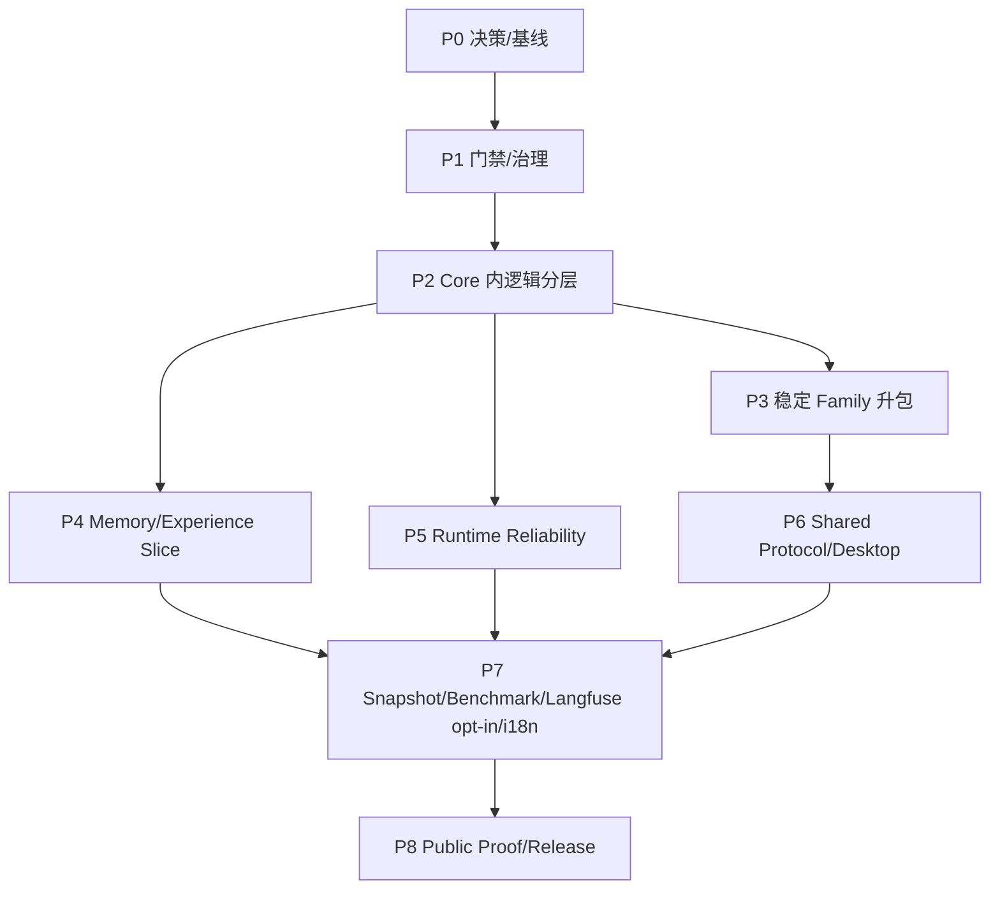
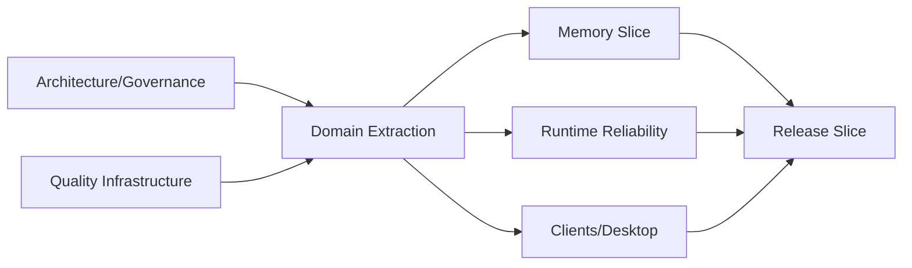

# 阶段依赖与并行路线

## 1. 总体 DAG

该图表示最早安全开始点，不要求一个 Phase 所有任务串行完成。机器级 task 依赖以 `../roadmap.yaml` 为准。

## 2. 每阶段出口

| Phase | 主要产出 | 退出证据 | 不在本阶段做 |
|---|---|---|---|
| P0 | 接受的公理、术语、现状基线 | reviewed docs + baseline runs | 改 Runtime 行为 |
| P1 | AGENTS/Notes/Skills、架构/文档门禁 | CI failure fixtures | 大拆包 |
| P2 | core 内 Evidence/Session/Runtime/Tool/Context 边界 | import rules + behavior parity | 发布大量新 package |
| P3 | 满足门槛的 family packages | move-only diff + conformance/perf | 为目录美观抽包 |
| P4 | 一个可见、可纠正、可遗忘的 Memory 纵切 | 本地端到端与安全反例通过；Langfuse 质量评估可后续独立运行 | 人格/云同步 |
| P5 | cancel/recovery/reconcile/no-progress | failure injection snapshots | 分布式 scheduler |
| P6 | 共享协议、Desktop Host/bridge | multi-transport conformance/security | 独立业务语义 |
| P7 | snapshots/benchmarks、可选 Langfuse 接入、docs/i18n | 回归报告；外部质量评估独立报告且不阻塞本地门禁 | 只建空目录 |
| P8 | install→task→evidence→resume→export 公开路径 | clean install/release evidence | 未证明的营销能力 |

## 3. 并行 lanes

- Governance lane 可先建 Note、规则和 docs consistency gate；
- Quality lane 可先固定当前 fixtures/baselines；
- Domain extraction 必须先完成相关 logical seam 才允许相应 feature lane；
- Memory、Runtime reliability、Client 可并行，但共享协议/schema 由单 owner 合并。

## 4. 临界路径

当前最可能临界路径：现状基线 → Runtime/Evidence 逻辑分层 → shared protocol → Desktop；以及 Session/Evidence → Memory lifecycle → retrieval/context → 本地纵向验证。Langfuse 外部质量评估可在 P7 后按需补入，不阻塞该路径。

## 5. WIP 与切片参数

| 参数 | 推荐 |
|---|---|
| active architecture migrations | 每个 owning family 同时 1 个 |
| task diff | 非机械目标 <500 行，通常不超过 800 |
| behavior + move | 默认分开 PR/task |
| phase overlap | 仅在依赖 gate 通过后，不按日期强开 |
| rollback | 每个切片保持旧入口 shim 或单向数据迁移回退说明 |

## 6. 重新排期触发器

架构基线不成立、性能回归超过预算、迁移产生双真源、安全边界需改变、关键 API 无法形成窄端口时，停止后续抽包并回到设计 gate。任务“做完很多文件”不能作为忽略触发器的理由。

## 7. 验收标准

每个 roadmap task 只依赖已存在节点且图无环；任一 Phase 的出口可由证据判断而非主观进度；并行 lanes 不同时争用同一 canonical owner；删除任一前置时，下游任务能被机器或评审明确阻塞。
