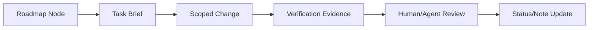
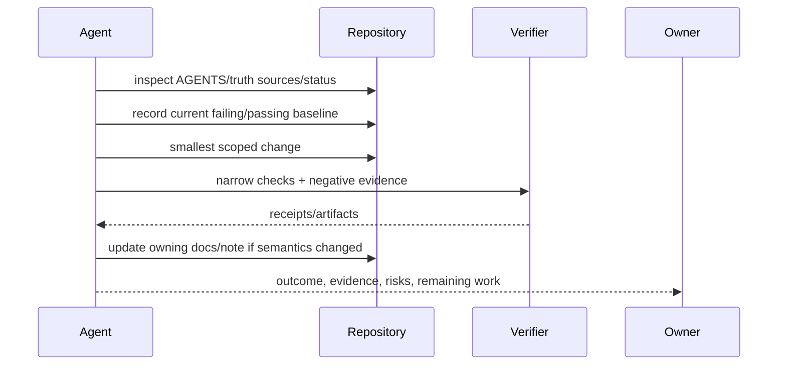

# Agent 任务执行契约

## 1. 任务在路线中的位置



路线图节点不是一句“实现 Memory”。每个可交给 Coding Agent 的任务必须边界明确、可停止、可验证、可回退，并声明不允许改变什么。

## 2. Task Brief 必填字段

```yaml
id: P2-EVIDENCE-SEAM
goal: "用公开端口隔离 Runtime 与 Evidence"
depends_on: [P1-ARCH-GATE]
in_scope: [packages/core/src/domains/evidence, tests/...]
out_of_scope: [behavior changes, package rename]
truth_sources: [design doc, current module doc, owning tests]
invariants: [event order, idempotency, projection rebuild]
deliverables: [port, adapter, tests, docs]
negative_evidence: [forbidden Evidence-to-Runtime import makes gate fail]
world_state_oracle: [CLI e2e re-reads changed and untouched workspace files]
verification: [narrow commands, negative fixture, optional full gate]
rollback: "keep old adapter behind one call site"
done_when: "observable behavior unchanged and forbidden import gate passes"
```

## 3. 执行顺序



Agent 不得因任务难而扩大范围、删除失败测试、修改 baseline 或宣称未验证完成。遇到未知外部状态和 destructive migration 按 task authority 停止/请求决策。

`negative_evidence` 应指向能故意制造违规并使检查变红的最小样例。`world_state_oracle` 由不依赖 Agent 自述的观察者执行：例如重读文件、重跑命令或从外部服务按同一业务 ID 查询；纯文档任务可写 `not_applicable` 并说明理由。任务开始前还要确认验证命令确实存在；P2 不得把 P7 的通用录制 Snapshot 作为现有前置。

## 4. 完成证据

| 任务类 | 最低证据 |
|---|---|
| docs | link/manifest/static consistency gate + 人类结构 review |
| move/refactor | behavior parity + import graph + 已有纵向 e2e/replay + 必要的 build/perf smoke |
| behavior | 新正反 fixtures + owning tests + event/contract update |
| schema/protocol | backward fixtures/upcaster + generated artifact clean |
| security | denial/escape/approval negative tests + threat decision |
| performance | correctness + raw benchmark + baseline comparison |

最终报告区分：changed、verified、not verified、deferred、risk。命令退出码、关键断言和 artifact 路径应可复核。

## 5. 参数

| 参数 | 推荐 |
|---|---|
| task ownership | 一个直接 owner；跨模块 reviewers 可多个 |
| concurrency | 不同时修改同一真源/生成物 |
| checkpoint | 每个可独立通过验证的薄切片 |
| retries | 对 deterministic failure 不盲重试；先诊断 |
| docs timing | 行为/契约同任务更新；target design 仅决策变更时更新 |

## 6. Prompt 模板边界

给 Agent 的 prompt 应链接真源，不复制整份设计；列出 explicit scope、不得改项、验收命令和工作树注意事项。不要只说“参考某项目实现”，而要说明 Outlive 接受的机制和不接受的耦合。

## 7. 验收

随机选择 roadmap 节点，另一名实现者能仅靠 brief 找到 owner、边界和完成标准；任务中断后可从 evidence/checkpoint 继续；最终结论不依赖聊天上下文。
