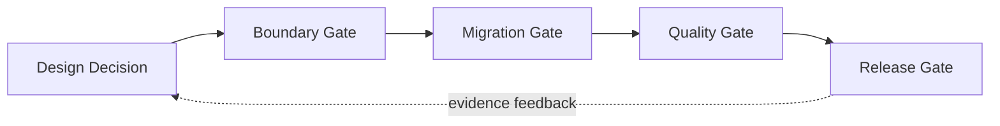
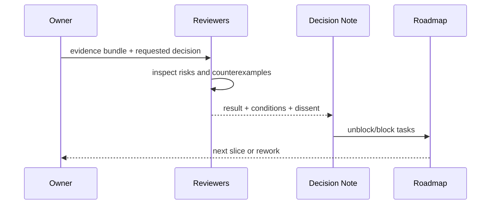

# 架构与阶段评审检查点

## 1. 检查点类型

检查点是可作出“继续/修正/撤回”决定的节点，不是状态汇报会议。

## 2. Gate 清单

| Gate | 核心问题 | 必备材料 |
|---|---|---|
| Design | owner、非目标、不变量、替代项是否清楚 | module/submodule doc + Note |
| Boundary | 端口是否窄，依赖方向能否机器守住 | import graph、API surface、conformance plan |
| Migration | 现有行为/数据如何保留，是否双真源 | migration table、fixtures、rollback |
| Quality | 新路径怎样失败，是否有回归预算 | tests/evals/snapshots/benchmarks |
| Security/privacy | authority、secret、删除、第三方数据 | threat cases、negative tests |
| Release | 用户路径、兼容、artifact 可复核 | release evidence bundle |

## 3. 决策结果

每个 Gate 只允许：`accepted`、`accepted_with_conditions`、`experiment`、`rework`、`rejected`。条件包含 owner 和过期点；“以后补”无 owner/里程碑等于不接受。

## 4. 特别评审触发器

- 新持久格式、删除语义或数据迁移；
- package 升级、公开协议 breaking change；
- 自动 Memory 准入、跨 scope 共享；
- 新外部副作用、approval cache、sandbox 放宽；
- Desktop/extension 权限新增；
- benchmark 阈值放宽或 Snapshot 大规模更新；
- 产品从本地单用户扩到多用户/远程。

## 5. 角色

| 角色 | 责任 |
|---|---|
| Owner | 提案、证据、迁移与回滚 |
| Domain reviewer | 领域语义与当前能力不丢失 |
| Architecture reviewer | 依赖、端口、组合与演进 |
| Quality reviewer | 验证是否能反证 claim |
| Security/privacy reviewer | 权限、数据、威胁与删除 |
| Product owner | 用户价值、非目标与发布声明 |

个人项目可由一人兼任，但必须逐角色写出问题，不能省略安全/反证视角。

## 6. 参数与验收

| 参数 | 推荐 |
|---|---|
| review size | 一个可逆架构决定或一个纵切，不一次审整套愿景 |
| stale decision | 前置/约束改变时强制复审，不按固定日期机械复审 |
| dissent | 保留在 Note，不能只留口头结论 |
| conditional acceptance | 条件未满足前不解锁依赖任务 |

验收：任一已开始重大任务都能指向已通过 Gate；任一 Gate 结论能追到证据、反对意见和后续条件；路线图不会因文件存在就自动标完成。
