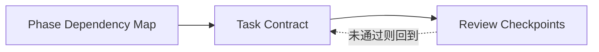
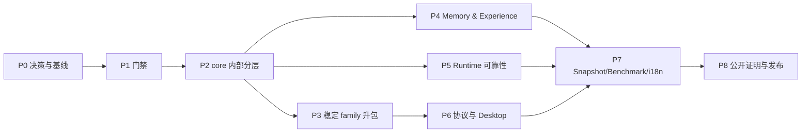

# 09 · 实施路线

## 子模块导航



| 子模块 | 评审焦点 |
|---|---|
| [阶段依赖图](01-phase-dependency-map.md) | 为什么按此顺序、哪些工作可以并行 |
| [任务执行契约](02-task-execution-contract.md) | 每个 Agent 任务必须携带哪些输入、输出和证据 |
| [评审检查点](03-review-checkpoints.md) | 何时允许升包、切换真源、进入下一阶段或发布 |

## 1. 执行原则

这不是一个“从目录顶部做到目录底部”的大重构。任务按可独立交付的薄切片排列：

- 每个任务只做 docs / move / behavior / protocol / baseline 中的一类；
- 非机械 diff 目标小于 500 行，通常不超过 800 行；
- 每步都有最窄验证和反向失败证据；
- 不以“所有 package 都拆完”作为进度，而以边界是否可守、用户路径是否可证明衡量；
- 任一 Phase 结束后都能安全停下；
- 任务 DAG 以 [roadmap.yaml](../roadmap.yaml) 为机器真源，本页解释为什么这样排。

## 2. 总览



P4 与 P5 可在 P2 后并行；P6 应等待 Evidence/Session/API 边界稳定，避免 Desktop 固化旧协议。

## 3. Phase 0 · 决策、文档和可复现基线

目标：所有后续 Agent 能区分当前事实与目标设计，并知道从哪里开始。

| Task | 动作 | 输出 | 验收 |
|---|---|---|---|
| `OLV-000` | 评审 V2 宪章与未决设计决定 | 接受/修订的 V2 charter | **决策评审已完成**：DEC-01–12 方向有结论，V2 文档仍为 proposed；目标 scope 为 `@outlive/*`，迁移期源码继续使用 `@tracegraph/*`，不把命名目标当作已发布能力；多人团队共享延后 |
| `GOV-001` | 验收根 `AGENTS.md`、Notes/Skills 入口 | 治理骨架 | **已核验（2026-10-03）**：根规则指向父级 canonical workflows，Notes/Skills 入口与生命周期可定位，未覆盖父级 trace 真源；V2 路径检查通过 |
| `DOC-002` | 校验 V2 frontmatter、manifest 和 roadmap DAG | `verify-v2-docs` | **已核验（2026-10-03）**：`pnpm verify:v2-docs` 与 5 项 checker 测试通过；坏路径、未知 status、重复 task id、依赖环均有失败负例 |
| `BASE-003` | 生成当前 package DAG、LOC、测试数、事件数、性能基线 | baseline report | **已完成并复验（2026-10-03）**：`pnpm baseline:current` 重新从当前源码生成 [结构与性能基线](../../generated/current-baseline.md)（22 包、192 个 test/eval 文件、104 种事件）；`pnpm baseline:current:check` 通过，环境与性能诊断单列，不把时间/耗时当永久结构常量 |
| `BOUND-004` | 把 local-first、当前 Memory/沙箱/Desktop 边界写入迁移基线和 owning modules | README/模块/迁移基线更新 | **已核验（2026-10-03）**：根 README、owning modules、迁移基线已纠正过时的 Desktop/Memory/恢复边界；local-first、Recall 默认关闭、Preview 未签名和外部评估限制明确 |

**退出标准**：未来 Agent 只读 `AGENTS.md` 和 V2 主入口即可定位 current truth、target design、owner 与验证命令。

`roadmap.yaml` 的前置关系是 `GOV-001 → DOC-002 → BASE-003`，不可因入口文件已存在便跳过验收。DEC-01 已裁决物理升包硬门槛、评分卡用途和 `architecture-policy.yaml` 文件名；`ARCH-010/011/012/013` 已交付包边界、生成图、差异化不变量门禁和渐进式包治理，并接入 CI。升包证据仍按根规则评审；`DOC-014` 已解除依赖阻塞。

## 4. Phase 1 · 先让架构违规可失败

| Task | 动作 | 验收要点 |
|---|---|---|
| `ARCH-010` | 按已接受的 DEC-01 新增 `architecture-policy.yaml` 与 `verify-boundaries` | **已完成**：12 个 workspace packages、20 条 workspace dependencies 和 1,259 条 import references 通过；反向依赖、deep import、依赖环与移除 CI 步骤的反例均通过测试 |
| `ARCH-011` | 建 module graph 生成器 | **已完成**：`pnpm graph:modules` 从 workspace manifest 与源码 imports 生成包/模块 Mermaid 图；`pnpm graph:modules:check` 在 package/module 图漂移时失败，并已接入 CI `typecheck` job |
| `ARCH-012` | 建差异化不变量门禁 | **已完成**：`pnpm verify:invariants` 锁定唯一 `JsonlEventLedger` writer、过滤 `_internal_` wire data 与无 I/O Projection；第二 writer、私有数据直出和 Projection I/O 反向 fixture 均失败，并已接入 CI `typecheck` job |
| `ARCH-013` | 渐进 `legacy/managed` 标记 | **已完成**：3 个 workspace packages 标为 `managed` 并强制规则；其余 9 个标为 `legacy`，违规只生成带迁移 owner 的 warning；managed/legacy 反例与缺少 owner 均有测试 |
| `DOC-014` | package README contract gate | **已完成**：12 个 workspace package 均提供 Purpose、Public API、Dependencies、State ownership、Extension points、Model effect、Verification、Known limitations；`pnpm verify:package-readmes` 校验缺失/空章节并接入 CI `typecheck` job |

**退出标准**：错误依赖、第二真源和文档漂移不再依赖人工发现。

## 5. Phase 2 · `core` 内部先成层

本阶段以 [TraceGraph → Outlive 迁移基线](../10-tracegraph-to-outlive-migration/README.md)的行为保持路线为基础。

### 5.1 P2A · Kernel 与 seams

| Task | 内容 | 不做 |
|---|---|---|
| `CORE-020` | **已完成并核对当前路径**：基础类型、crypto/workspace 与注册接口位于 `kernel/`，公开 API 保持兼容；[实现 Note](../../../.agents/notes/implemented/2026-09-29-core-020-kernel-extraction.md)记录原验收；本轮边界、不变量与 Core 回归检查复核 | 不改导出名/行为 |
| `CORE-021` | **已完成，后续升包已衔接**：sandbox 留在 `seams/`，LSP/MCP 后由 PKG-032 升包，Core 保留端口与工具适配；[历史验收 Note](../../../.agents/notes/archived/2026-09-29-core-021-seams-extraction.md)已按后续所有权归档；本轮 CLI E2E 复验通过 | 本任务不先升包 |
| `CORE-022` | **已完成，后续升包已衔接**：kernel 保留兼容契约，Tool Definition/Executor/Policy 当前由 `@tracegraph/tool` 承担；[实现 Note](../../../.agents/notes/implemented/2026-09-29-core-022-tool-definition-executor-policy-split.md)保留原验收；本轮 Tool 24 项及 Runtime 权限 13 项测试通过 | 不新增工具 |
| `CORE-023` | **已完成**：Extension registration contracts 与 manager lifecycle 分入 `domains/extensions/`；包根 API 保持兼容 | 不开放任意代码执行 |

### 5.2 P2B · Domains 与 Runtime 缩小

| Task | 内容 | 验收 |
|---|---|---|
| `CORE-024` | evidence/session/context/model/memory/team 等目录化 | **已完成**：Core `src/` 顶层只保留 `index.ts` 与 `kernel/`、`domains/`、`seams/`；行为测试与 CLI E2E、Ledger replay 验证通过 |
| `CORE-025` | 提取 Run/Turn/Step 状态机与纯函数 | **已完成**：纯迁移决策由表驱动测试覆盖；Runtime 调用点保留 Ledger authority、per-Run control mutex、取消计时与 canonical event 顺序；Core 402 项测试及 CLI E2E 4 项通过 |
| `CORE-026` | 提取 Tool/Context/Evidence service façade | **已完成**：Context/Tool/Evidence 各有 Runtime curated façade；源码测试禁止 `runtime.ts` 深层导入实现文件；Core 403 项测试、CLI E2E 4 项测试及全量 typecheck 通过 |
| `CORE-027` | feature drivers 通过扩展点注册 | **已完成**：Memory、Team、Todo、Attachment 改为 RuntimeFeatureDriverRegistry 生命周期贡献；`disabledRuntimeFeatures` 可逐项关闭，Turn loop 只消费通用贡献 | Core 416 项测试、CLI E2E 4 项、全 workspace typecheck 通过；feature-specific API/Tool fail-closed，Ledger/Event 顺序保持 |
| `CORE-028` | **已完成**：提取 AgentLoopCoordinator | `agent-loop.ts` 以 typed ports 协调 Context、model Decision 与 Tool batch；Runtime 继续拥有 Ledger、审批/控制锁、workspace authority、Tool 执行和恢复。`runtime.ts` 从 10,280 降至 9,506 行；Core 416 项、CLI E2E 4 项、Ledger replay eval 1 项通过。E2E 覆盖审批前 workspace 未变、审批后补丁与 replay timeline；canonical event 顺序和审批时点保持。 |

每个任务只做移动/提取；行为改进留 P4/P5。

`CORE-021` 与 `CORE-028` 在 P2 不依赖 P7 的 `SNAP-070`：前者先用现有 focused、CLI 纵向 e2e 与 replay 检查，后者再核对 canonical event 顺序、审批时点和外部文件字节。若增加最小 keyless 录制场景，先独立交付并在 DAG 中声明前置；通用录制、脱敏与刷新纪律仍归 `SNAP-070`。

## 6. Phase 3 · 只升稳定边界

| Task | 第一批物理 family | 为什么先做 |
|---|---|---|
| `PKG-030` | `packages/evidence` | **已完成**：Ledger、Artifact、Projection、Replay 经 `@tracegraph/evidence` 根 API 导出；Core 注入 canonical crypto/redaction 与 Team/Todo projectors，契约测试走公开入口；Action WAL、Recovery Ledger、Attachment 仍留 Core。设计与门槛证据见 [PKG-030 Note](../../../.agents/notes/implemented/2026-09-30-pkg-030-evidence-package-gate.md) |
| `PKG-031` | `packages/session` | **已完成**：Session JSONL 格式、持久化、查询和 generation migration 经公开根 API 提供；Core 通过兼容 façade 注入 canonical redactor，CLI 为第二直接 consumer；Session-to-Run controller 留在 Core。见 [PKG-031 Note](../../../.agents/notes/implemented/2026-09-30-pkg-031-session-package-gate.md) |
| `PKG-032` | `packages/mcp`、`packages/lsp` | **已完成**：stdio providers 与 Core Tool/Runtime 适配分离；Provider 仅依赖 Contracts，CLI 组合；通过包根 focused tests、路径 containment 与 Core adapter 测试。理由、边界和验证见 [PKG-032 Note](../../../.agents/notes/implemented/2026-09-30-pkg-032-mcp-lsp-package-boundaries.md) |
| `PKG-033` | `packages/tool` | **已完成**：`@tracegraph/tool` 公开 generic Definition/Registry/call validation/单一 Executor/Policy/one-shot Approval/有界输出 API；Core built-ins、Runtime policy snapshot、Workspace/Sandbox authority、Action WAL 与 Receipt/Observation 仍归 Core。硬隔离理由是阻止副作用 enforcement kernel 反向依赖 orchestration，未把内部组合路径声称为第二 consumer。包根 contract tests、最终 deny 顺序回归、17 包边界和 README/module graph 门禁通过。见 [PKG-033 Note](../../../.agents/notes/implemented/2026-09-30-pkg-033-tool-family-package-boundary.md) |
| `PKG-034` | `packages/context` | **已完成**：`@tracegraph/context` 根 API 拥有确定性组装、compaction、spill/refetch 与 Manifest-to-model-context reconstruction；Core Runtime 是唯一生产 consumer，Note 明确以模型可见信任边界作为硬隔离理由，不虚报第二 consumer。Context 只依赖 contracts、Tool shared helpers 与 Node APIs；Core 保留校准 meter implementation、ArtifactStore、provider 与 Ledger lifecycle。包根 27 项 tests、真实 ArtifactStore Core integration、18 包 boundary、README/module graph 门禁通过。见 [PKG-034 Note](../../../.agents/notes/implemented/2026-09-30-pkg-034-context-package-boundary.md) |
| `PKG-035` | `apps/cli/src/boot`、`apps/cli/src/profiles` | **已完成（升包门槛裁决）**：当前仅 CLI 是真实 app composition consumer，通用 Profile/Bundle contract 尚未稳定，因此本轮不创建物理 `@tracegraph/boot`。CLI 内部 `tracegraph.resolved-cli-profile.v1` 可确定性 dump/hash；摘要只覆盖显式安全投影，不代替完整 CompositionPlan、权限或 Run manifest。Note、CLI profile contract tests 与模块文档记录了限制和重新评估条件。 |

每升一个 package：添加 README、公开 export、依赖规则、conformance/REAL composition test，并证明旧 import 已清零。Memory family 等 contract V2 稳定后再升，不能先搬一个仍在快速变化的 API。

表中的物理包名是**候选输出**，不是要求一次创建全部。`PKG-030`～`PKG-034` 已通过各自升包门槛；`PKG-035` 已按[当前升包门槛](../03-package-topology/05-profiles-dependency-gates.md)裁决，本轮因通用 Profile/Bundle contract 未稳定且缺少第二个真实应用消费者，保持为 CLI 内部模块。未来满足升包门槛后再单独创建包；下游依赖应消费稳定公开 seam，不应把上游“未升包”误当失败或强行制造空包。

## 7. Phase 4 · Memory 与 Experience 差异化

### 7.1 Contract 与生命周期

| Task | 内容 | 验收 |
|---|---|---|
| `MEM-040` | Memory Contract V2：status/scope/provenance/validity/governance/lineage；定 Session/Run 与跨 Session Memory aggregate 的 ownership 边界 | **已完成**：V1 strict 兼容 schema、V2 executable schema、owner 显式传入、保留 Run scope 的 review-gated adjacent sidecar；原 JSONL/runtime 不切换，迁移记录默认不可使用/导出。见 [MEM-040 Note](../../../.agents/notes/implemented/2026-09-30-mem-040-memory-contract-v2-migration.md) |
| `MEM-041` | Candidate/Review/Activate/Dispute/Supersede/Revoke/Expire | **已完成**：canonical Evidence Ledger 中的 owner-scoped V2 lifecycle stream、strict transition event、CAS/idempotency/hash-chain 和确定性 replay；非法转移/无效激活 fail closed。G-21 Runtime 仍使用 V1。见 [MEM-041 Note](../../../.agents/notes/implemented/2026-09-30-mem-041-memory-lifecycle.md) |
| `MEM-042` | Context provenance + exact version/digest；区分 retrieved/selected/adapter-invoked；Run-scoped `MemoryUse` 状态 | **已完成**：canonical V1 Memory attribution 绑定 record version/evidence refs；ContextManifest 绑定渲染内容 digest 与 token estimate；Run Ledger 追加 dispatch intent、adapter invoked、response/failed/unknown 并可回放。只证明 Runtime 交给 Adapter 的请求边界；G-21 V1 store 未切换，未实现 UI/Provider acceptance 证明。见 [MEM-042 Note](../../../.agents/notes/implemented/2026-09-30-mem-042-context-provenance.md) |
| `MEM-045` | conflict/staleness/use feedback | **已完成**：显式 key + scope 的确定性冲突检测；V2 owner/scope/status/governance/source/validity 资格门；绑定 response-backed MemoryUse、精确版本与 Manifest 的内容无关反馈流；incorrect/stale 待复核阻断、dismissal/replay/CAS/hash-chain。未切换 G-21 V1 Runtime、未增加 UI。见 [MEM-045 Note](../../../.agents/notes/implemented/2026-09-30-mem-045-memory-conflict-feedback.md) |
| `MEM-046` | Inspect/Review/Correct/Revoke/Delete 领域命令与共享控制面 | **已完成：**唯一 Core 服务、Evidence Ledger command/event、Host/SDK、CLI、Web 与 Desktop 可查看候选/来源/冲突/反馈/MemoryUse，并支持审核/纠正/撤销/删除；已覆盖 revoked/deleted/cross-scope 反例。Desktop 复用 CLIENT-068 的 `MemoryExperienceController`、协议 v2 和共享 Workbench；Experience 操作边界另见 MEM-050/CLIENT-068。 |
| `MEM-043` | 两阶段 Episode extraction + consolidation | **已完成实现与验收：**保留单 Run Episode 和可恢复队列；跨 Run consolidation 校验 canonical 来源，精确重复复用候选，变化内容保留差异 lineage，用户纠正后的版本沿可信生命周期链参与。独立后台任务 UI 展示状态/重试/结果引用，Run 终态与 Job 完成分开；查询使用可重建的有界只读投影。候选仍需用户审核，Recall 默认关闭。见 [实现 Note](../../../.agents/notes/implemented/2026-10-03-mem-043-cross-run-job-control.md)。 |

### 7.2 Experience 与用户控制

| Task | 内容 | 验收 |
|---|---|---|
| `MEM-044` | Experience Case schema/extractor | **已完成：**strict/bounded Experience Case contract 表达 success/failure/partial/unknown、applicability 与 counterexamples；显式 ModelAdapter extractor 和 Core validator 将唯一证据序号解析为 canonical Run Ledger refs，并只投影 deterministic `candidate`。持久化、审核、检索与 Context 消费由后续独立的 MEM-050 实现。见 [MEM-044 Note](../../../.agents/notes/implemented/2026-10-01-mem-044-experience-case-extractor.md)。 |
| `MEM-049` | V2 Memory Runtime 召回消费者 | **已完成：**Host 显式开关默认关闭；V2 每 turn 重新读取完整 owner/scope 快照并先执行资格门，只对精确 eligible id/version 检索，失败时 fail closed 且不回退 V1。Focused Runtime 测试验证默认关闭、策略负例、来源与真实 Adapter handoff。见 [MEM-049 Note](../../../.agents/notes/implemented/2026-10-01-mem-049-v2-memory-recall-runtime.md)。 |
| `MEM-050` | Experience 生命周期与 Runtime 召回消费者 | **已完成：**Experience 独立 owner-scoped Ledger aggregate、CAS/幂等/replay 生命周期，以及 validated-only、scope/applicability/counterexample 召回；Runtime 默认关闭，独立 Context provenance 贯穿 Adapter handoff。Focused 生命周期与 Runtime 行为测试通过。见 [MEM-050 Note](../../../.agents/notes/implemented/2026-10-01-mem-050-experience-lifecycle-consumer.md)。 |
| `MEM-047` | Legacy Capsule v1 | **已完成：**固定 6 文件 v1 format、严格 checksum/schema/size/path 校验、选择性导出与 secret redaction、无副作用 quarantine diff、stale-review 防护和显式 accept。Memory 只以 external/untrusted/candidate 写入本地 V2 控制面；Experience 仅返回带外部证据标记的 candidate、不持久化。无 UI/CLI/ZIP/签名/加密/raw Artifact 导出。见 [MEM-047 Note](../../../.agents/notes/implemented/2026-10-01-mem-047-legacy-capsule-v1.md)。 |

**执行顺序约束**：先完成契约/事件所有权与可回放的 Context Manifest（MEM-040/042），再提供确定性冲突/反馈基础（MEM-045）和可见控制面（MEM-046），最后才允许 Episode 自动提取和 consolidation（MEM-043）。自动召回单独受 MemoryUse 请求状态、UI 可见性、撤销/删除和反例测试门控，不因检索实现存在就默认打开。

**退出标准**：能够现场展示“一条长期记忆从可回放的执行证据成为候选，经用户检查和准入后跨 Session 召回；Runtime 交给 Provider Adapter 的请求内容有 Run-scoped MemoryUse 记录；纠正后旧版本退出 Context；删除后回放清楚标注 redacted；导出后仍可校验”的完整链；本地端到端与安全反例通过，Langfuse 外部质量评估不作为本阶段阻塞条件。

## 8. Phase 5 · Runtime 可靠性补口

| Task | 内容 | 验收 |
|---|---|---|
| `RUN-050` | Progress fingerprint + no-progress guard | **已完成：**连续重复操作无新证据时以 `no_progress_detected` 可解释停机；不同调用、变化结果和用户 steering 负例通过。[实现 Note](../../../.agents/notes/implemented/2026-10-01-run-050-no-progress-guard.zh.md) |
| `RUN-051` | Cancellation ownership/quiescence | **已完成：**Run controller 封锁取消后的新派发；终态等待自有 job 结清；POSIX 子进程组有界回收。[实现 Note](../../../.agents/notes/implemented/2026-10-01-run-051-cancellation-quiescence.zh.md) |
| `RUN-052` | 外部 action reconciliation contract | **已完成：**受控 Provider 纵向验证 confirmed/failed/unknown/diverged；unknown 只重查不重放。[实现 Note](../../../.agents/notes/implemented/2026-10-01-run-052-external-action-reconciliation.zh.md) |
| `RUN-053` | Retry taxonomy | **已完成：**Provider 仅对明确瞬时错误最多尝试 3 次，250/500 ms 退避写入 `model.retry_scheduled`；Tool/Action 单 operation 不自动重放，unknown 只对账。[实现 Note](../../../.agents/notes/implemented/2026-10-01-run-053-retry-taxonomy.zh.md) |
| `ORCH-054` | Subagent capacity/status/direct message | **已完成：**父账本持久化委派 lineage、预算、消息与 hash-linked 终态；并发 permit 硬限额有第三个 child 排队的反例验证；Team 失联写入 root ledger，重启先收口 child 再恢复 parent，不重放模型工作。见 [实现 Note](../../../.agents/notes/implemented/2026-10-01-orch-054-subagent-control.zh.md)。 |
| `ORCH-055` | Workflow/Job continuation | **已完成：**终态 Run 的 Memory 后处理 Job 可扫描 Ledger 补回遗漏任务、恢复 stale `running`，并以稳定命令 id 幂等重放；Job 的 `running/retry/complete` 明确区分，`complete` 只在候选提交后，candidate 仍待用户审核。Run start 返回当前投影，不把接纳/传输成功冒充终态。[实现 Note](../../../.agents/notes/implemented/2026-10-01-orch-055-job-continuation.zh.md)。通用 Workflow DAG 与 operation 查询资源仍延后。 |

RUN-052 必须先用一个本仓完全控制的 provider 做纵向证明，再考虑外部 Agent Adapter。

## 9. Phase 6 · 三种产品入口与 Desktop

| Task | 内容 | 验收 |
|---|---|---|
| `API-060` | 定义三种产品入口共用的内部 Command/Query/Event contract | **已完成：**私有 `@tracegraph/sdk/protocol` 提供版本化消息 envelope，复用 contracts 中的 Run command、Run/Session 查询和三类事件 schema；CLI、Web 与 DESK-064 Host 复用同一协议契约。没有发布外部 SDK。[实现 Note](../../../.agents/notes/implemented/2026-10-02-api-060-shared-client-protocol.zh.md)。 |
| `API-061` | 分离领域 Controller 与本地客户端 transport | **已完成：**私有 `@tracegraph/api` 提供无 HTTP 依赖的 Run/Session Controller，负责 Workspace 绑定、Session scope、启动幂等及单活动 Run 协调；Fastify 实现位于 `packages/host/src/webserver/`，包根仍兼容导出。Run start/read、Session list/read/resume 经过 API Controller；其余 Host 路由与 SSE 留在现有 Host seams，未宣称已统一抽取。已验证进程内 controller contract、Host HTTP 行为及架构/文档 gates。[实现 Note](../../../.agents/notes/implemented/2026-10-02-api-061-run-session-controller.zh.md)。 |
| `API-062` | Desktop/CLI 内部 framed RPC conformance | **已完成：**私有 `@tracegraph/sdk/client` 与 `/server` 提供 4 字节大端 framing、8 MiB 默认帧限、有限请求/并发与队列、序列化背压写入、request-scoped transport cancel 和 fail-closed 版本校验；59 项 SDK 单测覆盖 partial/coalesced frame、取消目标、背压、版本错配和并发上限。本项只提供 transport seam；DESK-064 随后把首批 Desktop Run/Session 路由绑定到 API Controller，CLI-063 则继续使用 HTTP/SSE。[实现 Note](../../../.agents/notes/implemented/2026-10-02-api-062-framed-rpc-conformance.zh.md)。 |
| `CLI-063` | CLI 走同一 client/controller | **已完成：**新增 `run start|get|events` 与 `sessions list|get`，在 bootstrap 前验证共享 protocol schema，通过 `TraceGraphClient` 使用同一 Host Controller；JSONL stdout 只输出 schema-valid reply/event，诊断写 stderr。Host-backed E2E 逐条比对 CLI ledger output 与同 Host SDK SSE events；CLI 70 项单测、4 项 E2E 与 build 通过。此项保留 HTTP/SSE client，没有绑定 framed RPC dispatcher。[实现 Note](../../../.agents/notes/implemented/2026-10-02-cli-063-run-session-client.zh.md)。 |
| `DESK-064` | `apps/desktop-host` exact-version runtime | **已完成：**built child 通过 Node IPC 校验 package/protocol 精确版本，再以 stdin/stdout 有界 framed RPC 暴露首批 Run/Session controller；IPC 仅启动/就绪，不监听网络端口。无 GUI smoke、版本错配拒绝、EOF code 0 关闭、durable active Run 崩溃恢复与 Host 二次 crash/relaunch 去重均由真实子进程 E2E 验证；恢复 Run projection 只含一个 `run.interrupted`。边界/能力缺口见 [DESK-064 Note](../../../.agents/notes/implemented/2026-10-02-desk-064-desktop-host-lifecycle.zh.md)。 |
| `DESK-065` | Desktop shell + DSH/Codex-like shared workbench UI | **已完成：**Web/Desktop 共用 `@tracegraph/workbench` 的 App、导航、对话、Run/Tool 轨迹和审阅 UI；Desktop 是 Electron local-file renderer，context isolation + sandbox + 无 Node，Main 只开放 schema-validated fixed IPC，framed RPC 连接 exact-version Host，监听端口为零。`--preview` 使用现有 demo adapter 并清晰显示“演示预览”。DESK-065 完成时 Host 尚无项目注册路由、实时界面如实为空；该缺口已由 DESK-066 补足。见 [DESK-065 Note](../../../.agents/notes/implemented/2026-10-02-desk-065-shared-workbench-desktop-shell.zh.md)。 |
| `DESK-066` | 原生目录/打开文件/credential bridge | **已完成：**Electron Main 通过原生目录/文件选择器接收用户选择；Host 持久化 canonical 项目注册与 opaque Workspace handles，Renderer 只得到安全摘要/ID；项目文件打开经 realpath 与根目录范围校验；模型凭据 write-only 存入平台 `CredentialStore`，配置只存引用。真实 Electron 原生选择/打开流程、Host 重启持久化、注销不删目录、逃逸/密钥脱敏测试及相关 gates 已通过；见 [DESK-066 Note](../../../.agents/notes/implemented/2026-10-02-desk-066-desktop-native-bridges.zh.md)。 |
| `CLIENT-068` | Memory/Experience 控制面接入统一协议与共享 UI | **已完成：**protocol v2 与 strict fixtures 覆盖 Memory/Experience query/command；Web REST 和 Desktop framed RPC 共用 `MemoryExperienceController`，按 Host 当前项目注册派生 scope，并保留 command ID、CAS sequence 与 Core 幂等；固定 IPC/Preload 与 SDK 映射均 schema-validated。共享 Workbench 展示 Memory 控制和 Experience evidence/status/transitions；没有 Experience 编辑/删除，也不打开 Recall。contracts/API/SDK/Host/Workbench/Desktop/Web 测试、build/typecheck 与文档/架构 gates 已验证。见 [CLIENT-068 Note](../../../.agents/notes/implemented/2026-10-02-client-068-memory-experience-control.zh.md)。 |

Desktop 技术选择必须先有 Note；当前倾向 Electron，不在任务里预先锁死。

## 10. Phase 7 · 回归、性能、外部评估接入、i18n 和文档产品化

| Task | 内容 | 验收 |
|---|---|---|
| `SNAP-070` | top-level recorded-session harness | **已完成：**`snapshots/runtime/minimal-completion` 可由无凭据子进程只读 replay；`record` 需显式离线 capture 与 `--write`，只生成候选；`refresh` 默认 dry-run、显式写入只更新 expected；fixture 有界 strict schema 与 credential/path 脱敏门。基础 harness 验证已完成，新增场景与双重 oracle 见 SNAP-071。[实现 Note](../../../.agents/notes/implemented/2026-10-02-snap-070-recorded-session-harness.zh.md)。 |
| `SNAP-071` | recovery/cancel/memory/subagent 四组场景 | **已完成：**四个合成 Runtime 场景比较有序 event type/summary 与 workspace 前后路径/内容摘要；recovery 覆盖 restart、resume、审批和实际 patch，cancel 覆盖阻塞 provider 请求，Memory 覆盖 reviewed V2 recall，subagent 覆盖只读 child receipt。root `pnpm test` 将五个 accepted snapshots 纳入递归包测试前的门禁；test-support 67 项测试通过。OS 级 crash 注入、UI replay 与 live Session 导出仍未包含。[实现 Note](../../../.agents/notes/implemented/2026-10-02-snap-071-core-recorded-scenarios.zh.md)。 |
| `BENCH-072` | benchmark harness + machine report | **已完成：**有界离线 Node runner 在 correctness 通过后使用新进程执行固定 warmup 与原始样本；报告保留 wall-time P95/MAD、固定预算、配置摘要、Git 与 OS/CPU/Node 元数据。首批路径和校准基线留给 BENCH-073；进程树 RSS/CPU 指标未实现。[实现 Note](../../../.agents/notes/implemented/2026-10-02-bench-072-benchmark-harness.zh.md)。 |
| `BENCH-073` | 首批 8 条用户路径基线 | **已完成：**八个生产路径场景分别执行 correctness oracle 与固定样本，manifest 保存经审查的 P95 ceiling；覆盖 Runtime/Host 启动、Ledger 追加、Run replay、Context compact、受治理 Memory recall、只读 Tool、cancel/quiescence、pending-plan recovery。专用 Ubuntu 24.04 / Node 22.19.0 CI job 执行完整 suite 并上传原始报告；调预算需显式改 manifest。初始五样本 P95 与上限见 [Benchmark README](../../../benchmarks/README.md)。首轮 CI 报告仍待运行后审查；跨提交统计比较、RSS/CPU 延期。[实现 Note](../../../.agents/notes/implemented/2026-10-02-bench-073-user-path-baselines.zh.md)。 |
| `MEM-048` | Memory/Experience 的 Langfuse paired evaluation | **已完成首轮本机合成 pilot，`exploratory-inconclusive`：**Memory 24 wins/24 ties，`+50.0 pp`（95% CI `[+50.0,+50.0]`）；Experience 32 wins/16 ties，`+66.7 pp`（95% CI `[+66.7,+66.7]`）；均为 48 项，0 treatment 退化。Langfuse run/score/trace 已读回；点区间由单次合成任务样本与任务族内一致结果造成，不代表真实分布收益或一般性无伤害。真实分布评估归 `EVAL-074`。见[配对方案与报告](../07-quality-benchmarks-snapshots-i18n/05-memory-experience-paired-evaluation.md) 和 [MEM-048 Note](../../../.agents/notes/implemented/2026-10-01-mem-048-langfuse-paired-evaluation.zh.md)。 |
| `EVAL-074` | Memory 与 Experience 公开基准质量评估（外部、可选） | **已完成用户要求的公开基准范围：`exploratory`。**LongMemEval 500 题与 LongMemEval-V2 422 题均完成 control/treatment 配对，保留 exact match、上游提示词+本地 judge 补分、V2 rubric 分、task-family bootstrap 区间与逐题 canonical event；[报告](../../validation/2026-10-03-eval074-public-benchmarks/README.md)。线上真实分布 holdout 未提供，因此生产分布质量仍未知；可选研究不阻塞本地 CI |
| `I18N-075` | client locale module + terminology | **已完成：**`@tracegraph/sdk/client/locale` 为共享 key/术语真源，Web/Desktop/CLI 消费同一目录；fallback 与 SSR/CLI 有测试。当前无完整 TUI，不虚构终端界面；[实现 Note](../../../.agents/notes/implemented/2026-10-03-client-locale-docs-catalogs.md) |
| `DOC-076` | bilingual pair/YAML checker | **已完成：**配对清单、hash/结构/元数据/链接/锚点与漏登记检查进入 CI，负例覆盖漂移。历史译文保留 `legacy-unreviewed`，机器检查通过不等于人工审校；[治理说明](../../i18n/README.md) |
| `DOC-077` | 生成 event/tool/module/profile catalogs | **已完成：**真实契约、注册定义、模块图与 CLI profile 声明生成 [目录](../../generated/README.md)；`pnpm docs:check` 检查全部输出及来源指纹，接入 CI |

## 11. Phase 8 · 用证据发布，而不是靠功能清单

| Task | 公开证明 | 完成定义 |
|---|---|---|
| `DEMO-080` | 杀进程→恢复→对账 | **已完成：**真实 worker 在 patch apply 后、WAL applied 前遭 SIGKILL；新 Runtime 对账后只保留一次 applied/verified，重复对账无新事实或文件变更；[复现入口](../../releases/README.md) |
| `DEMO-081` | Memory 来源→召回→纠正→遗忘 | **已完成：**真实 Runtime 请求/MemoryUse 证明来源、召回、纠正版本、撤销排除；原版与纠正版分别明确同意导出并验证 Capsule。共享 UI 展示 lineage 与每版导出同意；[复现入口](../../releases/README.md) |
| `DEMO-082` | 取消→进程组静默 | **已完成：**真实 leader 与抵抗 SIGTERM 的 descendant 经 durable cancel 结束，PID 与整个 POSIX 进程组消失后才通过；macOS 与隔离 Linux 环境均保留实际回执 |
| `UX-086` | Codex 风格全页面与三端工作台验收 | **原范围与本轮本机安装验收完成：**统一项目/聊天页面、头像设置入口、简洁侧栏、一句公开说明+一行真实活动和点击展开；审批后留在对话，审阅按需打开，窄屏覆盖。首次配置明确保存≠测试，媒体读取/下载与修复操作连接真实后端。最新 Web 与实际 DMG 安装版各 66 张三尺寸截图、12 个真实流程断言及独立文件/回执校验通过。[本轮安装验收](../../validation/installable-product/README.md)；[原三端范围](../../validation/unified-local-workbench/README.md)、[首轮历史报告](../../validation/ui-086-workbench-ux/README.md)保留。最终品牌选择、干净双平台与外部发布条件单列。 |
| `REL-083` | 可安装 CLI + Desktop | **旧 Preview 范围通过；新自包含实物已交付，正式发行待验收：**共享工作台归档 SHA-256 `33147dfea9230ad877627946d5117bd1eb96bc27289435528bd60b067f87c615`，包含固定示例资源、闭合校验清单及依赖 SBOM；安装后实际 LIVE App 21 流程/134 截图与 22 次 CLI 通过，归档内三条证明通过。unsigned Preview；未签名、未公开发布，不沿用历史 Linux 结果证明新字节。[原归档/验收](../../validation/unified-local-workbench/README.md)、[新 DMG/EXE 与验收边界](../../validation/installable-product/README.md)及[安装说明](../../releases/README.md)。 |
| `REL-084` | 归档安装、CLI/Host、Desktop preview 与三条证明 | **本轮用户授权的维护者模拟范围已完成：**冻结摘要的 macOS 新解压目录完成校验/安装、共享 Host/CLI smoke、DEMO-080/081/082、实际 Electron 全矩阵与 Desktop 原生隔离预览；迁移、回滚、关闭窗口后台任务、明确停止/重启均有实际回执。失败候选和重跑原样保留，验后闭合 inventory 与进程回收通过。[安装回执](../../validation/unified-local-workbench/evidence/installed-desktop/report.json)。参与者仍为维护者工作区 Agent，真实非维护者与 P8 外部退出条件仍未满足。 |
| `SITE-085` | 静态文档站 | **本地规范文档预览已完成并刷新 UX-086：**VitePress 仅投影 canonical docs，当前选中 32 页、650 条本地引用、5 块 Mermaid 校验通过，版本/状态/来源摘要及本地搜索可见；612 条 repository references 明确不验证远端可达性。当前站点构建通过；首次站点的独立 1768 个内部链接/锚点检查仍保留为历史证据，不冒称已重新执行该独立全量检查。未公开部署、未审校译文不入站。[站点说明](../../site/README.md)与[当前验收](../../validation/ui-086-workbench-ux/README.md)。 |


| `HOST-087` | 应用自动管理的共享运行时 | **实现及本机 macOS 扩展验收完成：**安装包携带固定 Node/原生依赖；`.outlive` 共享 profile、认证私有通道与动态回环网关复用唯一写入者，关闭窗口任务继续，空闲设置重启真实替换 nonce 并重连。忙碌重启拒绝且保留任务；错误/不同版本运行时不回退外部 Node。旧数据预览/备份/选择/隔离、并发与恢复权限负例保持。[新安装证据](../../validation/installable-product/README.md)；[原范围](../../validation/unified-local-workbench/README.md)。干净双平台安装与升级在 DIST-095 待验收。 |
| `PAR-088` | 三端能力契约与 Desktop 缺口 | **已完成：**按当前权限和实际沙箱返回能力原因，固定 preload 补齐操作与三条真实 SSE；审批/Todo/Artifact/Memory/Team/附件/设置/回放/回滚共用业务控制器，实际 Desktop/CLI 流程闭环。[能力矩阵](../../validation/unified-local-workbench/capability-matrix.md)。 |
| `CLI-089` | 完整 CLI 与 JSON/JSONL | **已完成：**命令族共享认证 Host，实际 JSON/JSONL、进度/终态、独立取消、退出码及外部状态通过；终止订阅不取消 Run。安装版 22 次真实 CLI 与完整 App 旅程通过。 |
| `SET-090` | 十类设置、来源/范围/生效与模型测试 | **已完成：**分类/搜索、真实读写/CAS、来源/范围/时机、独立连接小请求、失败分类、凭据只写、用量/未知成本、工具配置与重启边界通过；进行中 Run 保留原模型/Key/权限，恢复重新校验。 |
| `DEV-091` | Git/worktree、PTY 与本地预览 | **已完成：**真实 Git/工作区/暂存/分支审阅、固定命令、活跃 worktree 拒绝移除；PTY job control、实际输出/退出/Host 死亡 guardian、工作区租约以及预览服务/原生隔离视图通过。平台和未知清理状态按文档保留限制。 |
| `RUN-092` | 多会话 FIFO、定时任务与通知 | **已完成：**独立工作区并发/同工作区串行、queued cancel、窗口关闭继续任务；耐久触发去重、错过/重叠跳过、待审批暂停和时区；通知关联规范 event ID，重连展示保留事实，系统提示按客户端权限。 |

本轮新范围（安装即用本地产品）保留上述旧验收原始记录，扩展完成状态由[安装产品验收](../../validation/installable-product/README.md)决定；旧归档与截图不证明新安装包或新媒体路径。

| Task | 新交付 | 当前状态 |
| --- | --- | --- |
| `BRAND-093` | 产品展示名称统一、自然色无圆点 SVG 标志候选 | **用户已确认 B Current，生产资源已统一，实际安装应用与 Finder 显示通过：**[唯一 SVG 与派生清单](../../brand/README.md)、透明 favicon/工作台及单底板完整 ICNS/ICO 通过资源校验。候选与旧 A 截图保留为历史；Windows 原生显示仍待验收。兼容技术标识与原始 Ledger 保留。 |
| `MEDIA-094` | 专用图片接口、原生图片输出、受限图表、三端真实 Artifact | **实现与受控三端验收完成：**实际 PNG/SVG、Ledger/Receipt/Artifact、权限与范围、冻结凭据、unknown 去重、回放限制；最终安装版 94 断言/20 次 CLI/6 份真实文件，独立 666 检查通过。[验收与限制](../../validation/media-094/README.md)。真实付费 Provider 质量/权限/成本未知，普通非 Patch UI 手动审批 fail closed。 |
| `DIST-095` | macOS/Windows 随包运行时、CLI、首次使用与升级安全 | **安装器实现、本机 macOS 操作与 Windows cross-build 完成；完整发行验收待完成：**最终 DMG 已实际安装，随包 Node/CLI/项目/媒体/审批/审阅通过。Windows EXE/ZIP 已生成并验证目标资源，尚无原生安装/PTY；干净 macOS/Windows 安装与升级、签名/公证、非维护者仍待验收。[交付字节与边界](../../validation/installable-product/README.md)。 |

本轮连接恢复、会话模型/权限、CAS 文件编辑、反馈和 B Current 扩展验收记录于[当前工作台闭环报告](../../validation/current-workbench-recovery/README.md)。上述旧完成记录保留其原范围；final8 本机 Web/Desktop/CLI 实现与操作证据已闭环；原生 Dock、Windows、干净双平台发行与独立用户条件继续待验收，详见下表。

### 11.1 当前工作台增量闭环 · final8（2026-10-03）

本表只更新本轮明确授权的本机工作台增量，不覆盖以上历史验收，也不把任务实现
完成等同正式发行。final8 的 [Web attempt 024](../../validation/current-workbench-recovery/attempt024-final8-web/report.json)
通过 9 条断言、126 张矩阵截图与 4 张补充图，
[独立校验 4,314 项](../../validation/current-workbench-recovery/attempt024-final8-web/independent-verification.json)；
[实际 DMG 安装版 Desktop attempt 025](../../validation/current-workbench-recovery/attempt025-final8-installed-desktop/report.json)
通过 11 条断言、126 张矩阵截图与 4 张补充图，
[独立校验 4,429 项](../../validation/current-workbench-recovery/attempt025-final8-installed-desktop/independent-verification.json)。
两轮隔离进程/profile 清理完成。[随包产品 smoke](../../validation/current-workbench-recovery/final8-product-smoke/report.json)
另通过 13 条断言、2 次 loopback provider 请求及全部清理。
冻结安装包路径、容器 SHA 与 product build identity 见[发布记录](../../releases/README.md)。

| Task | 本轮范围与实际闭环 | 当前边界 |
| --- | --- | --- |
| `HOST-087` | **本机增量已验收：**随包 Node 自动启动单 owner；外部 CLI 重启重新绑定 nonce/认证/流，实际 SIGKILL 恢复；明确 stop 保持停止，Repair 与完全退出后的新 Main 启动可继续。六条已完成 Run 的完整事实、模型请求数及文件回执不变，不自动重提任务或写命令。首次/同 PID 成功重连只退本次计数，真实反复崩溃仍有界。 | 单 owner/权限/迁移负例见[连接与 Host 验证](../../validation/current-workbench-recovery/host-connection-verification.md)；实际 OS sleep/wake、干净双平台升级和 Windows 原生运行未验收。 |
| `PAR-088` | **本机增量已验收：**连接状态与 backend capability 分开；保存模型连接、Session 选项、本机授权、CAS 文件保存/对账、反馈及文件上下文经 typed HTTP、固定 preload 和 CLI 同义处理。Replay 不升为 live；文件上下文先验范围/策略/版本，真实 Artifact/Manifest 与独立字节一致。 | 通用 non-Patch tool `ask` 没有可信 answerer 时仍 `approval_unavailable` fail closed；已有 Patch/Plan/人工文件审批不代表可代批所有 tool ask。 |
| `CLI-089` | **本机增量已验收：**实际 CLI 外部重启、模型/会话/文件/反馈读取与 `run start --context` 对账；结构化错误、冲突非零退出、未知结果 reconcile 与停止状态不复活有窄回归。随包 CLI 使用固定 Node，不要求用户 Node/pnpm。 | CLI 是命令与真实 JSON/JSONL 进度入口，不是完整 TUI；停止订阅不取消 Run。 |
| `SET-090` | **本机增量已验收：**模型保存与显式小请求测试分开，多服务/会话配置持久化；模型、版本化 Key、图片声明和权限在 admission 冻结。完全访问资格明确确认并等空闲 owner 替换后真实生效；设置 CAS、失效恢复和模型未配置首次入口实际可见。 | 管理员上限不可越过；保存成功、连接测试和 Run 完成是三个结果。loopback 测试不证明真实付费服务质量、成本或图片理解质量。 |
| `DEV-091` | **本机增量已验收：**真实编辑/CAS 冲突/审批写入与独立文件回执；后台任务和重连保留未保存缓冲；PTY 键盘输入产生实际文件，预览服务与隔离视图、Artifact 预览/下载使用真实受限资源。此前 Git/worktree、job-control/guardian 窄证据保持原范围。 | 文本读写有界、未知写入不自动重写；原生受限执行与 PTY 实际证明限 macOS，不能推广到 Windows/Linux。 |
| `UX-086` | **本机增量已验收：**新对话/项目/历史共用 Composer；左侧 Add/权限/Plan、右侧模型/发送；三种尺寸、明暗、公开说明/实际活动、按需面板、复制/反馈、图片与项目文件上下文均连接真实后端。外部重启和真实恢复保留草稿/编辑意图，主动 Retry 不自动派发。 | 本轮截图与事实只证明 final8 受控 macOS/Web 流程；不声称复制 Codex 品牌或纳入云账号/多人能力。 |
| `BRAND-093` | **生产资源与本机应用/Finder 显示已验收：**用户确认的 B Current 是唯一源，透明标志及完整 ICNS/ICO 来自同一派生图；final8 实际安装资源清单与图标像素已核验；[默认安装观察](../../validation/current-workbench-recovery/native-default/report.json)与 [Finder 应用简介](../../validation/current-workbench-recovery/native-default/finder-app-info.png)证明完整居中标志。 | Dock 无启用的 CUA 可观察界面，未完成实际显示验收；Windows 原生显示未验收。技术 scope/schema 与历史 Ledger 保持兼容。 |

final7 的 [attempt 021](../../validation/current-workbench-recovery/attempt021-final-installed-desktop/report.json)
恢复超时原因仍未知；[attempt 023](../../validation/current-workbench-recovery/attempt023-final7-native-lifecycle-diagnostic/report.json)
观察了真实生命周期但 CDP cleanup 失败，两者原样保留，不将后续通过倒写为根因证明。
`REL-083/084` 的本机/维护者模拟边界不变；正式签名/公证、干净双平台安装升级、
原生 Windows、独立非维护者与 P8 外部退出条件仍待验收。

Star 不是工程验收项，但这三条公开证明比“支持几十个工具”更容易形成可信差异。

## 12. 可并行与不可并行

### 可并行

- P1 的 module graph、README contract、invariant fixtures；
- P4 Memory contract UI 草图与 P5 no-progress 研究（代码合并仍按依赖）；
- P6 Desktop shell spike 与 framed protocol spec；
- P7 benchmark 与 snapshot harness 的基础设施。

### 不可并行

- 在 canonical event contract 未冻结前同时拆 Evidence 和改协议；
- 将 Capsule 当成 G-21 V1 Memory store migration 或 Runtime Recall 开关；Capsule v1 只经 V2 控制面导入为 untrusted candidate，迁移与 Recall 仍分别受其路线任务治理；
- 在 Controller/transport 未分离前让 Desktop 直接调用 Host internals；
- 在现有 CLI 纵向 e2e、Ledger replay 和外部工作区行为基线未固定前大改 Agent Loop；
- 在 current docs 更新前对外发布 V2 承诺。

## 13. 每个执行任务的交付模板

另一个 Agent 接任务时，应产出：

```markdown
## Scope
做什么；明确不做什么。

## Current evidence
现有代码、协议、测试和限制。

## Change
一个最小 coherent slice。

## Verification
实际运行命令、结果、反向失败证据。

## Compatibility and rollback
持久格式/API/行为影响；如何安全回退。

## Documentation
更新 owning module、迁移基线与 Note 状态。
```

不要让 Agent 从整份 V2 文档自由选择“一些功能实现”；必须给出明确 task id。

## 14. 当前收口与剩余外部验收（2026-10-03）

P0 状态已按当前源码与可执行检查对齐；旧的“下一轮先做 GOV-001”清单不再代表当前工作。
本轮交付记录、运行环境、验证回执和预览包定位见 [收口报告](../../validation/2026-10-03-roadmap-closure.md)。

`EVAL-074` 与 `REL-084` 的用户授权本地范围及边界见各自验收报告。公开基准不能证明线上真实分布质量，维护者模拟也不能证明非维护者独立安装；若要作出这两类更强的对外主张，仍需分别补充授权真实分布研究和真实独立用户回执。人工审校未完成的译文不进入本地站点；对外发布需另行评审。
