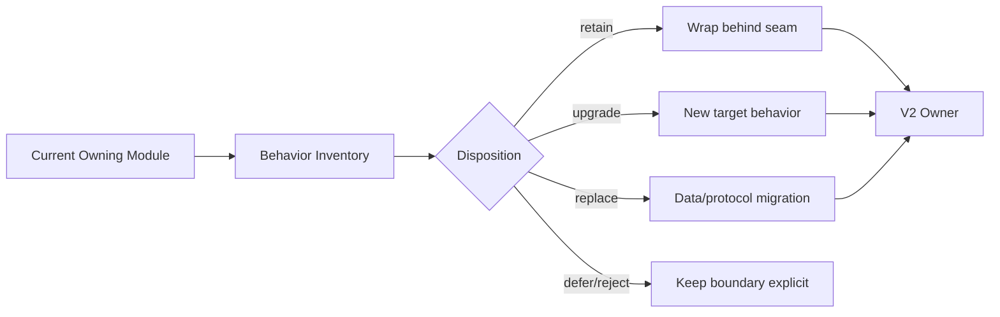
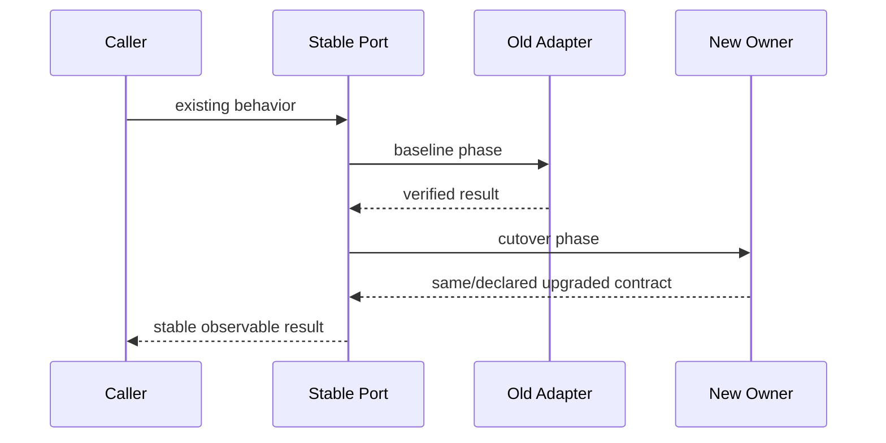

# TraceGraph 能力迁移处置

## 1. 迁移位置



本页定义怎么做处置决策；G-01～G-23 的逐项主表仍在父 README，避免出现两份会漂移的状态表。

## 2. 五种处置

| 处置 | 含义 | 要求 |
|---|---|---|
| Retain | 行为和数据语义保持，只换 owner/目录 | parity fixture + move-only slice |
| Upgrade | 保留旧主路径，增加目标能力 | 旧/new 正反例 + rollout/rollback |
| Replace | 新语义取代旧语义 | data/protocol migrator + compatibility window |
| Defer | 当前边界继续存在 | 文档、fail-closed 行为、复审前置 |
| Reject | V2 明确不做 | 产品/安全理由和防止误宣称的 guard |

禁止使用含糊的“重构”：必须说明属于哪一种，以及哪些可观察行为不变。

## 3. 能力群处置

| 能力群 | G 索引 | 目标 owner | 主策略 |
|---|---|---|---|
| Truth/Recovery | G-01/04/23 | Evidence + Session | Retain，先抽 seam，再补通用 reconcile/snapshot |
| Context/Model | G-02/03 | Context + LLM | Retain/Upgrade，补 provenance/provider seam |
| Tool/Security | G-05/06/13/19 | Tool + Execution + Credential | Retain，拆 Definition/Policy/Executor/Receipt |
| Orchestration | G-07/08/09/14 | Runtime + Orchestration | Upgrade，durable ownership/cancel/recovery |
| Integrations | G-10/11/12/17/18 | Skill/MCP/LSP/Extension/Attachment | Retain selected integrations behind provider seams；按价值逐项升级 |
| CodeGraph | G-20 | Current implementation only | 不纳入 V2 内建能力或迁移目标；未来重议需独立 Note |
| Memory | G-21 | Memory/Experience | Replace lifecycle, retain provenance/BM25 assets |
| Quality/Operations | G-15/16/22 | Quality/Governance | Keep deterministic tests and engineering gates local; Benchmark/Snapshot stay separate; model/product evaluation is external via Langfuse, not a local `evals/` suite |

## 4. 单项迁移卡

```yaml
legacy_id: G-XX
current_owner: docs/modules/...
current_evidence: [tests, source, events]
observable_contract: [must_preserve]
target_owner: package/submodule
disposition: retain|upgrade|replace|defer|reject
data_protocol_impact: none|compatible|migration
cutover: adapter|dual-read|one-shot-migrate
rollback: explicit procedure
verification: [positive, negative, replay, performance]
```

## 5. Cutover 规则

优先顺序：稳定公开 seam → 旧实现接 adapter → 新实现通过同一 conformance → shadow/read comparison（如适用）→ 单写切换 → 删除旧 adapter。原则上禁止 dual-write canonical facts；必要时只能有单 owner fan-out，并有对账与短期限。



## 6. 参数与优先级

| 参数 | 推荐 |
|---|---|
| priority | 数据/安全真源 → Runtime seam → Memory → clients |
| compatibility | 至少覆盖当前已发布/仓库 fixture 格式 |
| dual-write | default deny |
| migration batch | 可暂停、可续跑、记录 cursor |
| legacy deletion | 目标路径稳定且 rollback window 结束后 |

## 7. 验收

每个 G 项能从旧模块/测试追到目标 owner；迁移没有先删除强资产；Current/Target 状态不混写；被 defer/reject 的能力不会在 CLI、Web UI 或 README 中被误宣称为 Outlive Agent V2 能力。
