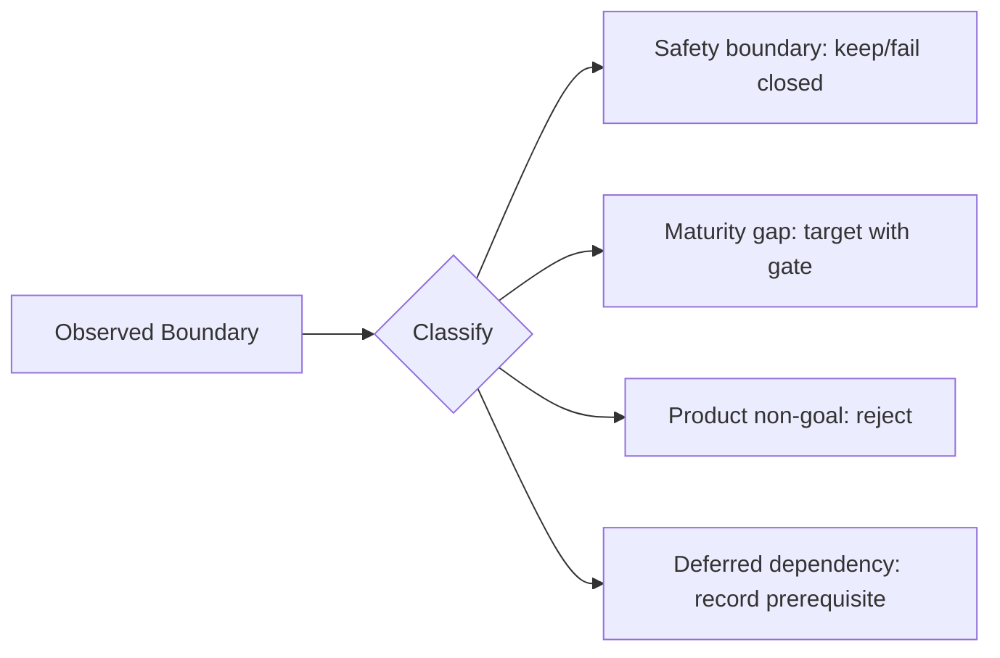
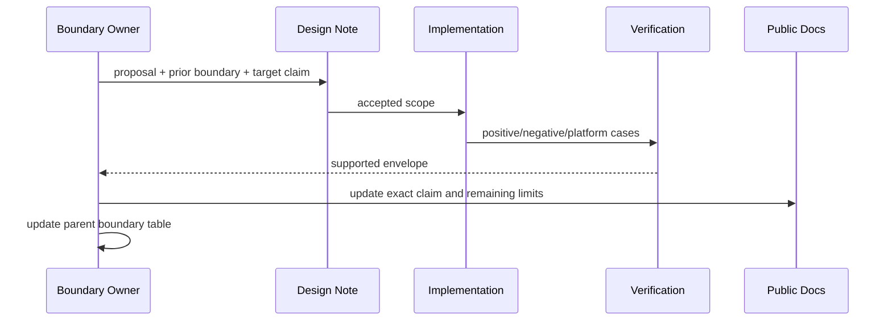

# TraceGraph 边界迁移处置

## 1. 边界不是缺陷清单

边界描述当前系统在哪些条件下不作保证。删除文字不会消除边界；只有实现、验证和公开声明同时改变，状态才可更新。

## 2. 边界群

| 群 | 当前主题 | V2 裁决原则 |
|---|---|---|
| Platform security | sandbox portability、credential portability、network egress | 未有真实 provider/conformance 前 fail closed |
| Distribution | multi-host、production TLS/multi-user、remote team | V2 MVP reject，保持 local-first |
| Provider fidelity | tokenizer、streaming、LSP/MCP transport | 先建 seam，再逐 provider 证明，不写万能宣称 |
| Knowledge depth | advanced retrieval、semantic codegraph | Memory 治理优先于向量；Codegraph 不冒充全语义 |
| Reliability | action reconcile、subagent recovery、SSE resume | Target，需 durable identity/cursor/receipt |
| Extension trust | hostile modules、Skill distribution | 保持声明式/本地/受信边界，隔离另立决策 |
| Quality realism | real-provider eval、browser E2E、large UX | P7 目标，不能替代离线确定性门 |
| Observability | full OTel/collector | 延后；telemetry 永不成为事实真源 |

逐项 Boundary ID 与状态仍由父 README 的唯一表维护。

## 3. 状态改变流程

状态只允许 `current → partial target → resolved`，或 `current → deferred/rejected/keep boundary`。`partial` 必须列出支持矩阵，不能用“基本支持”。

## 4. 支持矩阵要求

平台/transport/provider 边界使用维度矩阵：OS/arch、执行 provider、transport、auth、recovery、test level。一个格子通过不代表整行支持；未知格子默认 unsupported。

## 5. 参数与声明纪律

| 参数 | 推荐 |
|---|---|
| public claim | 与通过的最窄支持 envelope 一致 |
| unsupported behavior | 启动/调用前 fail closed + actionable error |
| experimental | 显式 flag/profile，数据格式有退出策略 |
| boundary owner | 对应 owning module，而非中央限制表 owner |
| review trigger | 前置能力完成或用户路径被其阻塞，不按时间自动升级 |

## 6. 不可接受的“解决”

- catch 异常后继续并称支持；
- 用 Docker/外部平台存在替代本仓 sandbox 语义验证；
- 加 vector DB 后称 Memory 完成；
- 有 SSE endpoint 但无 cursor/reconnect 就称可恢复；
- 有多 Agent UI 就称分布式调度；
- optional real eval 偶尔通过就替代 deterministic regression。

## 7. 验收

每个公开限制可从 README/模块文档找到，错误行为可复现；边界解决 PR 含旧失败 fixture 与新通过证据；剩余 unsupported 组合仍 fail closed；父表没有无 owner 的“未来优化”。

