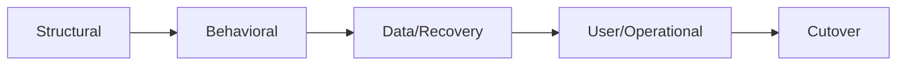
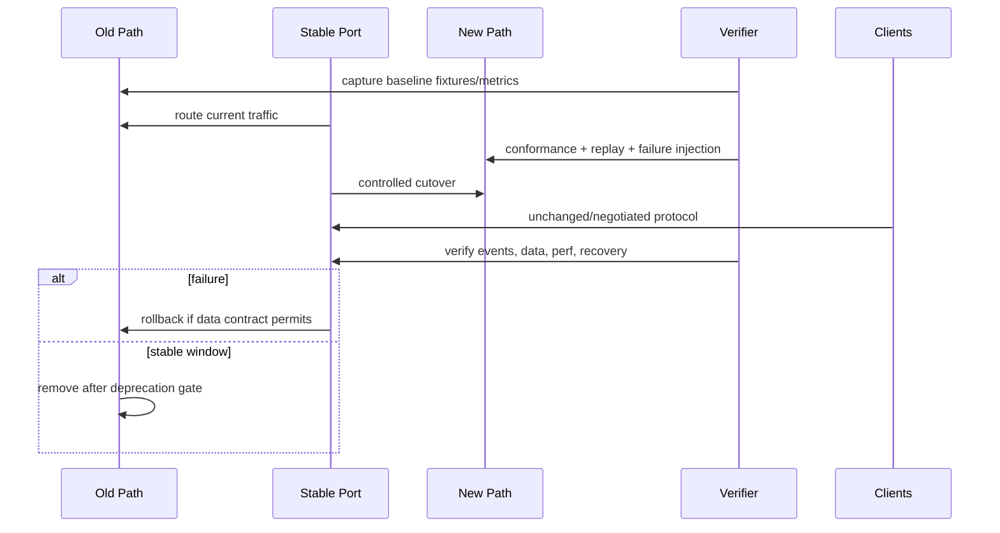

# 迁移验收与切换设计

## 1. 四层验收

结构正确不代表行为不变，测试通过不代表历史数据可恢复，数据迁移成功也不代表客户端路径可用。四层都通过才允许切换真源。

## 2. 验收矩阵

| 层 | 证明 |
|---|---|
| Structural | owner 唯一、禁止依赖为零、公开 API 窄、无 deep import |
| Behavioral | 旧正反 fixtures、事件/错误/receipt 语义一致或有声明升级 |
| Data/Recovery | 旧 session/event/artifact 可读；中断续跑；rollback/reconcile |
| User/Operational | CLI/Web UI/Desktop 关键路径、可观察错误、性能预算、文档 |

## 3. 切换时序

## 4. 无双真源规则

切换期间可双读比对派生视图，不能让两个实现独立写同一 canonical fact。若外部系统要求双写，由单一 owner 发出带同一 operation identity 的写入并对账；任一失败进入 `diverged/reconciling`。

## 5. Data migration

Migrator 必须 versioned、幂等、可 dry-run、记录 source/target cursor、每批 checksum 和失败清单。原数据在验证窗口内只读保留；不可逆删除另立显式 task。恢复测试包括迁移中断、磁盘满、旧版本打开、重复执行和部分损坏。

## 6. 参数

| 参数 | 推荐 |
|---|---|
| cutover unit | 一个可观察 user slice/owner，不按整个仓库大爆炸 |
| compatibility window | 与发布策略绑定；仓内 fixture 至少覆盖全部当前版本 |
| rollback trigger | correctness/security/data loss 立即；perf 按场景预算 |
| soak | 以场景次数/版本窗口定义，不只写“观察几天” |
| old path removal | 新路径稳定、rollback window 结束、文档/clients 已迁 |

## 7. Completion receipt

每个迁移任务输出：目标与处置、变更路径、旧/新 owner、执行验证及结果、未验证项、数据/protocol 兼容、性能 delta、回滚状态、文档/Note 链接。只有 receipt 对应证据存在，roadmap 才能标 complete。

## 8. 总体验收

G-01～G-23 每项有去向；所有现存 Boundary 有明确状态；关键历史 fixtures 可读；单一写入 owner 可机器检查；无客户端持有 Runtime 真源；公开 README 的 current/target/unsupported 与实现一致。
