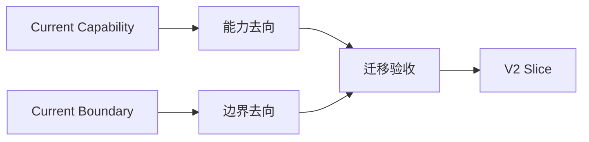

# 10 · TraceGraph → Outlive Agent 迁移基线

## 子模块导航

| 子模块 | 评审焦点 |
|---|---|
| [能力迁移处置](01-capability-disposition.md) | 保留、升级、替换、延后和拒绝的判定 |
| [边界迁移处置](02-boundary-disposition.md) | 单进程、本地优先、协议/存储等边界如何演进 |
| [迁移验收](03-migration-acceptance.md) | 如何证明没有丢能力、偷换真源或制造双写 |

## 1. 这份文档解决什么

本文件把 TraceGraph 初版文档中仍有迁移价值的内容收进 V2，避免继续维护四套互相重叠的“现状、缺口、路线图和限制清单”。它只回答三件事：

1. 哪些 TraceGraph 能力必须保留，不能在重构中重做或丢失；
2. 哪些旧能力将在 Outlive V2 中升级、延后或明确不做；
3. 每个迁移任务用什么统一标准证明完成。

合并后的文档真源是：

| 问题 | 真源 |
|---|---|
| 当前代码做了什么 | `docs/modules/*` + 对应源码和可执行测试 |
| Outlive 准备做成什么 | `docs/outlive-agent-v2.md` 与 00–10 专题文档 |
| 任务依赖与验收 | `docs/outlive-agent-v2/roadmap.yaml` |
| 为什么做某项长期决定 | `.agents/notes/*` |

不再建立一份覆盖全仓的手工 verification map。模块文档应直接写出其代码、契约、测试和最窄验证命令；机器一致性由 eval、架构门禁和生成目录检查。

## 2. 从 TraceGraph 继承的七条工程约束

这些约束是 V2 的底座，而不是旧品牌遗留：

1. **事实与叙事分离**：Event、Receipt、Artifact 是事实；摘要、Memory、UI 和报告是可重建解释。
2. **单一写入路径**：同一类 canonical fact 只能有一个 owner；第二写入点必须先经过架构决策。
3. **不确定性是一等状态**：无法确认外部结果时写 `unknown/diverged`，不能猜成成功或失败。
4. **边界默认关闭**：schema、scope、policy、projection 或凭据校验矛盾时，拒绝整个动作或出口。
5. **结构约束优于口头禁止**：优先用包依赖、类型、进程边界和 CI guard 让违规做不到。
6. **先留恢复依据，再做副作用**：副作用前持久化 operation identity、意图、必要的 before-image 或 reconcile key。
7. **可回放是正确性标准**：同一 canonical evidence 应得到确定性投影；不能依赖浏览器缓存或进程内偶然状态。

元原则是：**重要信念必须能指出谁会失败、如何失败，以及失败后如何恢复。**

## 3. G-01～G-23 的 V2 去向

旧编号只作为迁移索引，不再作为 Outlive 的产品路线编号。新的实施顺序完全以 `roadmap.yaml` 为准。

| 旧能力 | 当前可继承资产 | V2 处理 | V2 归属 |
|---|---|---|---|
| `G-01` Session 持久化/恢复 | versioned JSONL、lease、启动恢复、待审批恢复 | 保留语义，抽成 Session family | `PKG-031`、01/03/06 |
| `G-02` Context 压缩 | 有序策略、摘要、spill、原文 Artifact | 保留并补 provenance/Memory 来源 | `CORE-026`、`PKG-034`、`MEM-042` |
| `G-03` Token 计量 | preflight、provider usage、持久校准 | 保留，归入 Context/LLM seam | 03/05 |
| `G-04` Action WAL | before-image、hash 对账、受限 rollback | 提升为通用 external-action reconcile | `PKG-030`、`RUN-052` |
| `G-05` Tool 契约/调度 | strict I/O、输出边界、并发波、timeout | 拆为 Definition/Policy/Executor/Receipt | `CORE-022`、`PKG-033`、`RUN-053` |
| `G-06` Policy/Approval | preset ceiling、规则、digest、one-shot approval | 保留为 Tool family 强制边界 | `PKG-033`、05 |
| `G-07` Subagent | 有界 child Run、可信 profile、独立 Ledger | 改为 durable delegation，补容量/状态/取消 | `ORCH-054` |
| `G-08` Agent Team | root-Ledger roster/mailbox/task board | 保留事实模型，补失联恢复；不宣称分布式 | `ORCH-054` |
| `G-09` Plan/Todo | 同 Run 计划审批和 Ledger Todo | 保留为可选 workflow capability | 05 §7–8 |
| `G-10` Skill | 本地 `SKILL.md`、渐进披露、工具收窄 | 保留；边界稳定后再评估独立 package | 03 §14、05 §7 |
| `G-11` MCP | Host-owned stdio/native Tool bridge | 先抽 seam；PTC/远程 transport 单独决策 | `PKG-032` |
| `G-12` LSP | stdio diagnostics/definition/references | 保留 provider seam，统一 CodeIntel 边界 | `PKG-032`、03 §14 |
| `G-13` Sandbox | macOS `run_test` child enforcement | 保留平台真实性；未实现平台继续 fail closed | 05 §9 |
| `G-14` Steering | durable input queue、安全点消费、cancel lane | 合并到 cancellation ownership | `RUN-051` |
| `G-15` Telemetry | vendor-neutral bounded sink、Ledger 后派生 | 保留为诊断旁路，不升级为事实源 | 07 |
| `G-16` Evals | 离线行为、质量、性能与文档评测 | 拆清 Eval/Benchmark/Snapshot 职责 | P7 |
| `G-17` Extension | trusted catalog、六个 seam、idle reload | 保留注册思想，拆 registration/lifecycle | `CORE-023`、`CORE-027` |
| `G-18` Attachment | staging/claim、hash、Artifact、显式 image input | 保留为 capability contribution | `CORE-027` |
| `G-19` Credential | secret reference、Keychain、输出脱敏 | 保留；Desktop 只接 opaque handle bridge | `DESK-066` |
| `G-20` CodeGraph | 静态 TS 图、顶层 symbol、LSP 摘要、stale-base | 保留为集成家族；不冒充完整语义图 | 03 §14 |
| `G-21` Memory/Retrieval | JSONL、BM25、来源引用、Context 注入 | 作为 V2 差异化重点重构生命周期 | `MEM-040`～`MEM-048` |
| `G-22` 工程与发布 | CI、覆盖率、lockfile/release guard | 保留门禁，扩展架构/docs/snapshot 检查 | P0/P1/P7 |
| `G-23` Replay | 逐事件重放、差异、只读时间旅行 | 并入 Evidence family 和 recorded snapshots | `PKG-030`、`SNAP-070` |

## 4. 仍然存在的边界及处理决定

本表承接旧限制清单，但不再把“初版缺什么”当作独立产品路线。每项必须明确进入 V2、延后或拒绝；不能因为删除旧文件就被误写成已经完成。

| Boundary ID | 当前边界 | V2 决定 |
|---|---|---|
| `LIM-SANDBOX-PORTABILITY` | Linux/Windows 受限 native sandbox backend 未实现 | Deferred：等平台 provider 和 conformance 设计成熟；继续 fail closed |
| `LIM-PROVIDER-NETWORK` | provider 出站无 allowlist proxy | Deferred：单独 Security Note，不夹在 Memory MVP 中 |
| `LIM-MULTIHOST-COORDINATION` | 无跨 Host consensus、锁和命令协调 | Rejected for V2 MVP：保持 local-first |
| `LIM-TELEMETRY-STACK` | 无完整 OTel SDK、持久队列和真实 Collector 验证 | Deferred：Telemetry 继续是非权威旁路 |
| `LIM-CREDENTIAL-PORTABILITY` | 非 macOS 缺少 DPAPI/libsecret | Target：由 platform/desktop credential provider 解决，见 `DESK-066` |
| `LIM-GENERAL-ACTION-RECOVERY` | 自动对账主要覆盖单目标 Patch | Target：通用 action reconciliation，见 `RUN-052` |
| `LIM-TOKENIZER` | 无覆盖完整 provider wire request 的 canonical tokenizer | Deferred：通过 Model/Token provider seam 接入，不写死单一 tokenizer |
| `LIM-RETRIEVAL-ADVANCED` | 默认本地 BM25；无 Memory 管理面和自动全仓摄入 | Partial target：先做治理/管理面；vector 不是“事实”前置条件 |
| `LIM-SEMANTIC-CODEGRAPH` | 无动态调用、DI、路由、方法级和跨语言完整语义 | Deferred：不是 V2 差异化主线 |
| `LIM-LSP-PLATFORM` | 无完整 indexing、自动 post-patch 诊断和跨 Host session | Partial target：先稳定 LSP seam 与 Context provenance |
| `LIM-SUBAGENTS` | spawn 同步、无 worker 自动重启/重派、无跨 Host | Partial target：补 durable capacity/status；跨 Host 延后 |
| `LIM-MCP` | 仅 Host-owned stdio/native bridge | Partial target：先抽 contract；PTC/HTTP/resources 逐项 Note 裁决 |
| `LIM-EXTENSION-LOADING` | 不加载任意本地/npm 模块，也无 hostile-code isolation | Keep boundary：受信声明式扩展；不把插件加载等同沙箱 |
| `LIM-SKILL-DISTRIBUTION` | Skill 只读本地数据，无网络安装、签名或脚本执行 | Keep boundary for V2：先保证可审计和权限收窄 |
| `LIM-REAL-EVALS` | 主要使用确定性离线 fixture | Target：P7 增加隔离的 optional real-provider/browser lane，不替代离线门 |
| `LIM-PRODUCTION-HOST` | loopback Host 无 TLS、多人鉴权和部署封装 | Rejected for V2 MVP：产品仍为 local-first |
| `LIM-SSE-RESUME` | 刷新、长离线或 token 更新后的 durable cursor 不完整 | Target：统一 versioned Event protocol，见 `API-060`～`API-062` |
| `LIM-BROWSER-E2E` | 无真实浏览器 E2E | Target：纳入 P7 recorded scenario/browser lane |
| `LIM-WEB-SCALE-UX` | 大轨迹虚拟化、tail-follow 和中尺寸 Files Drawer 不完整 | Target after shared client protocol：不阻塞 Runtime 重构 |
| `LIM-PROVIDER-STREAMING` | 无安全 `public_delta` token streaming | Deferred：先定义 durable event 与 ephemeral hint 的边界 |

## 5. 已经很强、禁止重做的资产

- append-only hash-chained Event Ledger 与幂等/因果字段；
- 由 Ledger 重建的纯 Projection、Artifact Store 与 Replay；
- policy/approval 在 Tool dispatch、WAL 和 mutation 之前执行；
- Action WAL、before-image、hash 对账和 unknown/manual-review 边界；
- Context Manifest、spill、结构化 summary、token preflight/usage 校准；
- Session lease、版本迁移、启动恢复和 pending approval 恢复；
- 本地 Memory 来源引用、BM25 与预算内 Context 注入；
- Host/SDK/Web/CLI 的类型化纵向链；
- Subagent/Team/Skill/MCP/LSP/Extension 已有的有界能力；
- CI、覆盖率、供应链、离线 eval 与私有 release bundle 门禁。

迁移可以改变 owner、目录、package 和协议版本，但不能把这些能力先删除再“重新实现”。移动和行为改变必须分开验证。

## 6. 明确不进入 V2 MVP

- 为追赶功能数量而建立万能 Agent 控制平面；
- 将本地单 Host Team 宣称为分布式 scheduler；
- 用向量相似度替代 provenance、review 和 validity；
- 默认全权限并把安全完全交给外部容器；
- 同时维护第二语言实现或第二份 canonical event format；
- 为目录整齐一次拆出大量没有独立 owner/consumer 的空 package；
- 在工程记忆尚未可靠前实现人格复刻或身后自动代理。

## 7. 每个迁移任务的完成定义

每项任务至少回答：

1. **契约**：公开 schema/API 是否先定义并有正反例？
2. **事实**：新增持久事实的唯一 owner 和 canonical event 是谁？
3. **失败路径**：timeout、取消、非法输出、权限拒绝或崩溃至少覆盖哪一种？
4. **恢复**：重试是否幂等，外部结果未知时如何 reconcile？
5. **可重放**：同一 evidence 能否得到确定性投影和模型可见内容？
6. **兼容**：旧数据、旧调用者和 rollback 如何处理？
7. **文档**：Current 模块说明、V2 Target、Task 状态是否一致？
8. **验证**：实际执行了哪些最窄命令，结果和未验证项是什么？

## 8. 旧文档退出后的纪律

- `docs/modules/*` 在 V2 迁移完成前继续描述当前实现；某个模块被 V2 package 文档完全取代后，按 task 删除或归档，不一次性清空。
- 本文件只维护“旧能力如何迁往 V2”，不重新成长为逐测试明细清单。
- 精确事件数、LOC、测试数和版本号由代码/脚本生成，正文不重复硬编码。
- 每解决一个 Boundary，必须同时更新本表、对应 V2 专题和任务状态；不能只删掉文字。
