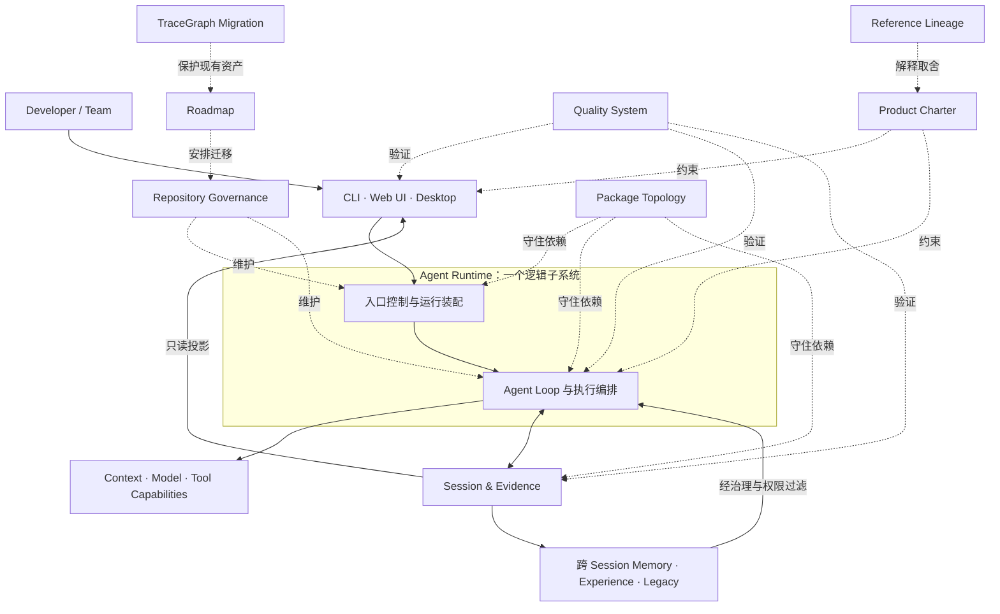

# Outlive Agent V2 · 设计文档索引

本目录把 V2 目标设计拆成三级：

1. [`../outlive-agent-v2.md`](../outlive-agent-v2.md)：产品与系统的唯一总入口；
2. `00`～`10` 模块目录的 `README.md`：大模块边界、总体取舍与子模块地图；
3. 模块目录内的编号文档：能支持架构评审和实施排序的子模块设计。

这些内容是**目标设计**，不是当前实现完成度声明。当前事实仍以根 README、`docs/modules/`、源码与可执行测试为准。

## 1. 总体位置图

图中的实线是产品运行路径，虚线是设计、治理和验证关系。所有客户端共享同一套领域命令、事件与真源，不拥有 Runtime 的权威副本。

## 2. 模块地图

| 模块 | 在整体架构中的位置 | 子模块文档解决的问题 |
|---|---|---|
| [00 产品宪章](00-product-charter/README.md) | 所有技术决定的上位约束 | 身份定位、价值边界、成功指标与决策机制 |
| [01 系统架构](01-system-architecture/README.md) | 全系统逻辑骨架 | Agent Runtime 内部边界、Session/Evidence、命令/事件、身份与恢复、Profile 组合 |
| [02 仓库治理](02-repository-governance/README.md) | 工程维护控制面 | AGENTS/Notes/Skills、文档与生成、变更门禁、[工程 SOP](02-repository-governance/04-engineering-sop.md) |
| [03 包家族](03-package-topology/README.md) | 物理依赖骨架 | 各家族职责、公开接缝、依赖与升包门槛 |
| [04 记忆与经验](04-memory-and-experience/README.md) | 从 Session/Evidence 派生的跨会话知识子系统 | Episode、Memory、Experience、Retrieval、Legacy |
| [05 Runtime 与能力](05-runtime-and-capabilities/README.md) | 执行与编排核心 | Loop、Tool、Context、扩展、取消与恢复 |
| [06 客户端与协议](06-clients-protocols-desktop/README.md) | 三种产品入口与内部传输边界 | 协议 Controller、CLI/Web UI、Desktop、状态同步 |
| [07 质量系统](07-quality-benchmarks-snapshots-i18n/README.md) | 横切验证平面 | 本地测试/工程门禁、Benchmarks、Snapshots、外部 Langfuse 评估、Docs/i18n/Website |
| [08 设计依据](08-reference-lineage/README.md) | 设计证据与取舍记录 | 源码观察、吸收/拒绝矩阵 |
| [09 实施路线](09-implementation-roadmap/README.md) | 迁移执行控制面 | Phase DAG、任务契约、评审检查点 |
| [10 迁移基线](10-tracegraph-to-outlive-migration/README.md) | 当前系统到 V2 的桥 | 能力、边界与验收迁移 |

## 3. 阅读方式

- 做产品取舍：先读 `00`，再读相关技术模块。
- 做架构评审：先读 `01` 与 `03`，再进入 `04`～`06`。
- 准备实施：读取目标子模块，再从 `09` 找依赖任务，从 `10` 检查不能破坏的现有行为。
- 核对当前实现：跳到 `docs/modules/` 和 owning source；不要把本文的 `proposed` 当成 `implemented`。

## 4. 子模块文档统一口径

每份子模块设计至少回答：

1. 它位于整体架构和父模块的哪里；
2. 它拥有什么事实，明确不拥有什么；
3. 输入、输出、端口、状态及核心不变量是什么；
4. 哪些参数必须在实现前决定，推荐值是建议还是硬约束；
5. 最关键流程如何发生，失败和恢复在哪个边界处理；
6. 哪些决定已经接受，哪些仍需评审，如何证明实现符合设计。

统一状态词：`Current` 表示已由当前代码证明，`Target` 表示 V2 目标，`Deferred` 表示本阶段明确延后；文中的“推荐”均不是已实现默认值。

## 5. 机器入口

- [`manifest.yaml`](manifest.yaml)：文档、子模块与所有权索引；
- [`roadmap.yaml`](roadmap.yaml)：任务依赖与机器可读验收；
- 模块 README：人类评审入口；
- 子模块文档：决策记录，不能替代具体实现 PR 的 API/数据库迁移说明。

## 6. 决策登记表：现在要评审什么

这是 V2 设计集的**唯一评审导航入口**，用于回答“哪些方向已定、哪些尚待决定、决定应在什么时候做”。它不是实现状态表，也不要求逐篇批准本目录的 53 份设计文档。

状态含义：

- **已接受**：维护者已确认目标方向；不代表功能已经实现。
- **待评审**：文档中有推荐方案，但尚未获得明确裁决；推荐不等于默认值。
- **已延后**：明确不在当前阶段决定或实现，并记录重新评审的时机。
- **已实现**：只有代码、测试或可复现验证支持时才能使用；本表不以文档设计代替实现证据。

文档 frontmatter 的 `status: proposed` 表示目标设计尚未由实现证明，和其中某项决策是否已接受是两件事。**设计已接受 ≠ 代码已交付。**

### 6.1 已接受的方向（本轮无需重审）

十五项具体记录见[总纲第 11 节](../outlive-agent-v2.md#11-本轮已评审的十五个决策)。按主题归纳：

- 产品统一叫 Outlive Agent，定位为通用 Agent；当前入口是 CLI、Web UI、Desktop，Web/Desktop 工作台参考 DSH/Codex 交互形态。
- Session/Run 执行事实与跨 Session Memory 分开治理；接受“记忆可延续，权限不延续”及有来源、可审查的 Memory 生命周期。
- 先在内部形成稳定边界，再按门槛升为物理包；最终 scope 为 `@outlive/*`，兼容改名另行迁移。
- 接受 LSP 作为可选只读代码导航接缝，不内置语言服务器；CodeGraph 不进入 V2 内建能力。
- 接受 Desktop 主进程不持有业务状态、质量验证交由本地确定性门禁/Benchmark/Snapshot 与外部 Langfuse 分工、V2 完成后再建设 Website。
- V2 不做多人团队共享 Workspace/Memory，也不做数字人格或身后代理；这些边界不取消内部多 Agent 协作或用户策展的 Legacy Capsule。

### 6.2 需要在相应阶段前裁决

表中“当前建议”只是源文档的提案摘要，不是预先替维护者作出的决定。阶段对应 [`roadmap.yaml`](roadmap.yaml)；不在当前阶段的条目先保留，不阻塞眼前工作。

| ID | 状态 / 裁决时机 | 需要回答的问题 | 当前文档建议（尚未批准） | 设计依据 |
|---|---|---|---|---|
| DEC-01 | **待评审：P1 的 `ARCH-010` 前** | 如何把现有包晋升硬门槛编码进门禁；评分卡是否只作排序参考；策略文件是否命名为 `architecture-policy.yaml`？ | 维持根 `AGENTS.md` 的现有硬门槛：边界稳定、至少两个真实消费者或有硬隔离理由、并有契约测试；评分卡只辅助排序，不自动升包。 | [依赖门禁与升包](03-package-topology/05-profiles-dependency-gates.md)；路线任务 `ARCH-010` |
| DEC-02 | **待评审：P4 Memory 实施前** | G-21 既有自动 Recall 的迁移开关和默认行为是什么；低风险候选何时可自动激活？ | 先迁移可见性、请求状态和策略控制；首阶段显式准入，高风险/冲突内容始终需确认。低风险自动准入需另设证据、撤销和审计门槛。 | [Memory 生命周期](04-memory-and-experience/02-memory-lifecycle.md)；[用户价值边界](00-product-charter/02-user-value-boundaries.md) |
| DEC-03 | **待评审：Memory 导出实现及公开 Beta 前** | 导出是否包含原始证据；是否提供脱敏等级和选择性导出；如何说明系统无法控制导出后副本的删除？ | 只导出用户明确选择、带来源和校验信息的内容；原始证据与敏感字段的默认策略仍需裁决，并明确外部副本边界。 | [用户价值边界](00-product-charter/02-user-value-boundaries.md)；[Legacy 治理](04-memory-and-experience/05-legacy-governance.md) |
| DEC-04 | **待评审：P5 Runtime 可靠性实现前** | Lease/fencing 的持久化和原子抢占位置、Checkpoint 存储与提交边界、长时工具的 owner、Provider/Profile 漂移及审批拒绝的终态如何定？ | 以 Run 级 fencing、Ledger 为恢复真源、未知副作用先 reconcile 为设计建议；具体存储、并发和终态映射仍由 ADR 裁决。 | [身份、状态与恢复](01-system-architecture/03-identity-state-recovery.md) |
| DEC-05 | **待评审：Profile/Host 组合实现前** | 是否采用静态完整 Bundle 列表而不做动态 `extends`；Patch、Generation 更新、`composition_digest`/脱敏 Manifest 如何定？ | 显式有序 Bundle、声明式 schema 校验 Patch、新 Run 使用新 Generation、Run 固定摘要及装配依据。当前为建议，尚未批准。 | [Profiles 与组合](01-system-architecture/04-profiles-composition.md) |
| DEC-06 | **待评审：P6 长任务协议实现前** | 长任务状态通过 Operation Resource 还是事件流提供？ | 优先考虑 Operation Resource；协议文档明确仍待裁决。 | [命令、查询与事件模型](01-system-architecture/02-command-query-event-model.md) |
| DEC-07 | **待评审：P6 Desktop 实施前** | Desktop 外壳选 Electron 还是 Tauri；Host 生命周期和私有传输如何落实？ | 当前 React/Vite/TypeScript 资产使 Electron 成为首选候选；这不是已作出的技术决定。 | [Desktop 客户端设计](06-clients-protocols-desktop/README.md)；[Desktop 进程安全](06-clients-protocols-desktop/03-desktop-process-security.md) |
| DEC-08 | **待评审：P8 Beta/Stable 发布前** | 是否启用匿名 opt-in 社区遥测；公开 README 展示哪些可信指标；Beta/Stable 的样本量、回归预算和支持周期是什么？ | 先有可解释的指标定义、隐私级别、分母和验证证据，再决定是否公开或收集遥测；当前没有已批准数值。 | [成功指标与决策机制](00-product-charter/03-success-metrics-decisions.md) |
| DEC-09 | **待评审：P0 `GOV-001` / `DOC-002` 完成前** | Note 的评审结果与 `status` 生命周期是否保持分开；Skill “两次真实使用”是成熟度指导还是自动准入硬门槛；哪些局部目录需要独立 `AGENTS.md`？ | 评审结果和实现状态分开表达；没有 schema/校验器前不新增机器状态字段；局部规则按真实子树风险添加，不为目录整齐而创建。 | [AGENTS、Notes 与 Skills](02-repository-governance/01-agents-notes-skills.md) |
| DEC-10 | **待评审：P7 文档国际化与 P8 Website 前** | 面向公开用户的 API 指南以哪种语言为源；Website 选静态站点还是直接发布 Markdown；何时引入章节级翻译工具？ | 按文档族指定 canonical language；已接受 Website 延后且只投影 docs，具体生成器和双语自动化仍未定。 | [文档、生成与国际化](02-repository-governance/02-docs-generation-i18n.md) |
| DEC-11 | **待评审：P3 首批 package 发布前** | `@outlive/*` 下的 package 采用统一版本还是独立版本；兼容变更如何映射到发布版本？ | 版本策略须配合已接受的独立兼容迁移方案；当前没有已批准的 changeset/版本发布工具选择。 | [变更门禁与发布](02-repository-governance/03-change-gates-release.md)；[包拓扑](03-package-topology/README.md) |
| DEC-12 | **待评审：P7 Snapshot/Benchmark 门禁接 CI 前** | Benchmark 用本机基线还是固定 runner 作阻断；PR、nightly、release lane 的资源预算和重跑策略是什么？ | 先保证场景、runner、正确性和原始样本可比较，再决定是否阻断；Langfuse 外部质量评估仍不进入普通确定性 CI。 | [变更门禁与发布](02-repository-governance/03-change-gates-release.md)；[质量系统](07-quality-benchmarks-snapshots-i18n/README.md) |

### 6.3 已明确延后（当前不阻塞）

- 多人团队共享 Workspace/Memory：已接受移出 V2，团队权限、共享 scope、纠错仲裁与撤销留待后续版本。
- 数字人格、自动身后代理：不进入 V2 MVP。第三方动态 Bundle 安装先延期，待单独定义来源、签名、权限和撤销信任模型。
- Website：已接受在 V2 P1–P7 实现阶段完成后再建设，只作为文档投影。
- P3 的首批物理包名单：等 P2 内部成层后依据真实边界、消费者和测试证据再决定，不预先按目标目录批量建包。

### 6.4 如何完成一次评审

只评审当前阶段已到期的条目。对每项给出 `接受 / 修改 / 试验 / 延后 / 拒绝`，说明理由、适用范围和复审条件；将裁决写入对应的 [Agent Note](../../.agents/notes/README.md)，再同步本登记表与负责该模块的设计文档。若选择“试验”，同时写出验证指标和停止条件。任何接受都只确认设计方向，不自动改变实现状态。
