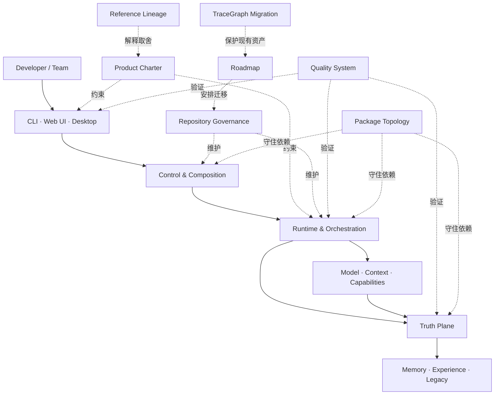

# Outlive Agent V2 · 设计文档索引

本目录把 V2 目标设计拆成三级：

1. [`../outlive-agent-v2.md`](../outlive-agent-v2.md)：产品与系统的唯一总入口；
2. `00`～`10` 模块目录的 `README.md`：大模块边界、总体取舍与子模块地图；
3. 模块目录内的编号文档：能支持架构评审和实施排序的子模块设计。

这些内容是**目标设计**，不是当前实现完成度声明。当前事实仍以根 README、`docs/modules/`、源码与可执行测试为准。

## 1. 总体位置图

图中的实线是产品运行路径，虚线是设计、治理和验证关系。所有客户端共享同一套领域命令、事件与真源，不拥有 Runtime 的权威副本。

## 2. 模块地图

| 模块 | 在整体架构中的位置 | 子模块文档解决的问题 |
|---|---|---|
| [00 产品宪章](00-product-charter/README.md) | 所有技术决定的上位约束 | 身份定位、价值边界、成功指标与决策机制 |
| [01 系统架构](01-system-architecture/README.md) | 全系统逻辑骨架 | 平面、命令/事件、身份与恢复、Profile 组合 |
| [02 仓库治理](02-repository-governance/README.md) | 工程维护控制面 | AGENTS/Notes/Skills、文档与生成、变更门禁、[工程 SOP](02-repository-governance/04-engineering-sop.md) |
| [03 包家族](03-package-topology/README.md) | 物理依赖骨架 | 各家族职责、公开接缝、依赖与升包门槛 |
| [04 记忆与经验](04-memory-and-experience/README.md) | 可信数据平面上层 | Episode、Memory、Experience、Retrieval、Legacy |
| [05 Runtime 与能力](05-runtime-and-capabilities/README.md) | 执行与编排核心 | Loop、Tool、Context、扩展、取消与恢复 |
| [06 客户端与协议](06-clients-protocols-desktop/README.md) | 三种产品入口与内部传输边界 | 协议 Controller、CLI/Web UI、Desktop、状态同步 |
| [07 质量系统](07-quality-benchmarks-snapshots-i18n/README.md) | 横切验证平面 | 本地测试/工程门禁、Benchmarks、Snapshots、外部 Langfuse 评估、Docs/i18n/Website |
| [08 设计依据](08-reference-lineage/README.md) | 设计证据与取舍记录 | 源码观察、吸收/拒绝矩阵 |
| [09 实施路线](09-implementation-roadmap/README.md) | 迁移执行控制面 | Phase DAG、任务契约、评审检查点 |
| [10 迁移基线](10-tracegraph-to-outlive-migration/README.md) | 当前系统到 V2 的桥 | 能力、边界与验收迁移 |

## 3. 阅读方式

- 做产品取舍：先读 `00`，再读相关技术模块。
- 做架构评审：先读 `01` 与 `03`，再进入 `04`～`06`。
- 准备实施：读取目标子模块，再从 `09` 找依赖任务，从 `10` 检查不能破坏的现有行为。
- 核对当前实现：跳到 `docs/modules/` 和 owning source；不要把本文的 `proposed` 当成 `implemented`。

## 4. 子模块文档统一口径

每份子模块设计至少回答：

1. 它位于整体架构和父模块的哪里；
2. 它拥有什么事实，明确不拥有什么；
3. 输入、输出、端口、状态及核心不变量是什么；
4. 哪些参数必须在实现前决定，推荐值是建议还是硬约束；
5. 最关键流程如何发生，失败和恢复在哪个边界处理；
6. 哪些决定已经接受，哪些仍需评审，如何证明实现符合设计。

统一状态词：`Current` 表示已由当前代码证明，`Target` 表示 V2 目标，`Deferred` 表示本阶段明确延后；文中的“推荐”均不是已实现默认值。

## 5. 机器入口

- [`manifest.yaml`](manifest.yaml)：文档、子模块与所有权索引；
- [`roadmap.yaml`](roadmap.yaml)：任务依赖与机器可读验收；
- 模块 README：人类评审入口；
- 子模块文档：决策记录，不能替代具体实现 PR 的 API/数据库迁移说明。

## 6. 建议先评审的八个决定

| 顺序 | 决定 | 主要输入 | 会阻塞 |
|---:|---|---|---|
| 1 | 首要用户是否锁定长期 Coding 开发者，核心产品承诺是否聚焦可追溯、可修正、可继承的工程经验 | [身份与定位](00-product-charter/01-identity-positioning.md) | 对外叙事、指标 |
| 2 | 三平面只是逻辑边界，还是在 V2 内拆 Host/Truth 进程 | [三平面](01-system-architecture/01-runtime-control-truth-planes.md) | 协议、Desktop、恢复 |
| 3 | 自动 Memory 准入允许到什么范围，删除语义如何承诺 | [Memory 生命周期](04-memory-and-experience/02-memory-lifecycle.md) | Memory MVP、隐私声明 |
| 4 | 哪些逻辑模块最先升包，升包评分卡是否接受 | [依赖门禁](03-package-topology/05-profiles-dependency-gates.md) | P2/P3 包迁移 |
| 5 | 有副作用工具的 `unknown → reconcile` 是否作为全局硬约束 | [Tool 管线](05-runtime-and-capabilities/02-tool-policy-receipt.md) | Runtime 可靠性 |
| 6 | Desktop shell、Host 生命周期和私有传输选型 | [Desktop 安全](06-clients-protocols-desktop/03-desktop-process-security.md) | Desktop 实施 |
| 7 | 哪些本地测试/门禁、Snapshot/Benchmark 阻断合并；Langfuse 评估如何独立报告 | [质量系统](07-quality-benchmarks-snapshots-i18n/README.md) | P7/发布 |
| 8 | local-first、单 Host 和非人格模拟边界是否保持为 V2 非目标 | [边界处置](10-tracegraph-to-outlive-migration/02-boundary-disposition.md) | 产品范围、社区承诺 |

建议按顺序逐项给出 `接受 / 修改 / 试验 / 延后 / 拒绝`，再把结果写入 Agent Note；没有必要一次批准全部 53 份文档。
