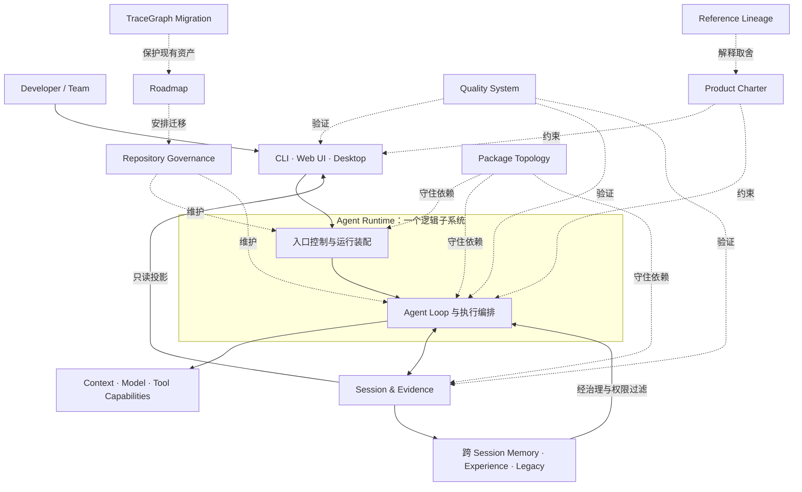

# Outlive Agent V2 · 设计文档索引

本目录把 V2 目标设计拆成三级：

1. [`../outlive-agent-v2.md`](../outlive-agent-v2.md)：产品与系统的唯一总入口；
2. `00`～`10` 模块目录的 `README.md`：大模块边界、总体取舍与子模块地图；
3. 模块目录内的编号文档：能支持架构评审和实施排序的子模块设计。

这些内容是**目标设计**，不是当前实现完成度声明。当前事实仍以根 README、`docs/modules/`、源码与可执行测试为准。

## 1. 总体位置图

```mermaid
flowchart TB
  U[Developer / Team] --> S[CLI · Web UI · Desktop]
  S --> C
  subgraph AR[Agent Runtime：一个逻辑子系统]
    C[入口控制与运行装配]
    R[Agent Loop 与执行编排]
    C --> R
  end
  R --> MC[Context · Model · Tool Capabilities]
  R <--> T[Session & Evidence]
  T --> MX[跨 Session Memory · Experience · Legacy]
  MX -->|经治理与权限过滤| R
  T -->|只读投影| S

  P[Product Charter] -.约束.-> S
  P -.约束.-> R
  G[Repository Governance] -.维护.-> C
  G -.维护.-> R
  Q[Quality System] -.验证.-> S
  Q -.验证.-> R
  Q -.验证.-> T
  PK[Package Topology] -.守住依赖.-> C
  PK -.守住依赖.-> R
  PK -.守住依赖.-> T
  RL[Reference Lineage] -.解释取舍.-> P
  RM[Roadmap] -.安排迁移.-> G
  MG[TraceGraph Migration] -.保护现有资产.-> RM
```

图中的实线是产品运行路径，虚线是设计、治理和验证关系。所有客户端共享同一套领域命令、事件与真源，不拥有 Runtime 的权威副本。

## 2. 模块地图

| 模块 | 在整体架构中的位置 | 子模块文档解决的问题 |
|---|---|---|
| [00 产品宪章](00-product-charter/README.md) | 所有技术决定的上位约束 | 身份定位、价值边界、成功指标与决策机制 |
| [01 系统架构](01-system-architecture/README.md) | 全系统逻辑骨架 | Agent Runtime 内部边界、Session/Evidence、命令/事件、身份与恢复、Profile 组合 |
| [02 仓库治理](02-repository-governance/README.md) | 工程维护控制面 | AGENTS/Notes/Skills、文档与生成、变更门禁、[工程 SOP](02-repository-governance/04-engineering-sop.md) |
| [03 包家族](03-package-topology/README.md) | 物理依赖骨架 | 各家族职责、公开接缝、依赖与升包门槛 |
| [04 记忆与经验](04-memory-and-experience/README.md) | 从 Session/Evidence 派生的跨会话知识子系统 | Episode、Memory、Experience、Retrieval、Legacy |
| [05 Runtime 与能力](05-runtime-and-capabilities/README.md) | 执行与编排核心 | Loop、Tool、Context、扩展、取消与恢复 |
| [06 客户端与协议](06-clients-protocols-desktop/README.md) | 三种产品入口与内部传输边界 | 协议 Controller、CLI/Web UI、Desktop、状态同步 |
| [07 质量系统](07-quality-benchmarks-snapshots-i18n/README.md) | 横切验证平面 | 本地测试/工程门禁、Benchmarks、Snapshots、外部 Langfuse 评估、Docs/i18n/Website |
| [08 设计依据](08-reference-lineage/README.md) | 设计证据与取舍记录 | 源码观察、吸收/拒绝矩阵 |
| [09 实施路线](09-implementation-roadmap/README.md) | 迁移执行控制面 | Phase DAG、任务契约、评审检查点 |
| [10 迁移基线](10-tracegraph-to-outlive-migration/README.md) | 当前系统到 V2 的桥 | 能力、边界与验收迁移 |

## 3. 阅读方式

- 做产品取舍：先读 `00`，再读相关技术模块。
- 做架构评审：先读 `01` 与 `03`，再进入 `04`～`06`。
- 准备实施：读取目标子模块，再从 `09` 找依赖任务，从 `10` 检查不能破坏的现有行为。
- 核对当前实现：跳到 `docs/modules/` 和 owning source；不要把本文的 `proposed` 当成 `implemented`。

## 4. 子模块文档统一口径

每份子模块设计至少回答：

1. 它位于整体架构和父模块的哪里；
2. 它拥有什么事实，明确不拥有什么；
3. 输入、输出、端口、状态及核心不变量是什么；
4. 哪些参数必须在实现前决定，推荐值是建议还是硬约束；
5. 最关键流程如何发生，失败和恢复在哪个边界处理；
6. 哪些决定已经接受，哪些仍需评审，如何证明实现符合设计。

统一状态词：`Current` 表示已由当前代码证明，`Target` 表示 V2 目标，`Deferred` 表示本阶段明确延后；文中的“推荐”均不是已实现默认值。

## 5. 机器入口

- [`manifest.yaml`](manifest.yaml)：文档、子模块与所有权索引；
- [`roadmap.yaml`](roadmap.yaml)：任务依赖与机器可读验收；
- 模块 README：人类评审入口；
- 子模块文档：决策记录，不能替代具体实现 PR 的 API/数据库迁移说明。

## 6. 决策登记表：现在要评审什么

这是 V2 设计集的**唯一评审导航入口**，用于回答“哪些方向已定、哪些尚待决定、决定应在什么时候做”。它不是实现状态表，也不要求逐篇批准本目录的 53 份设计文档。

状态含义：

- **已接受**：维护者已确认目标方向；不代表功能已经实现。
- **待评审**：文档中有推荐方案，但尚未获得明确裁决；推荐不等于默认值。
- **已延后**：明确不在当前阶段决定或实现，并记录重新评审的时机。
- **已实现**：只有代码、测试或可复现验证支持时才能使用；本表不以文档设计代替实现证据。

文档 frontmatter 的 `status: proposed` 表示目标设计尚未由实现证明，和其中某项决策是否已接受是两件事。**设计已接受 ≠ 代码已交付。**

### 6.1 已接受的方向（本轮无需重审）

十五项具体记录见[总纲第 11 节](../outlive-agent-v2.md#11-本轮已评审的十五个产品与架构总纲决策)。按主题归纳：

- 产品统一叫 Outlive Agent，定位为通用 Agent；当前入口是 CLI、Web UI、Desktop，Web/Desktop 工作台参考 DSH/Codex 交互形态。
- Session/Run 执行事实与跨 Session Memory 分开治理；接受“记忆可延续，权限不延续”及有来源、可审查的 Memory 生命周期。
- 先在内部形成稳定边界，再按门槛升为物理包；最终 scope 为 `@outlive/*`，兼容改名另行迁移。
- 接受 LSP 作为可选只读代码导航接缝，不内置语言服务器；CodeGraph 不进入 V2 内建能力。
- 接受 Desktop 主进程不持有业务状态、质量验证交由本地确定性门禁/Benchmark/Snapshot 与外部 Langfuse 分工、V2 完成后再建设 Website。
- V2 不做多人团队共享 Workspace/Memory，也不做数字人格或身后代理；这些边界不取消内部多 Agent 协作或用户策展的 Legacy Capsule。

### 6.2 已接受的设计决策与实施节点

维护者已于 **2026-09-28** 接受 DEC-01 至 DEC-12 下列设计方向。这里的 `accepted` 是评审结果，不是代码状态；对应代码、门禁和运行验证仍须按 [`roadmap.yaml`](roadmap.yaml) 的阶段实施。逐项 DSH 源码/文档证据以及不可据此推断的内容见[参考观察记录](08-reference-lineage/01-source-observations.md)。DSH 作为工程参照，不代表 DSH 已实现 Outlive 的 Memory 产品，也不意味着 Outlive 必须照搬 DSH 的技术栈。

| ID | 评审结果 / 实现状态 | 已接受的裁决（结合 DSH 实践适配） | 设计依据 / 实施阶段 |
|---|---|---|---|
| DEC-01 | **已接受；`ARCH-010` 已交付依赖门禁** | 保留 Outlive 的物理包硬门槛：职责边界稳定、至少两个真实消费者或有明确硬隔离理由、并有契约测试。评分卡只排序和触发讨论，不能自动升包。`architecture-policy.yaml` 是唯一机器可读边界策略源；检查器要求包清单显式登记并验证依赖方向与公开导出。是否满足边界稳定、consumer/隔离理由和契约测试，仍须在升包评审中提供证据。根 `AGENTS.md` 与模块文档只解释规则并链接，不复制配置。两个消费者这一数值门槛是 Outlive 自己的规则，不宣称来自 DSH。 | [依赖门禁与升包](03-package-topology/05-profiles-dependency-gates.md)；`ARCH-010` |
| DEC-02 | **已接受；待 P4 Memory 实施** | Memory Candidate 默认必须经用户可见的检查/确认才能成为 active；V2 不做低风险自动准入。自动 Recall 与自动准入分开：G-21 先迁移可见性、请求状态、scope/policy 和逐轮来源记录，自动 Recall 默认关闭并由用户显式开启；不扩大静默注入路径。 | [Memory 生命周期](04-memory-and-experience/02-memory-lifecycle.md)；[用户价值边界](00-product-charter/02-user-value-boundaries.md) |
| DEC-03 | **已接受；待 Memory/Capsule 与 Beta 实施** | 导出默认只含用户选择的 Memory/Experience、来源引用与校验信息；原始证据按项 opt-in 并经过脱敏/密钥检查，第三方资料默认排除。Capsule 不携带凭据、审批或可执行权限；导出后副本不受本机删除控制，必须在确认页说明。 | [Legacy 治理](04-memory-and-experience/05-legacy-governance.md)；公开 Beta 前验证 |
| DEC-04 | **已接受原则；物理存储细节待 P5 实施 ADR** | Run 级所有权采用单调 fencing；Ledger 是恢复真源，Checkpoint 是可重建的恢复加速资料。旧 Attempt 不得复活；未知副作用进入 reconcile，不盲目重试；恢复时重新检查权限和 Provider/Profile 摘要。操作资源控制生命周期，执行 Provider 持有其资源并报告收敛。审批拒绝单独记录，不等同于用户取消；若没有可继续的替代路径才以明确策略失败结束。具体 SQLite/文件/事务位置由实现 ADR 决定。 | [身份、状态与恢复](01-system-architecture/03-identity-state-recovery.md)；P5 |
| DEC-05 | **已接受；待 Profile/Host 组合实施** | Profile 保存完整、有序的 Bundle 清单，不做隐式动态 `extends`；Patch 是有版本、受 Schema 校验的声明式修改，不执行任意代码。新 Run 固定 Composition Generation、摘要和脱敏装配依据；在途 Run 不被热更新改写。 | [Profiles 与组合](01-system-architecture/04-profiles-composition.md) |
| DEC-06 | **已接受；待 P6 协议实施** | 长任务以可查询的 Operation Resource 作为当前状态与重连真相；durable event stream 供实时更新、游标续传和观察，不单独承担最终状态。断线后重新读 Resource/Snapshot，再续订事件，沿用 DSH Job 的“资源控制 + 事件观察”组合。 | [命令、查询与事件模型](01-system-architecture/02-command-query-event-model.md) |
| DEC-07 | **已接受；待 P6 Desktop 实施** | Desktop 采用 Electron 壳、独立 Host 和 Web 共享工作台 UI；Renderer 通过受限 Preload/Bridge 与 Main 通信，Main 通过私有 framed RPC 调用 Host。业务状态归 Host/Runtime，不归 Electron Main。 | [Desktop 客户端设计](06-clients-protocols-desktop/README.md)；[Desktop 进程安全](06-clients-protocols-desktop/03-desktop-process-security.md) |
| DEC-08 | **已接受原则；指标阈值待 P8 基线后确定** | 默认不外发产品遥测；如后续启用，必须由用户明确 opt-in，按事件白名单发送，不收集 Prompt/响应、源码、Session/Memory 正文或自动身份标识。Langfuse 独立承载用户授权的模型/任务质量评估。README 只发布有定义、分母、窗口、隐私说明和可复核证据的指标；样本量与回归阈值在基线后制定。 | [成功指标与决策机制](00-product-charter/03-success-metrics-decisions.md)；P8 |
| DEC-09 | **已接受；`GOV-001` / `DOC-002` 已核验** | 治理入口已存在，V2 manifest/roadmap DAG checker 与违规 fixtures 于 2026-10-03 重新通过。评审结果记录在本登记表/Note 正文，Note `status` 只表示提案、实现、否决或归档生命周期；接受但未实现仍是 `proposed`。Skill 的“两次真实使用”是成熟度复核建议，不是创建/启用硬门槛。目录级 `AGENTS.md` 只按子树独有、高风险规则增设。 | [AGENTS、Notes 与 Skills](02-repository-governance/01-agents-notes-skills.md)；[校验器](../../scripts/verify-v2-docs.mjs) |
| DEC-10 | **已接受；待 P7 文档治理、P8 Website 实施** | 文档按文档族指定单一源语言；公开 API/用户指南采用英文为 canonical、中文为人工审校配对版，现有中文 V2 设计集继续以中文为源，直到抽取公开文档。接受静态站点从版本化 docs 投影；使用 VitePress 路线，Website 延后至 P1–P7 开发完成。社区翻译可通过 PR 贡献，但必须经术语/事实审校及配对检查，不接受未审校机器译文直接发布。 | [文档、生成与国际化](02-repository-governance/02-docs-generation-i18n.md)；[Docs/Website 设计](07-quality-benchmarks-snapshots-i18n/04-docs-i18n-website.md) |
| DEC-11 | **已接受；待 P3 首批 package 发布前实施** | `@outlive/*` 属于同一 Monorepo 发布族，包版本跟随仓库统一版本；兼容性和破坏性变更按统一 SemVer/迁移说明发布，不采用每包独立版本或 Changesets 作为版本真源。真正公开发布前再确定注册表、发布凭据和自动化细节。 | [变更门禁与发布](02-repository-governance/03-change-gates-release.md)；[包拓扑](03-package-topology/README.md) |
| DEC-12 | **已接受原则；固定 Runner/预算待 P7 门禁实施时校准** | 性能门禁采用可复现的固定 Runner class 和受控运行时；PR 运行短小的关键路径集，较大场景放到 nightly/release。先以观察模式量化噪声，再对少数用户关键路径阻断；基线绑定 commit、场景、硬件/运行时指纹和原始样本。借鉴 DSH 的独立 PR Benchmark lane，不照搬其专用 Runner 的资源规格。 | [Benchmark 系统](07-quality-benchmarks-snapshots-i18n/02-benchmark-system.md)；[变更门禁与发布](02-repository-governance/03-change-gates-release.md) |

### 6.3 已明确延后（当前不阻塞）

- 多人团队共享 Workspace/Memory：已接受移出 V2，团队权限、共享 scope、纠错仲裁与撤销留待后续版本。
- 数字人格、自动身后代理：不进入 V2 MVP。第三方动态 Bundle 安装先延期，待单独定义来源、签名、权限和撤销信任模型。
- Website：已接受在 V2 P1–P7 实现阶段完成后再建设，只作为文档投影。
- P3 的首批物理包名单：等 P2 内部成层后依据真实边界、消费者和测试证据再决定，不预先按目标目录批量建包。

### 6.4 如何完成一次评审

只评审当前阶段已到期的条目。对每项给出 `接受 / 修改 / 试验 / 延后 / 拒绝`，说明理由、适用范围和复审条件；将裁决写入对应的 [Agent Note](../../.agents/notes/README.md)，再同步本登记表与负责该模块的设计文档。若选择“试验”，同时写出验证指标和停止条件。任何接受都只确认设计方向，不自动改变实现状态。
